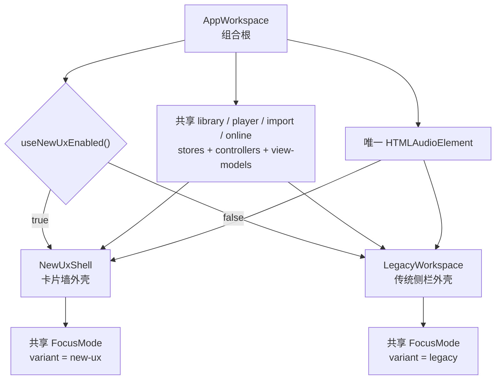
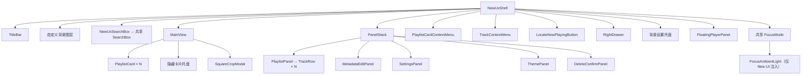
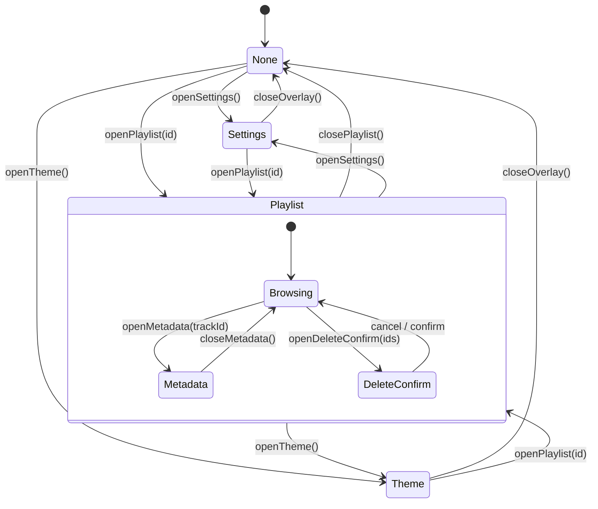

# New UI 实现归档

> 快照日期：2026-08-12
> 对应提交：`06e3ff4`
> 性质：现状归档，不是目标架构，也不保证此后代码仍与本文一致。
> 退役状态：本文所列 New UI 源码已在归档后移除；文件路径均为历史路径。

## 1. 归档目的

这份文档记录当前 New UI/UX 的视觉结构、组件边界、交互状态、动画和持久化约定，供未来暂停、删除、重写或恢复这一套界面时使用。

最重要的结论是：**New UI 不是第二套播放器内核，而是共享领域层之上的另一套外壳。** `AppWorkspace` 先创建资料库、播放器、导入、在线音源等 store/controller/view-model 和唯一的 `<audio>`，最后才根据 `la_new_ux_enabled` 在 `NewUxShell` 与 `LegacyWorkspace` 之间二选一。

## 2. 总体边界



### 2.1 New UI 自己拥有的内容

- 卡片墙与卡片编辑：`MainView`、`PlaylistCard`、`SquareCropModal`。
- New UI 面板状态机：`useNewUxStore`。
- 右侧工具抽屉、左侧隐藏卡片/背景托盘。
- New UI 浮动播放器的表现层。
- New UI 卡片覆盖、背景图和背景模糊存储。
- New UI 固定深色变量、玻璃材质、3D 卡片墙动画。
- Focus Mode 的 New UI 布局变体与额外环境光层。

### 2.2 与 Legacy 共享的内容

- `useLibrarySlots` / library store、player store、各 controller 和 view-model。
- 同一个 `<audio>`、播放上下文、音量、进度、播放模式和切歌逻辑。
- 文件导入、元数据读写、WebDAV、QQ/网易云/汽水服务及下载/上传。
- `TitleBar`、`SearchBox`、`FocusMode`、`SettingsPanel`、`ThemePanel` 的实现主体。
- 持久化的曲库索引、播放状态、主题、语言、快捷键、WebDAV/在线音乐凭据。

因此，恢复 New UI 时应优先复用 `AppWorkspace` 暴露的意图回调，不要在 UI 内重新实现播放、曲库写入或在线音源逻辑。

## 3. 当前视觉布局

New UI 是一个 `100vw × 100vh`、不允许页面滚动的全屏舞台：

```text
┌──────────────────────────────────────────────────────────────────┐
│ TitleBar（固定最上层，窗口拖拽/聚焦模式/最小化/最大化/关闭）       │
│                    [ 顶部居中全局搜索 ]                          │
│                                                                  │
│ [隐藏卡片或背景托盘]     3D 可拖拽卡片墙        [右侧工具抽屉]     │
│                                      ┌──────────────────────┐    │
│                                      │ 歌单/设置/主题/编辑   │    │
│                                      │ 右侧玻璃面板栈        │    │
│                                      └──────────────────────┘    │
│                                                [定位正在播放]     │
│              [底部居中浮动播放器：资料 / 进度 / 控制]            │
└──────────────────────────────────────────────────────────────────┘
                         ↓ 进入 Focus Mode
┌──────────────────────────────────────────────────────────────────┐
│ 封面取色/模糊背景 + New UI 环境光；左封面/资料，右滚动歌词，底部控制 │
└──────────────────────────────────────────────────────────────────┘
```

关键尺寸与层级来自 `src/styles/layout.css`、`tokens.css`、`components.css`：

- 背景是粉、紫、蓝多层径向渐变；可再叠一张用户背景图并做 `0–200px` 模糊。
- 舞台透视为 `1600px`，透视原点约在 `50% 48%`。
- 卡片宽度 `clamp(128px, 13.5vw, 186px)`，封面为正方形，后方叠两层错位封面。
- 顶部搜索默认最宽 `440px`，展开为 `720px`。
- 普通歌单面板靠右，宽 `360px`，上距 `100px`、下距 `140px`。
- 元数据/删除/设置/主题侧面板靠右略内缩；默认宽 `420px`，设置 `392px`，主题 `440px`，删除 `360px`。
- 浮动播放器底部居中，宽 `min(660px, 100vw - 32px)`，底距 `22px`。
- 右抽屉宽 `56px`，折叠时完全移出屏幕，只露出 `18px` 把手。
- 左侧隐藏卡片托盘宽 `160px`；背景托盘宽 `200px`；两者互斥。
- 窄于 `640px` 时播放器改为单列，并隐藏音量/播放模式辅助区；其余区域仍以桌面布局为主。

## 4. 组件层级



`PanelStack` 本身只是绝对定位容器，互斥与叠加规则由 `useNewUxStore` 保证。

## 5. 状态模型

### 5.1 主面板状态机

`src/stores/newUxStore.ts` 名称像全局 store，实际上是 `NewUxShell` 内部调用的 React hook；卸载 New UI 后其中状态全部丢失。



- 顶层只允许 `none | playlist | overlay(settings/theme)` 之一。
- 元数据编辑与删除确认只能叠在歌单上下文之上。
- 歌曲右键菜单、歌曲多选编辑模式是与主面板正交的临时状态。
- 打开新顶层面板会清理旧的元数据、删除、菜单与选择状态，避免陈旧面板串场。

### 5.2 其他临时状态

- `isCardEditMode`：卡片墙编辑模式，与歌单内歌曲编辑模式不是一回事。
- `cardOverrides`：启动时从 IndexedDB 加载，修改后立即写回。
- `activePanel/exitingPanel`：左托盘只允许 `hidden | bg | null`，退出动画期间保留 DOM。
- `playlistMenu` / `trackMenu`：使用屏幕坐标的固定定位右键菜单；点击外部或 `Escape` 关闭。
- `isCurrentTrackVisible + locateRequest`：决定“定位正在播放”按钮及滚动请求 token。
- 搜索输入、歌单排序、抽屉开合、卡片墙平移/惯性、各确认框均为临时状态，不持久化。

## 6. 卡片墙与卡片编辑

### 6.1 卡片来源

`usePlaylistEntries` 当前按以下顺序生成卡片：

1. `local` 本地槽；
2. `cloud` WebDAV 槽；
3. `online` 在线播放历史槽；
4. 已登录的 QQ、网易云、汽水用户歌单，每个歌单一张卡。

槽卡最多取前三首歌的封面形成叠层。第三方歌单卡 ID 固定为 `playlist-info-${source}-${playlistId}`。`CardEntry` 类型还保留 `settings/theme` 两类 overlay 卡，但 `usePlaylistEntries` 目前不会生成它们；设置和主题只能从右侧抽屉进入。

`playlist` 播放槽没有独立卡片。它是第三方歌单真正开始播放后承接队列的内部播放上下文。

### 6.2 卡片墙运动

- 网格间距约 `210px × 280px`，最多四列，奇偶行错位；每张卡使用确定性的小角度旋转。
- 拖动空白或卡片会平移整面墙；移动超过 `12px` 才认定为拖拽，释放后按速度系数 `0.62` 进入惯性，摩擦系数 `0.92`。
- 滚轮也平移卡片墙，双击背景回到中心。
- 单个 `requestAnimationFrame` 统一写入墙体与每张卡的 CSS 变量；中心附近卡片获得更高 `z`、更正的朝向、更高不透明度。
- hover 目标缩放为 `1.18`；窗口失焦、页面隐藏、进入 Focus Mode 时暂停计算。`ResizeObserver` 只在尺寸变化时重算边界。
- 面板关闭会更新 key/epoch，让卡片重新执行入场表现。

### 6.3 编辑能力

右抽屉的铅笔按钮进入卡片编辑模式。此时卡片点击不再打开歌单，hover 后出现：

- 更换封面：选图后进入正方形裁切；滚轮缩放、拖动选区、拖角缩放。结果导出为 `512 × 512`、JPEG 质量 `0.88` 的 data URL。
- 改名：原位输入；`Enter` 或失焦保存，`Escape` 取消；名称回到原名时清除覆盖字段。
- 隐藏：从墙上移除；若存在隐藏卡片，进入编辑模式会自动打开左侧隐藏托盘，可逐张恢复。

这些编辑只改变展示，不改真实槽、第三方歌单或服务端数据。它们使用 `entry.id` 作为键，且与 Legacy 的 `playlist-overrides` 完全独立。

## 7. 歌单、播放与歌曲操作

### 7.1 槽卡

- 打开本地/云端/在线播放历史卡时，先调用共享 `library.switchViewSlot(slotId)`，再打开右侧歌单面板。
- 点击歌曲调用 `library.selectTrack(index, slotId)`，播放逻辑仍由 player controller 完成。
- 卡片右键菜单提供打开、导入；本地还可“重新加载不可用歌曲”，云端可进入 WebDAV 设置。

### 7.2 第三方歌单

- 打开卡片只把第一页加载进 `playerController.browsingTracks`，不会切换 active slot，也不会中断当前歌曲。
- 列表距底部不足 `240px` 自动加载下一页；首屏不够滚动时会继续取页。不同音源错误相互隔离，翻页失败显示在列表底部。
- 真正点击一首歌时，当前已浏览列表才整体写入 `playlist` 槽，设置点击索引并切换到该槽开始播放；下一首/上一首在这一队列中运行。
- 列表排序循环为：默认、标题、歌手、专辑、时长。排序只影响显示，播放仍使用原始索引。

### 7.3 歌曲右键、多选和元数据

- 普通模式右键：播放、编辑元数据、进入多选、删除。
- 多选模式：行点击切换选择；可选择当前可见行、批量删除或退出。
- 删除确认可选择“同时删除本地音频文件”；只有目标中存在 `filePath` 才显示该选项。
- New UI 元数据面板只编辑 `title / artist / album / lyrics`。保存时重新解析 LRC；有本地 `filePath` 时通过 preload API 写回音频标签，再调用共享 library 更新。

### 7.4 定位正在播放

当前歌曲不在已打开的槽面板可见区域时，右下出现定位按钮。点击后切换到推断出的槽卡、打开面板、把排序恢复为默认，并在两个 animation frame 后平滑滚动到列表中部。可定位范围仅限槽卡，不能恢复到“这首歌来自哪一张第三方歌单”。

## 8. 搜索

`NewUxSearchBox` 只是共享 `SearchBox` 的 New UI 皮肤和定位包装：

- 本地和云端分别最多显示 8 条；匹配标题、歌手、专辑和文件名，支持标准化文本及 `pinyin-pro` 连续拼音匹配。
- 只有输入聚焦且查询非空才展开；点外部或按 `Escape` 清空并收起。
- 在线音乐实验开关打开后，以 `500ms` 防抖并行搜索 QQ 与网易云；单一音源失败不会清空另一音源结果。
- New UI 结果使用封面卡片网格；本地/云端点击会定位并播放，在线结果点击直接串流播放。
- 上下键和回车完整支持本地/云端；当前实现虽把在线结果计入选中总数，却没有为在线卡渲染选中态，也没有回车播放分支。
- New UI 在线搜索卡没有 Legacy `QQRow` 的音质选择、下载、上传和进度 UI；相关 props 仍被传入，但只在 Legacy 行布局分支消费。
- 汽水歌单会出现在卡片墙，但全局在线搜索当前只查 QQ/网易云。

## 9. 设置与主题

### 9.1 设置面板

Settings 面板是 New UI/Legacy 共享组件，New UI 传入固定深色 `themeOverride`。当前包含：

- 应用版本与语言；
- WebDAV 地址、账号、密码、测试和保存；
- 背景模糊透明度；
- Focus Mode 背景模糊半径、歌词字号、行距、非当前歌词模糊；
- 在线音乐实验开关；
- 孤儿元数据/封面缓存清理及二次确认；
- 快捷键；
- 实验开关启用后显示 QQ/网易云/汽水登录凭据、音源和下载目录设置。

### 9.2 主题与退出 New UI

- `NewUxShell` 会把默认深色主题的全部 CSS 变量直接钉在自身根元素，因此切换全局主题不会让 New UI 跟着变色。
- Theme 面板的第一张特殊卡用于进入 New UI。
- 在 New UI 中选择任意普通主题时，`themeManager.setTheme()` 会保存主题并调用 `settingsManager.setNewUxEnabled(false)`，根节点立即切回 Legacy；这是当前实际的“退出 New UI”路径。
- 代码中 `NewUxShell` 顶部注释仍写着“从 Settings card 退出”，但 `SettingsPanel` 没有 New UI 开关；这是注释与实现漂移，恢复时不要照该注释实现。

## 10. Focus Mode

New UI 复用共享 `FocusMode`，传入 `variant="new-ux"`，差异主要在布局和环境光：

- 点击底部播放器的封面/歌曲资料进入；共享 `TitleBar` 的聚焦按钮可进入或退出。
- New UI 布局为封面/歌曲资料列 + 歌词列 + 底部控制；沉浸区文字颜色固定为深色背景上的白色系。
- 额外注入 `FocusAmbientLight`：以当前封面缩略图为模糊底光，再叠三束蓝/粉/暖色缓慢漂移光；暂停时降低亮度和动画速度。
- 同步歌词以 audio element 的真实 `currentTime` 为准，React 约以 20fps 更新活动行，逐字填充仍可逐帧读取 ref。
- 自动滚动在歌词开始前 `0.2s` 预滚；短距离约 `500–750ms`，长距离 `900ms`。鼠标滚轮/拖拽可手动浏览，恢复时约 `600ms` 回到活动行；点击带时间戳歌词可 seek。
- Focus 内容进入/退出使用 `600ms` 位移动画；退出后保留到 `700ms` 再卸载重资源。进入约 `650ms` 后，New UI 将背后的模糊背景和 3D 卡片墙设为不可见，释放合成开销，但共享 `<audio>` 不受影响。
- 封面首次背景淡入约 `700ms`，切歌时 canvas 交叉过渡约 `1000ms`；歌词入场约 `980ms`。

## 11. 动画与性能约定

| 对象 | 当前约定 |
| --- | --- |
| 侧面板入场 | `260ms`，透明度 + `translateY(18px)` + `scale(.98)` |
| 搜索宽度 | `280ms` 弹性曲线；结果面板 `220ms` scaleY + `180ms` opacity |
| 右抽屉 | `300ms` 从右侧滑入 |
| 左托盘 | 入场 `280ms`，退场 `220ms`；退场完成前保留 DOM |
| 卡片 hover | rAF 插值到 `1.18`；阴影/边框使用 `160–260ms` CSS transition |
| Focus 环境光 | 三束漂移约 `16/19/23s`，脉冲约 `9/11/13s` |
| reduced motion | `components.css` 顶部有 `prefers-reduced-motion` 降级，关键动画/过渡会被压缩或关闭 |

性能上的关键意图：卡片墙只保留一个 rAF 写入口，静止时休眠；卡片图使用缩略图与懒加载；背景图限制最长边 `2048px` 并转为 WebP `0.86`；Focus 退出后卸载 canvas、图片和歌词 DOM。

## 12. 持久化键

### 12.1 New UI 专属

存储库为 IndexedDB `lyrics-adapter-db` v4 的 `settings` object store。

| 键 | 值 | 读写方 |
| --- | --- | --- |
| `new-ux-card-overrides` | `Record<entryId, { coverUrl?, name?, hidden? }>` JSON | `newUxCardEdit.ts` |
| `new-ux-bg-image` | 优化后的 WebP data URL；清空时删除键 | `newUxCardEdit.ts` |
| `new-ux-bg-blur` | 模糊半径 JSON 数字，默认 `80` | `newUxCardEdit.ts` |
| `playlist-cache` | `{ qq?, netease?, soda?, ts }` JSON | `playlistCache.ts` |

注意：`playlist-overrides` 属于 Legacy/在线服务层，键格式为 `${source}:${id}`；它和 `new-ux-card-overrides` 不会互相同步。

### 12.2 New UI 会消费的共享偏好

这些键经 `appStorage` 同步写入内存、`localStorage`，Electron 中再异步写入主进程 `~/.la/settings.json`。

| 键 | 含义 |
| --- | --- |
| `la_new_ux_enabled` | 根外壳选择 |
| `app-theme` | Legacy/全局主题；选择普通主题也会退出 New UI |
| `app-language` | 界面语言 |
| `app-shortcuts` | 快捷键配置 |
| `la_bg_blur_trans` | Focus 背景透明度 |
| `la_focus_bg_blur_radius` | Focus 背景模糊半径，限制 `40–80` |
| `la_focus_lyrics_font_size` | Focus 歌词字号，限制 `16–40` |
| `la_focus_lyric_line_spacing` | Focus 歌词行距，限制 `12–48` |
| `la_focus_inactive_lyric_blur` | 非当前歌词模糊，限制 `0–12` |
| `la_qq_music_enabled` | 第三方在线音乐总开关（历史命名） |
| `la_online_source` | 当前在线音源 |
| `la_download_path` | 下载路径 |
| `webdav-config` | WebDAV 配置 |
| `qq_music_cookie` / `netease_cookie` / `soda_cookie` | 在线音源登录凭据；主进程存储会按能力加密 |

卡片墙的位置、歌单排序、搜索词、右抽屉开合、面板栈、多选、Focus 是否打开均不持久化。

## 13. 与 Legacy 的功能差异

| 领域 | New UI 当前实现 | Legacy 当前实现/差异 |
| --- | --- | --- |
| 导航 | 3D 卡片墙 + 右侧面板 | 侧栏 + Browse/Metadata/Library 视图路由 |
| 曲库浏览 | 扁平歌曲面板，临时排序 | 还具有分类/筛选、滚动位置恢复、拖放和重排等机制 |
| `playlist` 槽 | 无独立卡片；只作为第三方歌单播放队列 | 可作为 Library 歌单浏览上下文 |
| 元数据 | 单曲侧栏，仅标题/歌手/专辑/歌词 | 完整 MetadataView 工作流更丰富，并有未保存确认 |
| 在线搜索 | 卡片式、点击即播；QQ + 网易云 | 行式结果还提供音质、下载、上传和进度 |
| 卡片/歌单外观覆盖 | `new-ux-card-overrides`，按 `entry.id` | `playlist-overrides`，按 `${source}:${id}` |
| 主题 | 外壳固定默认深色；选普通主题即退出 | 整个 Legacy 随全局主题变化 |
| Focus | 共享内核 + New UI 环境光和布局类 | 共享内核的 legacy 布局 |

## 14. 已知缺口与危险边界

以下均为当前代码事实，不代表建议继续保留：

1. **第三方浏览歌单的编辑/删除归属不完整。** 面板数据来自独立的 `browsingTracks`，但 `onUpdateTrack/onRemoveTrack(s)` 仍接到按 `viewSlot` 写入的 library controller。槽卡中是正确的；第三方浏览卡中可能更新/删除旧的 view slot 或无效。恢复时应禁用这些动作，或为 browse context 增加明确的 owner API。
2. **卡片覆盖双轨。** 在线 provider/Legacy 的 `playlist-overrides` 和 New UI 的 `new-ux-card-overrides` 可能对同一歌单产生不同名称、封面或可见性。
3. **overlay 卡类型闲置。** 类型和 `handleOpenPlaylist` 支持 settings/theme 卡，但 entry 构造器不生成；实际入口只有右抽屉。
4. **右键菜单有可见占位项。** “刷新云端歌曲”和“清空在线播放历史”按钮当前禁用；云端导入禁用原因被传入菜单但没有渲染提示文本。
5. **在线歌单 loading 未展示。** `useOnlinePlaylists` 返回 `loading`，`NewUxShell` 只取 `playlists`；首次无缓存时卡片会静默稍后出现。
6. **搜索能力分叉。** New UI 分支未消费在线下载/上传/进度，在线键盘回车也未闭环；汽水不参加全局搜索。
7. **定位器只有槽概念。** `playlist` 无卡片，第三方歌单卡又没有稳定的“当前播放源歌单”映射，因此定位不能回到原歌单。
8. **文本国际化不完整。** 多个 New UI 面板和菜单仍硬编码英文/中文；归档恢复时不要把这些文案当成稳定 API。
9. **退出说明漂移。** Shell 注释称 Settings 可退出，实际是 Theme 面板选择普通主题触发退出。
10. **卡片墙不是歌单排序器。** 拖拽只平移整面墙，卡片顺序由 entry 数组决定且不持久化。

## 15. 恢复/重做时的最小顺序

1. 保留 `AppWorkspace` 的共享 `<audio>` 和四个边界：library、player、import、online。
2. 先恢复 `NewUxShell` 的纯展示骨架，再接 `useNewUxEnabled`；不要把业务状态复制到新壳。
3. 恢复 `usePlaylistEntries` 与 card ID 规则，否则原有 `new-ux-card-overrides` 无法命中。
4. 恢复 `useNewUxStore` 的主面板互斥，再接元数据/删除子层，避免陈旧状态串场。
5. 先打通槽卡的打开/播放/定位；第三方歌单维持“浏览不打断、点歌才提交 playlist 槽”的两阶段协议。
6. 明确第三方 browse context 是否允许编辑/删除，在有 owner-aware API 前不要直接复用 view-slot mutation。
7. 最后恢复卡片墙 rAF、背景图、Focus 环境光等重效果，并保留失焦休眠、Focus 后台层暂停和退出卸载。
8. 若要兼容旧用户个性化，迁移四个 IndexedDB 键和 `la_new_ux_enabled`；若有意重置，应显式给出迁移/清理策略。

## 16. 关键文件索引

| 责任 | 文件 |
| --- | --- |
| 组合根与 Legacy/New UI 分支 | `src/AppWorkspace.tsx` |
| New UI 根壳及所有意图接线 | `src/components/new-ui/NewUxShell.tsx` |
| 卡片墙、拖拽、rAF、隐藏托盘 | `src/components/new-ui/MainView.tsx` |
| 卡片表现与编辑入口 | `src/components/new-ui/PlaylistCard.tsx` |
| 歌单面板、排序、翻页、定位 | `src/components/new-ui/PlaylistPanel.tsx` |
| 面板状态机 | `src/stores/newUxStore.ts` |
| 卡片 entry 构造 | `src/hooks/new-ui/usePlaylistEntries.ts` |
| 在线用户歌单缓存优先加载 | `src/hooks/new-ui/useOnlinePlaylists.ts` |
| 正在播放定位推断 | `src/hooks/new-ui/useNowPlayingLocator.ts` |
| 搜索包装 / 共享搜索实现 | `src/components/new-ui/NewUxSearchBox.tsx` / `src/components/SearchBox.tsx` |
| New UI 元数据编辑 | `src/components/new-ui/MetadataEditPanel.tsx` |
| 设置 / 主题 | `src/components/new-ui/SettingsPanel.tsx` / `ThemePanel.tsx` |
| 浮动播放器 | `src/components/new-ui/FloatingPlayerPanel.tsx` 与 `player/MiniPlayerParts.tsx` |
| 共享 Focus Mode | `src/components/FocusMode.tsx` 与 `src/components/focus-mode/*` |
| New UI Focus 环境光 | `src/components/new-ui/focus/FocusAmbientLight.tsx` |
| New UI 专属持久化 | `src/services/newUxCardEdit.ts` / `playlistCache.ts` |
| 全局设置、主题与外壳切换 | `src/services/settingsManager.ts` / `themeManager.ts` / `appStorage.ts` |
| New UI 样式 | `src/styles/tokens.css` / `layout.css` / `components.css` / `animations.css` / `focus-mode-newux.css` |
