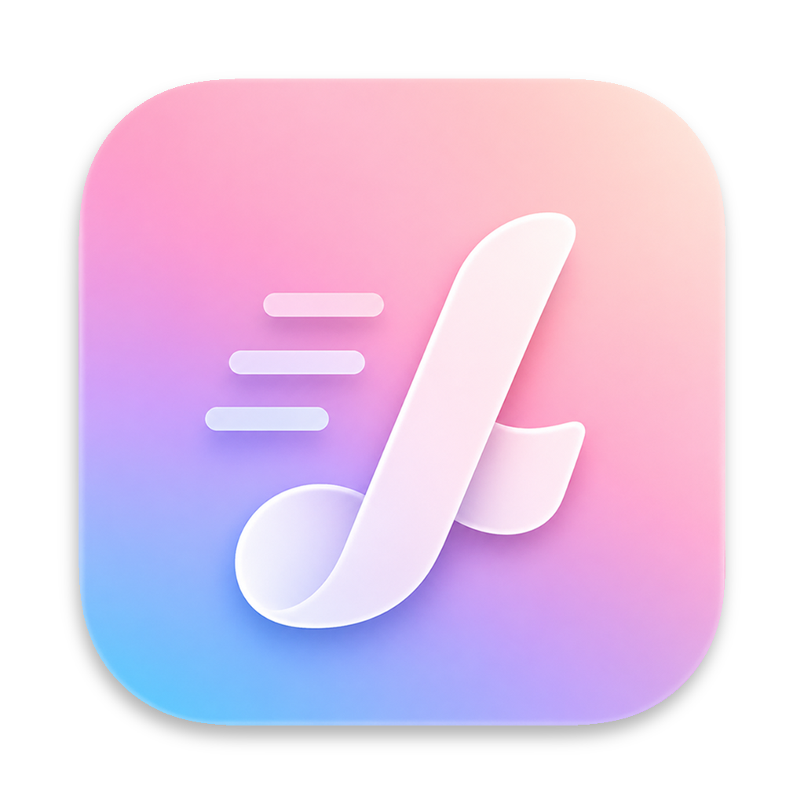

<div align="center">



# LyricsAdapter

**A feature-rich Electron desktop music player with synchronized lyrics display and immersive playback experience**

[](https://reactjs.org/)
[](https://www.typescriptlang.org/)
[](https://vitejs.dev/)
[](https://www.electronjs.org/)
[](https://tailwindcss.com/)
[](LICENSE)

[Features](#-features) • [Quick Start](#-quick-start) • [Usage Guide](#-usage-guide) • [Project Structure](#-project-structure) • [Architecture](#-architecture)

</div>

---

## ✨ Features

### 🎵 Core Playback

- **Multi-format audio support** — Full support for FLAC, MP3 and other common audio formats
- **Smart metadata parsing** — Automatically extract embedded title, artist, album, cover art, and lyrics from audio files
- **LRC lyrics sync** — Parse and display LRC synced lyrics with millisecond precision
- **Complete playback controls** — Play/pause, previous/next track, seek, volume control
- **Multiple playback modes** — Sequential, repeat-one, shuffle

### 🎨 User Interface

- **Elegant UI design** — Glassmorphism effects, responsive layout, smooth animations
- **Immersive mode** — Full-screen display with dynamic album-art-derived background, real-time synchronized lyrics scrolling
- **Virtualized list** — Smooth scrolling for large libraries with drag-and-drop sorting
- **2 built-in themes** — Warm Rice and Classic Blue
- **6 language support** — Chinese, English, Japanese, Korean, German, French

### 🌐 Online Features

- **Multi-quality downloads** — 128kbps, 320kbps, and FLAC lossless
- **Auto metadata write** — Automatically embed lyrics, cover art, and other info after download
- **Song recommendations** — Smart recommendations based on trending charts
- **WebDAV support** — Browse and play music files from WebDAV servers
- **Cloud playback** — Stream remote audio files on-demand, no download required

---

## 🚀 Quick Start

### Prerequisites

- **Node.js** 18.0 or higher
- **npm** 9.0 or higher (or yarn/pnpm)
- **OS**: Windows 10+, macOS 10.15+, Linux (x64/arm64)

### Installation & Setup

1. **Clone the repository**
   ```bash
   git clone https://github.com/yourusername/LyricsAdapter.git
   cd LyricsAdapter
   ```

2. **Install dependencies**
   ```bash
   npm install
   ```

3. **Start development server**
   ```bash
   npm run electron:dev
   ```

4. **Start using**
   - The app window will open automatically
   - Click the "Import Files" button in the sidebar
   - Select audio files (batch selection and multi-format supported)
   - Enjoy your music!

### Other Commands

```bash
# Build for Windows (x64)
npm run electron:build:win

# Build for Windows (ARM64)
npm run electron:build:win:arm64

# Build for macOS
npm run electron:build:mac

# Build for Linux
npm run electron:build:linux

# Build for current platform
npm run electron:build
```

Build artifacts will be output to the `release/` directory.

---

## 📘 Usage Guide

### Library Management

#### Importing Music

- **Method 1**: Click the "Import Files" button in the sidebar and select audio files
- **Method 2**: Drag and drop audio files directly onto the app window
- **Supported formats**: `.flac`, `.mp3`

#### Managing Tracks

- **Search**: Use the search box in the sidebar to quickly find tracks
- **Delete**: Click the delete button on a track, or enter edit mode for batch deletion
- **Reorder**: Drag tracks to customize their order
- **Locate**: Click "Locate Current Track" to quickly find the currently playing track

#### Editing Metadata

1. Switch to the "Metadata" view
2. Select a track from the library
3. Edit title, artist, album, lyrics, and other fields
4. Save changes

#### Search & Download

1. Switch to the "Browse" view
2. Enter a song name, artist, or album name in the search box
3. Click the download button next to a search result
4. Choose quality:
   - **128kbps** — Standard quality, smaller file size
   - **320kbps** — High quality, recommended
   - **FLAC** — Lossless quality, larger file size

Downloaded files are automatically added to your library with complete metadata and lyrics.

#### Setting Download Path

Configure the download folder path in the Settings dialog:
- Use `~` for the user's home directory
- Example: `~/Music` → `/Users/yourname/Music`

### WebDAV Cloud Playback

#### Configuring a WebDAV Server

1. Go to the "Settings" view
2. Find the "WebDAV Settings" section
3. Fill in the following:
   - **Server URL**: WebDAV server URL (e.g. `https://example.com/dav`)
   - **Username**: Authentication username
   - **Password**: Authentication password
   - **Root Directory**: WebDAV root path (optional)

#### Browsing Cloud Music

1. Switch to the "Browse" view
2. Select the "WebDAV" tab
3. Browse the server directory structure
4. Click an audio file to play (no download required)

#### Cloud Playback Features

- **Streaming**: Audio files are loaded on-demand, no local storage used
- **Caching**: Played audio segments are cached
- **Resume playback**: Continue from the last playback position
- **Independent state**: Cloud playback state is saved independently from the local library

### Immersive Playback

Enter immersive mode:
- **Method 1**: Click the "Focus Mode" button on the bottom control bar
- **Method 2**: Use the `Ctrl/Cmd + Enter` shortcut

Immersive mode features:
- Full-screen lyrics display
- Dynamic background colors extracted from the album art
- Automatic lyrics scrolling to the current line
- Click a synced lyric line to seek to that time
- Mouse and keyboard playback controls

### Theme Switching

The app comes with 2 built-in themes: Warm Rice and Classic Blue.

To switch:
1. Click the "Theme" button in the sidebar
2. Preview and select your preferred theme
3. Click "Apply"

### Keyboard Shortcuts

The app provides comprehensive keyboard shortcuts, all customizable.

#### Playback Controls

| Shortcut | Function | Description |
|----------|----------|-------------|
| `Space` | Play/Pause | Toggle playback state |
| `Ctrl/Cmd + ←` | Previous track | Switch to previous track |
| `Ctrl/Cmd + →` | Next track | Switch to next track |
| `←` | Rewind 5s | Seek backward 5 seconds |
| `→` | Fast forward 5s | Seek forward 5 seconds |
| `Alt + ←` | Rewind 30s | Seek backward 30 seconds |
| `Alt + →` | Fast forward 30s | Seek forward 30 seconds |
| `↑` | Volume up | Increase by 1% |
| `↓` | Volume down | Decrease by 1% |
| `Alt + ↑` | Volume up 10% | Increase by 10% |
| `Alt + ↓` | Volume down 10% | Decrease by 10% |
| `M` | Toggle mute | Toggle mute state |
| `Alt + Tab` | Cycle playback mode | Switch between playback modes |

#### Navigation

| Shortcut | Function |
|----------|----------|
| `Ctrl/Cmd + Enter` | Enter/Exit immersive mode |
| `Ctrl/Cmd + F` | Focus search box |
| `Ctrl/Cmd + I` | Import files |
| `Ctrl/Cmd + L` | Go to library |
| `Ctrl/Cmd + B` | Go to browse |
| `Ctrl/Cmd + ,` | Open settings |
| `Ctrl/Cmd + T` | Open themes |
| `Ctrl/Cmd + 1` | Switch to local library |
| `Ctrl/Cmd + 2` | Switch to cloud library |
| `Ctrl/Cmd + M` | Go to metadata view |

#### Customizing Shortcuts

1. Go to the "Settings" view
2. Find the "Shortcuts" section
3. Click the shortcut you want to change
4. Press your new key combination
5. Press `Esc` to cancel, or `Backspace` to clear

---

## 🛠️ Tech Stack

| Technology | Version | Description |
|-----------|---------|-------------|
| **React** | 18.2.0 | UI framework with Hooks and function components |
| **TypeScript** | 5.8.2 | Type-safe JavaScript superset |
| **Vite** | 6.2.0 | Next-gen frontend build tool with fast HMR |
| **Electron** | 40.0.0 | Cross-platform desktop application framework |
| **Tailwind CSS** | 4.1.18 | Utility-first CSS framework |
| **music-metadata** | 11.11.0 | Audio metadata parsing (read) |
| **node-id3** | 0.2.9 | MP3 metadata writer |
| **flac-metadata** | 0.1.1 | FLAC metadata read/write |
| **idb** | 8.0.3 | IndexedDB wrapper (deprecated, using file system) |
| **probe-image-size** | 7.2.3 | Image size detection |

### Build Tools

- **Vite Plugin Electron** — Electron integration plugin
- **Vite Plugin Electron Renderer** — Electron renderer plugin
- **Electron Builder** — Cross-platform packager
- **cross-env** — Cross-platform environment variables

---

## 📁 Project Structure

```
LyricsAdapter/
├── components/              # React components
│   ├── BrowseView.tsx       # Online browse & download view
│   ├── Controls.tsx         # Playback controls (seekbar, play controls, volume)
│   ├── CookieDialog.tsx     # Cookie configuration dialog
│   ├── ErrorBoundary.tsx    # Error boundary component
│   ├── FocusMode.tsx        # Immersive lyrics mode (Canvas dynamic bg, LRC sync)
│   ├── GlobalSearch.tsx     # Global search dialog
│   ├── LibraryToolbar.tsx   # Library toolbar (filter, sort, edit mode)
│   ├── LibraryTrackRow.tsx  # Library track row component
│   ├── LibraryView.tsx      # Library view (list, category filter, edit mode)
│   ├── LyricsOverlay.tsx    # Lyrics overlay component
│   ├── MainPlayer.tsx       # Main player view
│   ├── MetadataEditorPopup.tsx # Inline metadata editor popup
│   ├── MetadataView.tsx     # Metadata editor view
│   ├── QueuePanel.tsx       # Play queue panel
│   ├── SearchBox.tsx        # Global search box
│   ├── SettingsDialog.tsx   # Settings dialog
│   ├── SettingsView.tsx     # Settings view
│   ├── ShortcutsSettings.tsx# Shortcut settings component
│   ├── Sidebar.tsx          # Sidebar navigation
│   ├── ThemeView.tsx        # Theme selection view
│   ├── TitleBar.tsx         # Custom window title bar
│   └── TrackCover.tsx       # Cover display component
├── hooks/                   # Custom React Hooks
│   ├── useAppLifecycle.ts   # App lifecycle management
│   ├── useBlobUrls.ts       # Blob URL management (auto-release)
│   ├── useFloatingPanel.ts  # Floating panel state
│   ├── useImport.ts         # File import logic (desktop + browser)
│   ├── useLibraryActions.ts # Library operations (delete, reload, reorder)
│   ├── useLibraryCloudSync.ts # Cloud library sync
│   ├── useLibraryLoad.ts    # Library load/save
│   ├── useLibrarySlots.ts   # Library slot management (separate playback contexts)
│   ├── useLibraryVirtualScroll.ts # Virtual scrolling
│   ├── usePlayback.ts       # Playback control logic
│   ├── useQQMusicIntegration.ts # QQ Music integration
│   ├── useShortcuts.ts      # Keyboard shortcuts
│   ├── useWebDAV.ts         # WebDAV client integration
│   ├── useWindowControls.ts # Window controls
│   └── useWindowFocus.ts    # Window focus detection
├── services/                # Business logic services
│   ├── cookieManager.ts     # Cookie management
│   ├── coverArtService.ts   # Cover art service (extract, cache)
│   ├── dataValidator.ts     # Data validation
│   ├── debugCommands.ts     # Debug command registration
│   ├── desktopAdapter.ts    # Electron API adapter
│   ├── i18n.ts              # Internationalization (6 languages)
│   ├── indexedDBStorage.ts  # IndexedDB storage (deprecated)
│   ├── librarySerializer.ts # Library serialization
│   ├── libraryStorage.ts    # Library storage (file system)
│   ├── logger.ts            # Logging service (levels, scopes)
│   ├── metadataCacheService.ts # Metadata cache
│   ├── metadataService.ts   # Audio metadata parsing
│   ├── notificationService.ts # System notification service
│   ├── qqMusicApi.ts        # QQ Music API integration
│   ├── settingsManager.ts   # App settings management
│   ├── shortcuts.ts         # Shortcut management
│   ├── themeManager.ts      # Theme management
│   ├── webdavClient.ts      # WebDAV client
│   ├── webdavMetaService.ts # WebDAV metadata service
│   ├── themes/              # Theme configurations
│   │   └── predefinedThemes.ts
│   ├── webdav/              # WebDAV submodules
│   └── workers/             # Web Workers
├── electron/                # Electron main process
│   ├── main.ts              # Main process entry
│   └── preload.ts           # Preload script
├── utils/                   # Utility functions
│   ├── trackProcessor.ts    # Track processing utilities
│   └── errorHandler.ts      # Error handling
├── constants/               # Constants
│   └── config.ts            # App configuration constants
├── types/                   # TypeScript type definitions
├── App.tsx                  # Main app component
├── types.ts                 # Global types (Track, PlaybackContext, LibrarySlot, etc.)
├── index.tsx                # App entry point
├── vite.config.ts           # Vite configuration
├── tsconfig.json            # TypeScript configuration
├── package.json             # Project dependencies
├── README.md                # Project documentation (Chinese)
└── README.en.md             # Project documentation (English)
```

---

### Data Flow

#### File Import Flow

```
User selects files
    ↓
File dialog (Electron IPC)
    ↓
Metadata parsing (metadataService)
    ↓
Cover extraction & caching (coverArtService)
    ↓
Track object creation (lazy audioUrl)
    ↓
Save to library (libraryStorage)
    ↓
UI update
```

#### Playback Flow

```
User clicks play
    ↓
Select track (selectTrack)
    ↓
Check audioUrl
    ↓
If missing → lazy-load file (desktopAPI.readFile)
    ↓
Create Blob URL
    ↓
HTML Audio element playback
    ↓
Preload adjacent tracks (500ms delay)
```

#### WebDAV Playback Flow

```
User browses WebDAV directory
    ↓
WebDAV PROPFIND call (webdavClient.browseDirectory)
    ↓
Parse XML response, get file list
    ↓
User selects audio file
    ↓
Get redirect URL (webdavClient.getRedirectUrl)
    ↓
Stream audio via Range requests (webdavClient.getRange)
    ↓
Create Track object (source: 'webdav')
    ↓
Add to cloud library slot
    ↓
On-demand audio loading during playback
```

### State Management

The app uses React Hooks for state management with a **separate playback context** architecture:

#### Library Slots
The app maintains two independent library slots, each with its own complete playback state:

```typescript
interface LibrarySlot {
  id: 'local' | 'cloud';      // Slot ID: local or cloud
  tracks: Track[];            // Track list
  currentTrackIndex: number;  // Current track index
  currentTime: number;        // Current playback time
  volume: number;             // Volume
  playbackMode: 'order' | 'shuffle' | 'repeat-one'; // Playback mode
  scrollPosition: number;     // Scroll position
  filterType: 'default' | 'album' | 'artist'; // Filter type
  categorySelection: string | null; // Category selection
}
```

#### Key State
- **`slots`** — Slot collection (local and cloud)
- **`activeSlotId`** — Currently active slot identifier
- **`activeSlot`** — Currently active slot
- **`viewMode`** — Current view mode
- **`isFocusMode`** — Whether in immersive mode
- **`searchInputValue`** — Search input value

#### Switching Behavior
- Saves current playback state to the corresponding slot when switching lists
- Playback pauses, no auto-play
- Target list's playback state is restored (progress, volume, mode)
- `isPlaying` is always set to `false` after switching (requires manual play)

### Persistence

- **Library**: `userData/library.json` and `userData/library-index.json`
- **Cover cache**: `userData/covers/`
- **Settings**: `localStorage`
- **Theme**: `localStorage`
- **Shortcuts**: `localStorage`
- **Cookie**: `localStorage` (encrypted)

---

## ❓ FAQ

### 1. How do I batch import music?

**Methods**:
- Hold `Ctrl` (Windows/Linux) or `Cmd` (macOS) in the file picker dialog to multi-select
- Drag and drop a folder directly onto the app window

### 2. Where is app data stored?

**Storage locations**:
- **macOS**: `~/Library/Application Support/lyrics-adapter/`
- **Windows**: `%APPDATA%/lyrics-adapter/`
- **Linux**: `~/.config/lyrics-adapter/`

**Contents**:
- `library-index.json` — Library index and WebDAV metadata
- `covers/` — Cover image cache

### 3. How do I migrate my library?

**Steps**:
1. Back up the data directory listed above
2. Install the app on the new device
3. Copy the backup data directory to the corresponding location
4. Restart the app

### 4. What audio formats are supported?

**Supported formats**:
- **FLAC** — Lossless compression (recommended)
- **MP3** — Universal lossy compression

### 5. How do I customize keyboard shortcuts?

**Steps**:
1. Go to the "Settings" view
2. Find the "Shortcuts" section
3. Click the shortcut you want to modify
4. Press your new key combination
5. Press `Esc` to cancel, or `Backspace` to clear

---

## 📄 License

This project is licensed under GPLv3 — see the [LICENSE](LICENSE) file for details.
The app icon is licensed under CC BY 4.0 — see the [app-icon-LICENSE](app-icon-LICENSE) file for details.

---

## 🙏 Acknowledgments

### Core Dependencies

- [React](https://reactjs.org/) — UI framework
- [TypeScript](https://www.typescriptlang.org/) — Type safety
- [Vite](https://vitejs.dev/) — Build tool
- [Electron](https://www.electronjs.org/) — Desktop app framework
- [Tailwind CSS](https://tailwindcss.com/) — CSS framework
- [music-metadata](https://github.com/Borewit/music-metadata) — Audio metadata parser

### Icons & Design

- [Material Symbols](https://fonts.google.com/symbols) — Icon library
