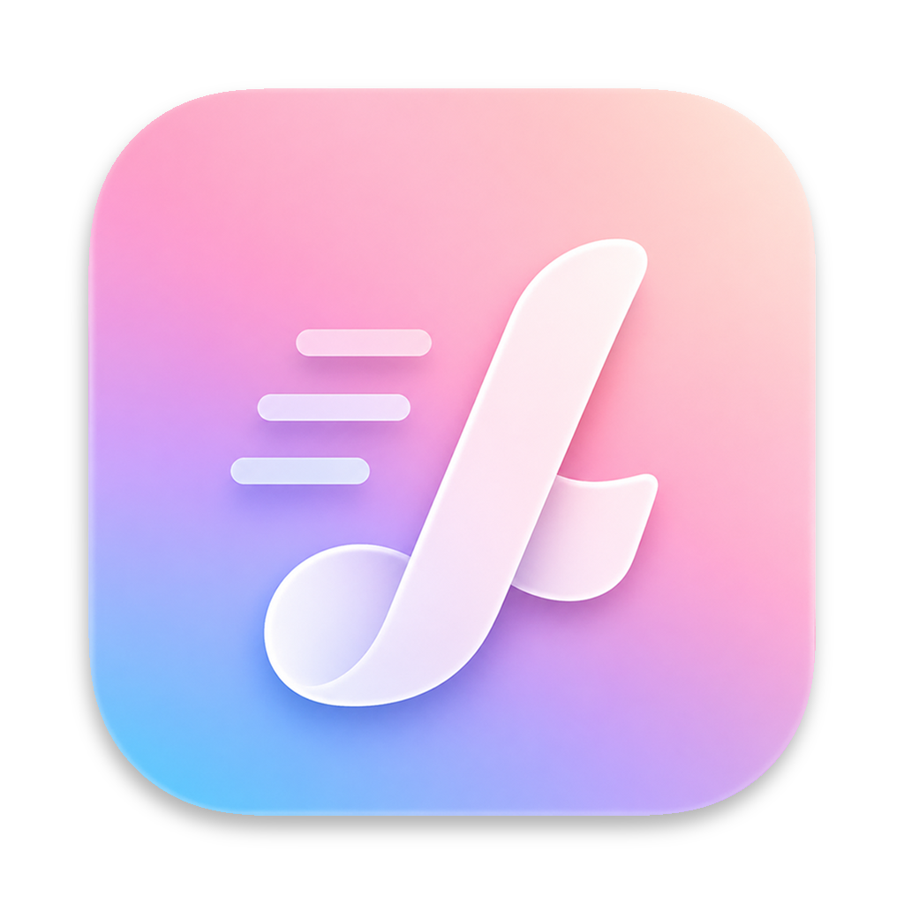
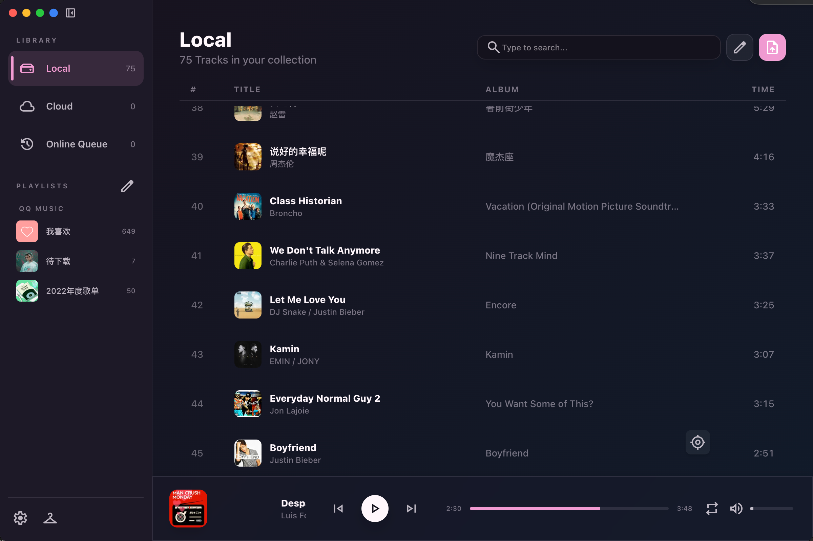
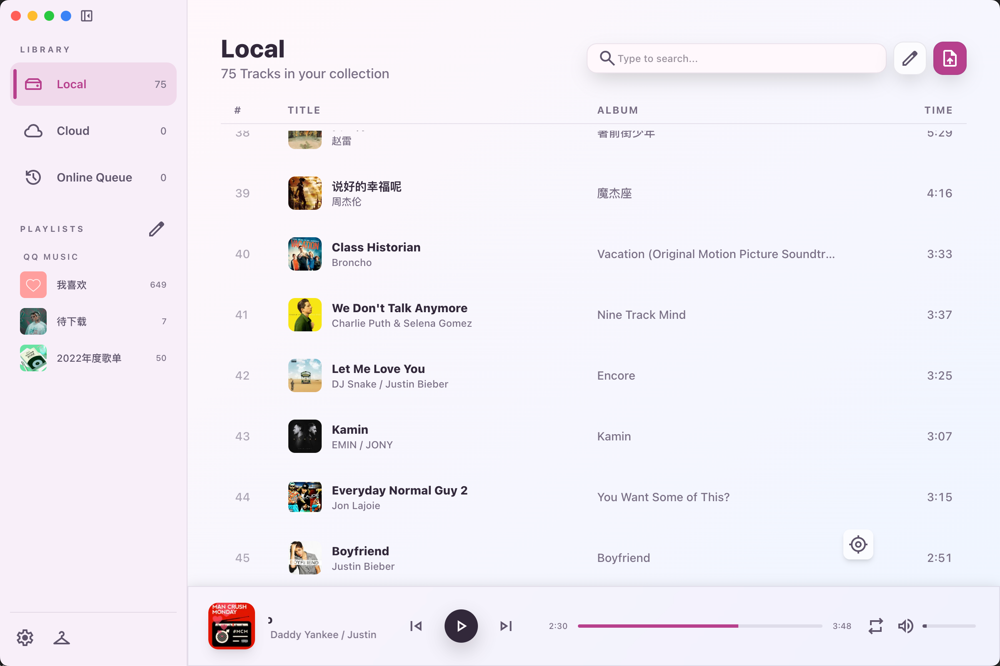
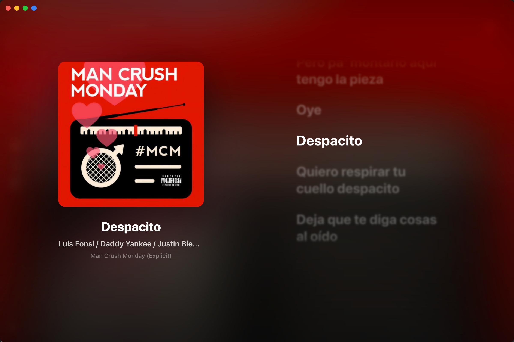
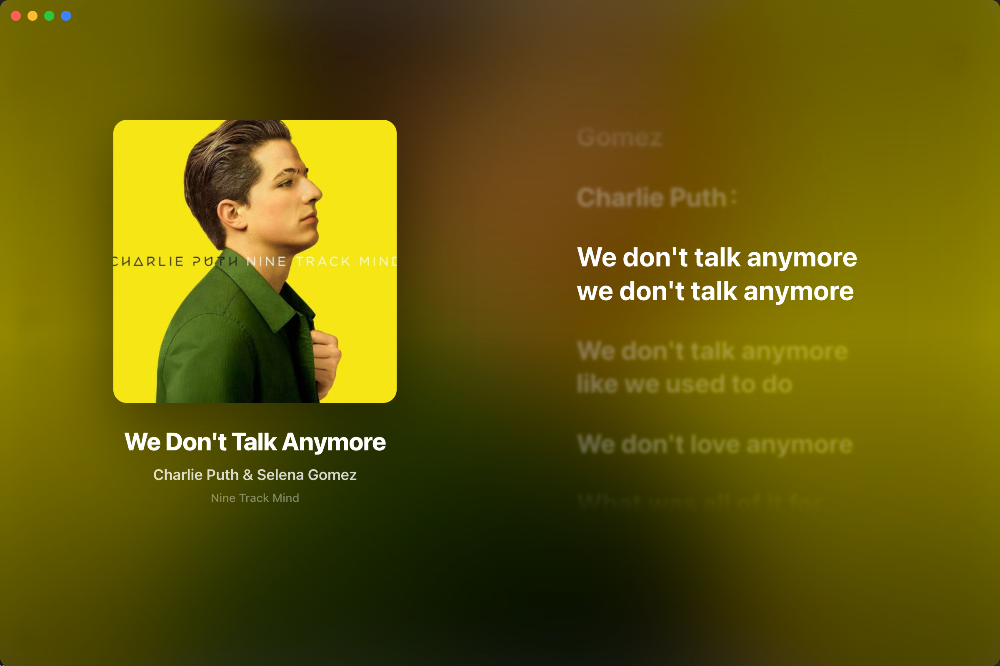

<div align="center">



# LyricsAdapter

**A feature-rich Electron desktop music player with synchronized lyrics display and immersive playback experience**

[](https://reactjs.org/)
[](https://www.typescriptlang.org/)
[](https://vitejs.dev/)
[](https://www.electronjs.org/)
[](https://tailwindcss.com/)
[](LICENSE)

[Features](#-features) • [Preview](#-preview) • [Quick Start](#-quick-start) • [Usage Guide](#-usage-guide) • [Project Structure](#-project-structure) • [Architecture](#️-architecture)

</div>

---

## ✨ Features

### 🎵 Core Playback

- **Multi-format audio support** — Full support for FLAC, MP3 and other common audio formats
- **Smart metadata parsing** — Automatically extract embedded title, artist, album, cover art, and lyrics from audio files (Rust lofty engine)
- **Synced lyrics** — LRC lyrics with millisecond precision; word-by-word QRC/YRC karaoke lyrics from online providers, persisted back into custom audio tags
- **Streaming local playback** — Local files are streamed via the custom `audio://` protocol with Range requests, never fully loaded into memory
- **Complete playback controls** — Play/pause, previous/next track, seek, volume control
- **System media integration** — Publishes metadata, artwork, and playback actions to macOS Control Center and Windows system media controls
- **System lyrics** — Live lyrics in the macOS menu bar; on Windows, Electron HTML/CSS renders the Fluent-style UI while an independently implemented C++ Node-API/Win32 bridge embeds the lyrics window into the taskbar
- **Multiple playback modes** — Sequential, repeat-one, shuffle

### 🎨 User Interface

- **Elegant UI design** — Glassmorphism effects with GSAP-driven page and transition animations
- **Immersive mode** — Full-screen display with dynamic album-art-derived background, real-time synchronized lyrics scrolling
- **Virtualized list** — Smooth scrolling for large libraries with drag-and-drop sorting
- **Pinyin search** — Search Chinese tracks by pinyin initials or full pinyin
- **5 built-in themes** — Default Dark, Default Light, Classic Blue, Warm Rice, Brutalist Yellow
- **6 language support** — Chinese, English, Japanese, Korean, German, French (i18next)

### 🌐 Online & Cloud

- **Multiple online providers** — QQ Music and NetEase Cloud Music, switchable in settings
- **QR login** — Scan-to-login for QQ Music and NetEase Cloud Music to unlock high quality and playlists
- **Search, stream & download** — Search, preview via streaming, download at 128kbps / 320kbps / FLAC with tags and lyrics written automatically
- **Playlists** — Browse and play third-party playlists with a dedicated play context
- **WebDAV cloud library** — Browse and stream music from WebDAV servers; upload from local files or online providers
- **Auto update** — Built-in electron-updater checks for new releases in-app

### 💾 Data Management

- **SQLite persistence** — Library and settings live in `~/.la/state.sqlite3`, independent of Chromium's clearable cache
- **Four play slots** — Local / Cloud / Online / Playlist each save their own progress, volume, and browsing state
- **Cover cache** — Embedded covers extracted to `userData/covers/`, served through the `cover://` protocol with on-demand downscaling

---

## 🎬 Preview

### Main Interface
A clean library view with independent local/cloud play contexts, batch import, pinyin search, editing, and drag-and-drop sorting



The category view groups your library by album or artist for one-click browsing



### Immersive Lyrics Mode
Full-screen experience with a dynamic background following the cover colors and real-time synced lyrics




---

## 🚀 Quick Start

### Prerequisites

- **Node.js** 24.19.x
- **npm** 9.0 or higher (or yarn/pnpm)
- **OS**: Windows 10+, macOS 10.15+, Linux (x64/arm64)
- **Windows native bridge**: source installs require Visual Studio 2022 with **Desktop development with C++** and Python 3; `npm install` compiles for the current Electron/architecture automatically, or run `npm run native:rebuild:taskbar -- --force`
- **macOS native bridge**: source installs require Xcode Command Line Tools and Python 3; `npm install` compiles for the current Electron/architecture automatically, or run `npm run native:rebuild:macos-statusbar -- --force`

### Installation & Setup

1. **Clone the repository**
   ```bash
   git clone https://github.com/xwsjjctz/LyricsAdapter.git
   cd LyricsAdapter
   ```

2. **Install dependencies**
   ```bash
   npm install
   ```

3. **Start the dev server**
   ```bash
   npm run electron:dev
   ```

4. **Start using it**
   - The app window opens automatically
   - Click "Import Files" in the sidebar
   - Select audio files (batch selection and multiple formats supported)
   - Enjoy your music!

### Other Commands

```bash
# Browser-only renderer dev server
npm run dev

# Electron with CDP / main-process debug ports
npm run electron:debug

# Type-check, unit tests, and production build
npm run check

# Real Electron smoke test
npm run test:e2e

# Build for Windows (x64)
npm run electron:build:win

# Build for Windows (ARM64)
npm run electron:build:win:arm64

# Build for macOS
npm run electron:build:mac

# Build for Linux
npm run electron:build:linux

# Build for the current platform
npm run electron:build
```

Build artifacts are output to `release/`.

---

## 📘 Usage Guide

### Library Management

#### Importing Music

- **Option 1**: Click "Import Files" in the sidebar and select audio files
- **Option 2**: Drag and drop audio files onto the app window
- **Supported formats**: `.flac`, `.mp3`

#### Managing Tracks

- **Search**: Use the sidebar search box (pinyin supported for Chinese titles)
- **Delete**: Click the delete button on a track, or use edit mode for batch deletion
- **Sort**: Drag tracks to reorder them
- **Locate**: Click "Jump to current track" to scroll to the playing track

#### Editing Metadata

1. Switch to the "Metadata" view
2. Select a track from the library
3. Edit title, artist, album, lyrics, etc.
4. Save changes (written back to file tags)

### Online Music

#### Configuring Providers

1. Open the "Settings" view and pick QQ Music / NetEase Cloud Music under "Online Source"
2. For high quality or playlists, scan the QR code in settings to log in

#### Search & Download

1. Switch to the "Browse" view
2. Type a song, artist, or album name in the search box
3. Click a result to preview it (streaming)
4. Click download or upload and pick a quality:
   - **128kbps** — standard quality, smaller files
   - **320kbps** — high quality, recommended
   - **FLAC** — lossless, larger files

Downloaded files get full metadata, cover art, and lyrics (including word-by-word lyrics) written automatically and are added to the local library; you can also upload them straight to WebDAV.

#### Playlists

Open the playlist tab in the "Browse" view to browse and play third-party playlists. Playlists use a dedicated play context and never disturb your library state.

#### Download Location

Configure the download folder in settings:
- `~` stands for the user home directory
- e.g. `~/Music` → `/Users/your-name/Music`

### WebDAV Cloud Playback

#### Configuring a WebDAV Server

1. Open the "Settings" view
2. Find the "WebDAV Settings" section
3. Fill in:
   - **Server URL**: WebDAV server URL (e.g. `https://example.com/dav`)
   - **Username**: auth username
   - **Password**: auth password
   - **Root directory**: optional root path

#### Browsing Cloud Music

1. Switch to the "Cloud" library
2. Browse the server directory tree
3. Click an audio file to play it instantly (no download)

#### Cloud Playback Notes

- **Streaming**: audio is loaded on demand through proxied Range requests, no local storage used
- **Metadata cache**: remote metadata and file-list snapshots are cached in IndexedDB for instant re-entry
- **Independent state**: cloud playback state is saved separately from the local library

### Immersive Playback

Enter immersive mode:
- **Option 1**: Click the "Focus Mode" button in the bottom control bar
- **Option 2**: Press `Ctrl/Cmd + Enter`

Immersive mode features:
- Full-screen lyrics
- Dynamic background color extracted from the cover
- Lyrics auto-scroll to the current line
- Click a lyric line to seek to that timestamp
- Mouse and keyboard playback control

### Theme Switching

The app ships with 5 themes: Default Dark, Default Light, Classic Blue, Warm Rice, Brutalist Yellow.

To switch:
1. Click the "Theme" button in the sidebar
2. Preview and pick a theme
3. Click "Apply"

### Keyboard Shortcuts

Full keyboard shortcut support, all customizable.

#### Playback

| Shortcut | Action | Notes |
|----------|--------|-------|
| `Space` | Play/Pause | Toggle playback |
| `Ctrl/Cmd + ←` | Previous track | |
| `Ctrl/Cmd + →` | Next track | |
| `←` | Seek back 5s | |
| `→` | Seek forward 5s | |
| `Alt + ←` | Seek back 30s | |
| `Alt + →` | Seek forward 30s | |
| `↑` | Volume up | +1% |
| `↓` | Volume down | −1% |
| `Alt + ↑` | Volume up 10% | +10% |
| `Alt + ↓` | Volume down 10% | −10% |
| `M` | Mute/Unmute | |
| `Tab` | Cycle playback mode | |

#### Navigation

| Shortcut | Action |
|----------|--------|
| `Ctrl/Cmd + Enter` | Toggle immersive mode |
| `Ctrl/Cmd + F` | Focus search box |
| `Ctrl/Cmd + B` | Go to Browse |
| `Ctrl/Cmd + Shift + M` | Go to Metadata view |
| `Ctrl/Cmd + ,` | Open Settings |
| `Ctrl/Cmd + T` | Open Themes |

#### Customizing Shortcuts

1. Open the "Settings" view
2. Go to the "Shortcuts" section
3. Click the shortcut you want to change
4. Press the new key combination
5. `Esc` cancels, `Backspace` clears

---

## 🛠️ Tech Stack

| Technology | Version | Purpose |
|------------|---------|---------|
| **React** | 18.2.0 | UI framework with Hooks and function components |
| **TypeScript** | ~5.8.2 | Type-safe JavaScript superset |
| **Vite** | ^8.1.0 | Next-generation build tool with fast HMR |
| **Electron** | ^42.5.0 | Cross-platform desktop framework |
| **C++ Node-API / Win32** | Node-API 8 | Windows taskbar child-window bridge; the UI remains Electron HTML/CSS |
| **Tailwind CSS** | ^4.3.1 | Utility-first CSS framework |
| **GSAP** | ^3.15.0 | Page transitions and animations |
| **music-tag-native** | ^1.0.0 | Audio metadata read/write (Rust lofty engine) |
| **@applemusic-like-lyrics/lyric** | ^1.0.2 | Word-by-word QRC/YRC lyric parsing |
| **i18next / react-i18next** | ^26 / ^17 | Internationalization (6 languages) |
| **zod** | ^4.4.3 | Typed IPC payload validation |
| **electron-updater** | ^6.3.9 | In-app auto updates |
| **node:sqlite** | built-in | User state persistence (`~/.la/state.sqlite3`) |

### Build Tools

- **Vite Plugin Electron** — Electron integration
- **Electron Builder** — Cross-platform packaging
- **node-gyp / @electron/rebuild** — Source builds of Node-API modules for the current Electron version and system architecture
- **cross-env** — Cross-platform environment variables

---

## 📁 Project Structure

```
LyricsAdapter/
├── electron/                # Electron main process
│   ├── main.ts              # Entry: protocols, IPC, window, updater
│   ├── preload.ts           # contextBridge exposing a controlled window.electron
│   ├── windowManager.ts     # Frameless window and window state
│   ├── native/              # Node-API bridge loading, validation, and platform fallback
│   ├── protocols/           # Custom protocols: audio:// cover:// stream:// app://
│   ├── ipc/                 # typed + legacy IPC handlers (files, library, WebDAV, providers, login…)
│   └── services/            # SQLite user-state repository, audio metadata, settings store
├── native/
│   └── windows-taskbar-native/ # Independently implemented C++ Node-API/Win32 taskbar child bridge
├── src/                     # Renderer (React)
│   ├── App.tsx              # Root composition + ErrorBoundary (wiring only)
│   ├── components/          # UI components (new-ui/, focus-mode/, settings/, legacy/)
│   ├── controllers/         # Player/library controllers (the only state mutators)
│   ├── viewmodels/          # View-facing data models
│   ├── stores/              # Hook aggregation (library / player / import / ui)
│   ├── hooks/               # Business hooks (playback, import, WebDAV, shortcuts…)
│   ├── services/            # desktopAdapter, libraryStorage, metadataService,
│   │                        # qqMusicApi / neteaseMusicApi,
│   │                        # onlineMusicProvider, webdavClient, themes, i18n…
│   ├── domain/              # Pure domain rules
│   ├── repositories/        # Data access wrappers
│   ├── shared/              # LRC/QRC/YRC parsing, persistence policy, schemas
│   ├── taskbar-lyrics/      # Dedicated HTML/CSS renderer for Windows taskbar lyrics
│   └── i18n/                # Locale files for 6 languages
├── test/                    # Vitest unit tests + Playwright Electron E2E
├── docs/                    # Architecture & development docs (overview / playback-flow / …)
└── resource/                # Screenshots and doc assets
```

> UI components never mutate state directly; user intent flows up through callbacks into controllers. Playback always goes through the player controller and library changes through the library controller. See the ownership boundaries in [AGENTS.md](AGENTS.md).

---

## 🏗️ Architecture

### Data Flow

#### File Import

```
User selects files (dialog / drag & drop)
    ↓
Paths enter the main-process allowlist (typed IPC)
    ↓
Metadata parsing (music-tag-native / metadataService)
    ↓
Cover extraction & caching (userData/covers → cover://)
    ↓
Track objects created
    ↓
Library persisted (librarySerializer → SQLite)
    ↓
UI updated
```

#### Playback

```
User plays a track (player controller)
    ↓
URL picked by Track.source:
  - local   → audio://<path> (streamed Range responses from the main process)
  - webdav  → proxied HTTP Range requests
  - qq/netease → stream:// (cookie injection, CDN resolution, Range forwarding)
    ↓
HTML <audio> plays; progress/volume/mode sync back to the slot
    ↓
Adjacent tracks preloaded
```

#### Online Music

```
User searches / opens a playlist (BrowseView)
    ↓
onlineMusicProvider (qq / netease normalized to OnlineSong)
    ↓
Play → streaming preview via stream://
Download → downloadAndSave + writeAudioMetadata (tags/cover/QRC lyrics)
Upload → read bytes and PUT to WebDAV
    ↓
Merged into the local / cloud slot
```

#### Windows Taskbar Lyrics

```
Playback snapshot → typed IPC → dedicated Electron BrowserWindow (HTML/CSS)
    ↓
BrowserWindow HWND → C++ Node-API/Win32 bridge
    ↓
SetParent taskbar embedding + window-region / DPI-aware placement
```

The isolated Electron page owns the lyrics, artwork, and Fluent-style presentation. The Windows-only C++ bridge is limited to HWND handling, the taskbar parent/child relationship, window regions, and placement. It is independently implemented in this repository and does not require a C#/.NET helper process. See the [third-party notices](docs/THIRD_PARTY_NOTICES.md) for design and licensing details.

### Library Slots

The app maintains four independent slots, each storing `tracks`, current index, progress, volume, playback mode, scroll position, and filter state:

| Slot | Purpose | Sidebar entry |
|------|---------|---------------|
| `local` | Imported local library | Yes |
| `cloud` | WebDAV cloud library | Yes |
| `online` | Online preview history (LRU) | Yes |
| `playlist` | Playlist play context | No (backs the Playlists view) |

The active play context is `activeSlotId` while the library panel browses `viewSlot` — the two can differ, e.g. playing a playlist while browsing the local library. Switching slots restores that slot's state and always resets `isPlaying` to `false`.

### Persistence

| Data | Location |
|------|----------|
| Library membership, settings, user state | `~/.la/state.sqlite3` (auto-imported from legacy JSON on first run) |
| Cover cache | `userData/covers/` (downscaled on demand via `cover://`) |
| Metadata cache, WebDAV snapshots | IndexedDB (renderer side, LRU) |
| Browser-mode library | IndexedDB + localStorage |

> User data lives in `~/.la` instead of Chromium's userData directory, so "clear browser data" never wipes your library.

---

## 📚 Development Docs

### Dev Environment Setup

1. **Clone and install**
   ```bash
   git clone https://github.com/xwsjjctz/LyricsAdapter.git
   cd LyricsAdapter
   npm install
   ```

2. **Start the dev server**
   ```bash
   npm run electron:dev
   ```

3. **Tooling**
   - Chromium DevTools / CDP — renderer, DOM, network, and console debugging
   - Node Inspector — main-process breakpoint debugging
   - Playwright MCP — AI agents inspecting and driving Electron over CDP

   See [DEBUGGING.md](DEBUGGING.md) for the full workflow and
   [docs/architecture/overview.md](docs/architecture/overview.md) for architecture details.

### Code Conventions

- **Components**: function components and Hooks
- **Types**: TypeScript types for all Props and State
- **Naming**: PascalCase for components, camelCase otherwise
- **Styling**: Tailwind CSS classes
- **Logging**: use the `logger` service, never `console.*`
- **Boundaries**: UI never mutates state; playback goes through the player controller, library changes through the library controller

### Adding Features

1. **New component**
   - Create a `.tsx` file under the matching `src/components/` subdirectory
   - Define a Props interface and emit user intent through callbacks
   - Style with Tailwind CSS

2. **New service**
   - Create a `.ts` file under `src/services/`
   - Desktop capabilities go through `services/desktopAdapter.ts` only
   - New online providers plug in by implementing the `OnlineMusicProvider` interface

3. **New types**
   - Add them in `src/types.ts` or `src/types/`
   - Strict mode is enforced

4. **New theme**
   - Add the theme config in `src/services/themes/predefinedThemes.ts`
   - Add name/description translations under `src/i18n/locales/`

### Debugging Tips

For cross-process debugging (renderer / preload / main), run `npm run electron:debug` first, then follow [DEBUGGING.md](DEBUGGING.md) to attach CDP, MCP, or VS Code.

1. **Logs**
   - Dev: `logger.debug()` / `logger.info()` in the console
   - Production: only `logger.warn()` / `logger.error()` are shown

2. **IPC**
   ```typescript
   logger.debug('[App] IPC call:', result);
   ```

3. **State**
   ```typescript
   useEffect(() => {
     logger.debug('[Component] State changed:', state);
   }, [state]);
   ```

---

## ❓ FAQ

### 1. How do I batch import music?

- Multi-select files with `Ctrl` (Windows/Linux) or `Cmd` (macOS) in the file dialog
- Or drag & drop files onto the app window

### 2. Where is app data stored?

- **Library & settings**: `~/.la/state.sqlite3` (same on every platform, separate from app caches)
- **Cover cache**:
  - **macOS**: `~/Library/Application Support/lyrics-adapter/covers/`
  - **Windows**: `%APPDATA%/lyrics-adapter/covers/`
  - **Linux**: `~/.config/lyrics-adapter/covers/`

### 3. How do I migrate my library?

1. Back up `~/.la/state.sqlite3` and your audio files
2. Install the app on the new device
3. Restore the database file to the same location; keep audio file paths unchanged (or re-import)
4. Restart the app

### 4. What audio formats are supported?

- **FLAC** — lossless (recommended)
- **MP3** — ubiquitous lossy

### 5. Online provider won't play or quality is limited?

Some providers require login for full quality and playlists: open "Settings", pick the provider, and scan the QR code. Login state is stored locally as encrypted cookies.

### 6. How do I customize keyboard shortcuts?

1. Open the "Settings" view
2. Go to the "Shortcuts" section
3. Click the shortcut you want to change
4. Press the new key combination
5. `Esc` cancels, `Backspace` clears

---

## 📄 License

This project is licensed under GPL — see the [LICENSE](LICENSE) file for details.
The app icon is licensed under CC BY 4.0 — see [app-icon-LICENSE](app-icon-LICENSE).
Third-party source and design acknowledgments are listed in the [third-party notices](docs/THIRD_PARTY_NOTICES.md).

---

## 🙏 Acknowledgments

### Core Dependencies

- [React](https://reactjs.org/) — UI framework
- [TypeScript](https://www.typescriptlang.org/) — Type safety
- [Vite](https://vitejs.dev/) — Build tooling
- [Electron](https://www.electronjs.org/) — Desktop framework
- [Tailwind CSS](https://tailwindcss.com/) — CSS framework
- [GSAP](https://gsap.com/) — Animation engine
- [music-tag-native](https://github.com/subframe7536/music-tag-native) — Audio metadata read/write
- [@applemusic-like-lyrics/lyric](https://github.com/Steve-xmh/applemusic-like-lyrics) — Word-by-word lyric parsing

### Icons & Design

- [Material Symbols](https://fonts.google.com/symbols) — Icon library
