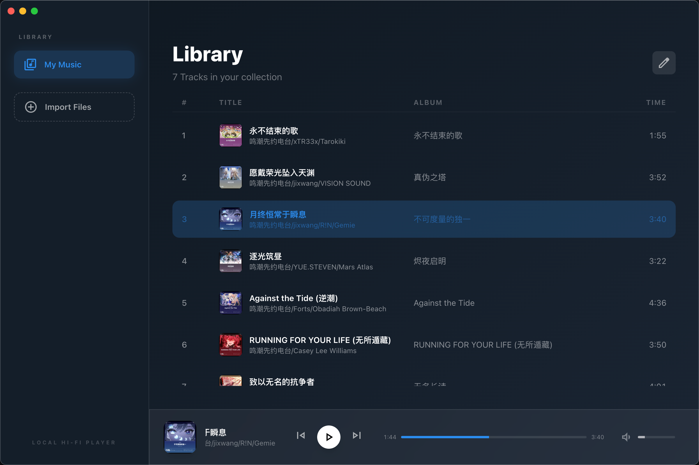
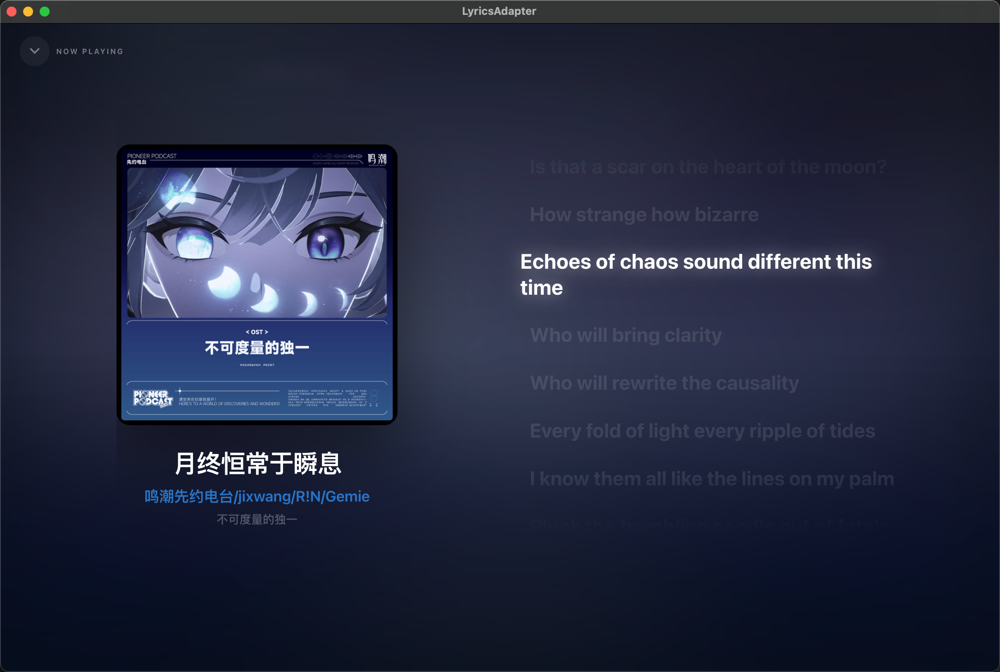
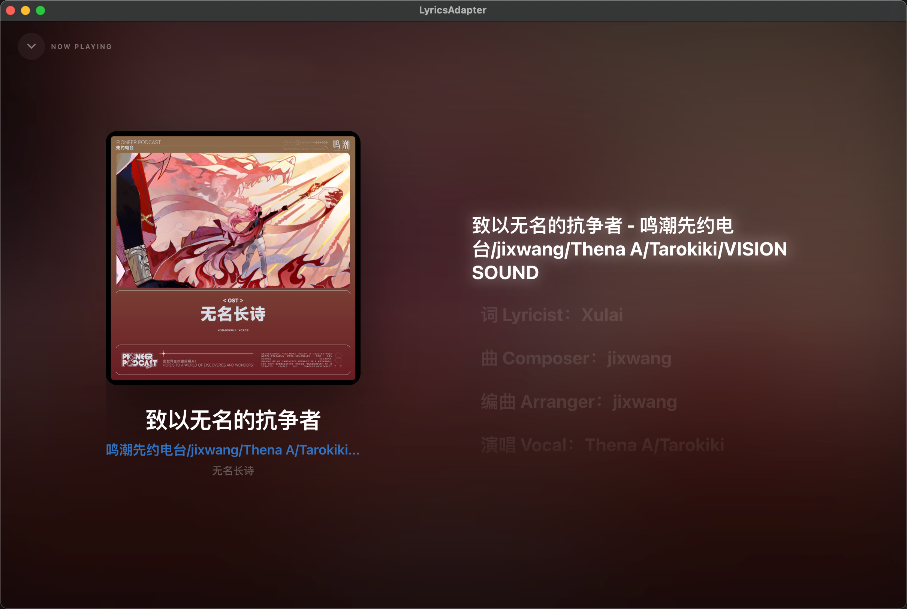

# LyricsAdapter

<div align="center">

**一个功能丰富的本地音乐播放器，专注于歌词同步显示和沉浸式播放体验**

[](https://reactjs.org/)
[](https://www.typescriptlang.org/)
[](https://vitejs.dev/)
[](LICENSE)

</div>

## ✨ 功能特性

- 🎵 **多格式支持** - 支持 FLAC、MP3、M4A、 WAV 等常见音频格式
- 📝 **智能歌词解析** - 自动提取并同步显示 LRC 格式歌词，支持时间戳精确同步
- 🖼️ **封面显示** - 自动提取音频文件内嵌的封面图片，支持多种标签格式
- 🎭 **沉浸式模式** - 全屏显示，动态背景跟随封面色调，歌词滚动同步
- 🎚️ **完整播放控制** - 播放/暂停、上一曲/下一曲、进度调节、音量控制
- 🎨 **精美 UI 设计** - 玻璃拟态效果、响应式布局、平滑动画过渡
- 📚 **本地播放** - 完全在浏览器中运行，无需后端服务器，保护隐私

## 🎬 界面预览

### 主界面
简洁优雅的曲库管理界面，支持批量导入和编辑模式



### 沉浸式歌词模式
全屏沉浸体验，动态背景跟随封面色调，歌词实时同步滚动




## 🚀 快速开始

### 前置要求

- Node.js 16+
- npm 或 yarn

### 安装与运行

1. **克隆仓库**
   ```bash
   git clone https://github.com/yourusername/LyricsAdapter.git
   cd LyricsAdapter
   ```

2. **安装依赖**
   ```bash
   npm install
   ```

3. **启动开发服务器**
   ```bash
   npm run dev
   ```

4. **打开浏览器**

   访问 http://localhost:3000

5. **导入音乐**

   点击侧边栏的导入按钮，选择音频文件（支持批量选择）

### 其他命令

```bash
npm run build    # 构建生产版本
npm run preview  # 预览生产构建
```

## 🛠️ 技术栈

| 技术 | 说明 |
|------|------|
| **React 18.2** | 用户界面框架，使用 Hooks 和函数组件 |
| **TypeScript** | 类型安全的 JavaScript 超集 |
| **Vite** | 下一代前端构建工具，快速热更新 |
| **Tailwind CSS** | 实用优先的 CSS 框架 |
| **music-metadata-browser** | 浏览器端音频元数据解析库 |
| **Electron** | 可选桌面端打包运行 |

## 📁 项目结构

```
LyricsAdapter/
├── components/              # React 组件
│   ├── Controls.tsx         # 播放控制器（进度条、播放控制、音量）
│   ├── FocusMode.tsx        # 沉浸式歌词模式
│   ├── LibraryView.tsx      # 曲库视图（歌曲列表、编辑模式）
│   └── Sidebar.tsx          # 侧边栏导航
├── services/                # 业务逻辑
│   ├── metadataService.ts   # 音频元数据解析服务
│   ├── logger.ts            # 日志封装（生产环境降噪）
│   └── librarySerializer.ts # 保存数据结构生成
├── App.tsx                  # 主应用组件
├── types.ts                 # TypeScript 类型定义
├── index.html               # HTML 入口文件
└── vite.config.ts           # Vite 配置文件
```

## 🎯 核心特性详解

### 元数据解析

应用支持多种音频格式的元数据解析：

- **FLAC**: 完整解析 VORBIS_COMMENT 和 PICTURE 块
- **MP3**: ID3v2 标签解析，支持 synchsafe 整数
- **M4A**: MP4 容器格式解析
- **WAV**: RIFF/LIST 信息块解析

### 歌词同步

- ⏱️ 基于时间戳的精确同步（毫秒级）
- 📜 自动滚动到当前歌词行
- 🖱️ 点击歌词跳转到对应时间点
- 🎨 支持同步歌词和纯文本歌词
- 🎭 沉浸模式下动态背景跟随封面色调

### 界面设计

- 🪟 **玻璃拟态效果** - 使用 backdrop-filter 实现磨砂玻璃效果
- 📱 **响应式布局** - 适配桌面和移动设备
- ✨ **平滑动画** - CSS Transition 和 Framer Motion 风格动画
- 🌈 **动态背景** - 沉浸式模式下背景色从封面图片提取

## 🔧 开发指南

### 添加新功能

1. 在 `components/` 目录创建新组件
2. 在 `types.ts` 添加类型定义
3. 在 `App.tsx` 中集成组件
4. 使用 Tailwind CSS 编写样式

### 代码规范

- 使用函数组件和 Hooks
- Props 使用 TypeScript 接口定义
- 组件文件使用 PascalCase 命名
- 遵循 ESLint 和 Prettier 配置

## 📝 待办事项

- [ ] 添加播放列表功能
- [ ] 支持歌词搜索
- [ ] 添加均衡器
- [ ] 完善桌面端体验（安装包/自动更新）
- [ ] 添加主题切换功能
- [ ] 支持歌词翻译显示

## 🤝 贡献

欢迎提交 Issue 和 Pull Request！

## 📄 许可证

本项目采用 MIT 许可证 - 查看 [LICENSE](LICENSE) 文件了解详情

## 🙏 致谢

- [React](https://reactjs.org/) - 用户界面框架
- [Vite](https://vitejs.dev/) - 构建工具
- [Tailwind CSS](https://tailwindcss.com/) - CSS 框架
- [music-metadata](https://github.com/Borewit/music-metadata) - 音频元数据解析库
- [Material Symbols](https://fonts.google.com/symbols) - 图标库

---

<div align="center">

**享受音乐，享受歌词** 🎵📝

Made with ❤️ by xwsjjctz

</div>
