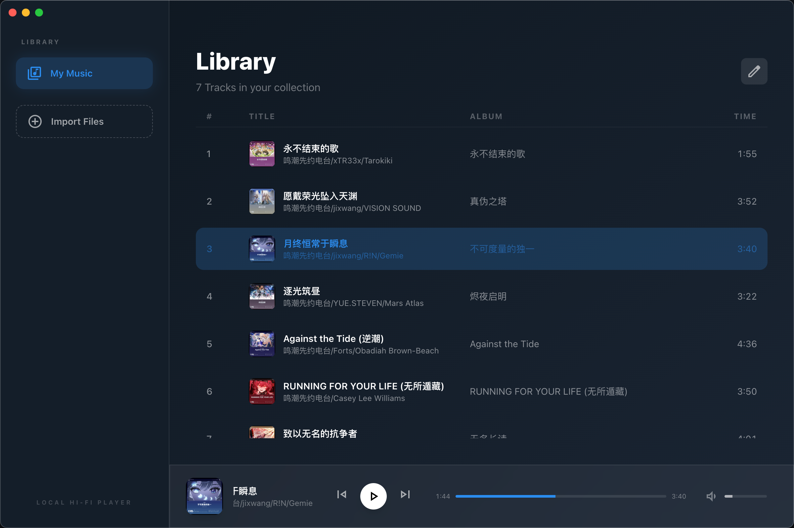
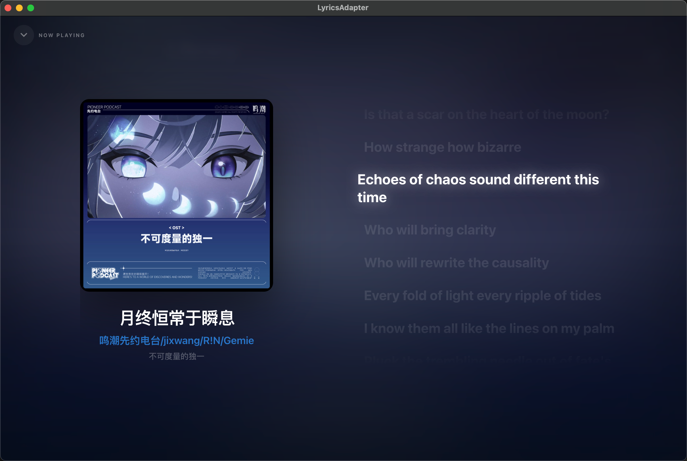
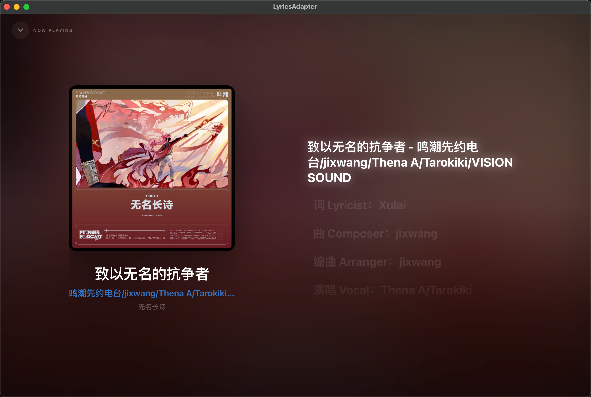

# LyricsAdapter

<div align="center">

**一款功能丰富的 Electron 桌面音乐播放器，专注于歌词同步显示和沉浸式播放体验**

[](https://reactjs.org/)
[](https://www.typescriptlang.org/)
[](https://vitejs.dev/)
[](https://www.electronjs.org/)
[](https://tailwindcss.com/)
[](LICENSE)

[功能特性](#-功能特性) • [快速开始](#-快速开始) • [使用指南](#-使用指南) • [开发文档](#-开发文档) • [架构设计](#-架构设计)

</div>

---

## 📖 目录

- [功能特性](#-功能特性)
- [界面预览](#-界面预览)
- [快速开始](#-快速开始)
- [使用指南](#-使用指南)
  - [音乐库管理](#音乐库管理)
  - [在线浏览与下载](#在线浏览与下载)
  - [沉浸式播放](#沉浸式播放)
  - [主题切换](#主题切换)
  - [快捷键](#快捷键)
- [技术栈](#-技术栈)
- [项目结构](#-项目结构)
- [架构设计](#-架构设计)
- [开发文档](#-开发文档)
- [构建部署](#-构建部署)
- [常见问题](#-常见问题)
- [贡献指南](#-贡献指南)
- [许可证](#-许可证)
- [致谢](#-致谢)

---

## ✨ 功能特性

### 🎵 核心播放功能

- **多格式音频支持** - 完整支持 FLAC、MP3、M4A、WAV 等常见音频格式
- **智能元数据解析** - 自动提取音频文件内嵌的标题、艺术家、专辑、封面、歌词等信息
- **LRC 歌词同步** - 自动解析并同步显示 LRC 格式歌词，支持毫秒级精确同步
- **完整播放控制** - 播放/暂停、上一曲/下一曲、进度调节、音量控制
- **多种播放模式** - 顺序播放、单曲循环、列表循环

### 🎨 用户界面

- **精美 UI 设计** - 玻璃拟态效果、响应式布局、平滑动画过渡
- **沉浸式模式** - 全屏显示，动态背景跟随封面色调，歌词实时同步滚动
- **虚拟化列表** - 大型音乐库流畅滚动，支持拖拽排序
- **6 种预设主题** - 经典蓝、可爱粉、海洋蓝、落日橙、森林绿、午夜紫
- **6 种语言支持** - 中文、英文、日语、韩语、德语、法语

### 🌐 在线功能

- **QQ 音乐集成** - 搜索并下载 QQ 音乐曲库
- **多音质下载** - 支持 128kbps、320kbps、FLAC 无损格式
- **自动元数据写入** - 下载后自动嵌入歌词、封面等信息
- **推荐歌曲** - 基于热歌榜的智能推荐

### ⚡ 高级特性

- **懒加载机制** - 智能预加载相邻曲目，流畅播放体验
- **播放状态持久化** - 应用关闭后自动恢复播放进度
- **自定义快捷键** - 完整可自定义的键盘快捷键系统
- **元数据编辑** - 可视化编辑音频文件元数据
- **离线使用** - 完全本地化运行，保护用户隐私

---

## 🎬 界面预览

### 主界面
简洁优雅的曲库管理界面，支持批量导入、搜索、编辑和拖拽排序



### 沉浸式歌词模式
全屏沉浸体验，动态背景跟随封面色调，歌词实时同步滚动




### 主题切换
6 种精心设计的主题，一键切换应用外观

### 在线浏览
直接搜索并下载 QQ 音乐曲库，支持多种音质选择

---

## 🚀 快速开始

### 前置要求

- **Node.js** 18.0 或更高版本
- **npm** 9.0 或更高版本（或 yarn/pnpm）
- **操作系统**：Windows 10+、macOS 10.15+、Linux (x64/arm64)

### 安装与运行

1. **克隆仓库**
   ```bash
   git clone https://github.com/yourusername/LyricsAdapter.git
   cd LyricsAdapter
   ```

2. **安装依赖**
   ```bash
   npm install
   ```

3. **启动开发服务器**
   ```bash
   npm run electron:dev
   ```

4. **开始使用**
   - 应用窗口将自动打开
   - 点击侧边栏的"导入文件"按钮
   - 选择音频文件（支持批量选择和多格式）
   - 开始享受音乐！

### 其他命令

```bash
# 构建 Windows 版本 (x64)
npm run electron:build:win

# 构建 Windows 版本 (ARM64)
npm run electron:build:win:arm64

# 构建 macOS 版本
npm run electron:build:mac

# 构建 Linux 版本
npm run electron:build:linux

# 构建当前平台版本
npm run electron:build
```

构建产物将输出到 `release/` 目录。

---

## 📘 使用指南

### 音乐库管理

#### 导入音乐

- **方式一**：点击侧边栏的"导入文件"按钮，选择音频文件
- **方式二**：直接拖拽音频文件到应用窗口
- **支持格式**：`.flac`, `.mp3`, `.m4a`, `.wav`

#### 管理曲目

- **搜索**：使用侧边栏的搜索框快速查找曲目
- **删除**：点击曲目右侧的删除按钮，或进入编辑模式批量删除
- **排序**：拖拽曲目进行自定义排序
- **定位**：点击"定位到当前播放"快速定位到正在播放的曲目

#### 编辑元数据

1. 切换到"元数据"视图
2. 从音乐库选择曲目
3. 编辑标题、艺术家、专辑、歌词等信息
4. 保存更改

### 在线浏览与下载

#### 配置访问凭证

由于 QQ 音乐 API 需要身份验证，首次使用需配置 Cookie：

1. 在浏览器中打开 [y.qq.com](https://y.qq.com) 并登录
2. 按 `F12` 打开开发者工具
3. 切换到 `Network` 标签
4. 刷新页面，找到任意请求
5. 复制请求头中的 `Cookie` 字段
6. 在应用的设置中粘贴 Cookie

> **注意**：Cookie 每 24 小时需要重新验证一次。

#### 搜索与下载

1. 切换到"浏览"视图
2. 在搜索框输入歌曲名、艺术家或专辑名
3. 点击搜索结果右侧的下载按钮
4. 选择音质：
   - **128kbps** - 标准音质，文件较小
   - **320kbps** - 高品质，推荐使用
   - **FLAC** - 无损音质，文件较大

下载的文件会自动添加到音乐库，包含完整的元数据和歌词。

#### 设置下载路径

在设置对话框中配置下载文件夹路径：
- 支持使用 `~` 代表用户主目录
- 例如：`~/Music` → `/Users/你的用户名/Music`

### 沉浸式播放

进入沉浸式模式：
- **方式一**：点击底部控制栏的"专注模式"按钮
- **方式二**：使用快捷键 `Ctrl/Cmd + Enter`

沉浸式模式特性：
- 全屏歌词显示
- 动态背景颜色跟随封面提取
- 歌词自动滚动到当前行
- 点击歌词行可跳转到对应时间点
- 支持鼠标和键盘控制播放

### 主题切换

应用内置 6 种精心设计的主题：

| 主题名称 | 特点 | 适用场景 |
|---------|------|---------|
| 经典蓝 | 默认主题，经典蓝色调 | 日常使用 |
| 可爱粉 | 甜美可爱，粉色系 | 个人喜好 |
| 海洋蓝 | 深邃海洋，宁静致远 | 专注工作 |
| 落日橙 | 温暖落日，温馨舒适 | 放松休闲 |
| 森林绿 | 清新自然，绿意盎然 | 自然风格 |
| 午夜紫 | 神秘优雅，深邃迷人 | 夜间模式 |

切换方式：
1. 点击侧边栏的"主题"按钮
2. 预览并选择喜欢的主题
3. 点击"应用"按钮

### 快捷键

应用提供完整的快捷键支持，且可自定义。

#### 播放控制

| 快捷键 | 功能 | 说明 |
|--------|------|------|
| `Space` | 播放/暂停 | 切换播放状态 |
| `Ctrl/Cmd + ←` | 上一首 | 切换到上一曲目 |
| `Ctrl/Cmd + →` | 下一首 | 切换到下一曲目 |
| `←` | 快退 5 秒 | 向后快退 5 秒 |
| `→` | 快进 5 秒 | 向前快进 5 秒 |
| `Alt + ←` | 快退 30 秒 | 向后快退 30 秒 |
| `Alt + →` | 快进 30 秒 | 向前快进 30 秒 |
| `↑` | 音量增加 | 增加 1% 音量 |
| `↓` | 音量减少 | 减少 1% 音量 |
| `Alt + ↑` | 音量增加 10% | 增加 10% 音量 |
| `Alt + ↓` | 音量减少 10% | 减少 10% 音量 |
| `M` | 静音/取消静音 | 切换静音状态 |
| `Alt + Tab` | 切换播放模式 | 循环切换播放模式 |

#### 导航

| 快捷键 | 功能 |
|--------|------|
| `Ctrl/Cmd + Enter` | 进入/退出沉浸模式 |
| `Ctrl/Cmd + F` | 聚焦搜索框 |
| `Ctrl/Cmd + I` | 导入文件 |
| `Ctrl/Cmd + L` | 跳转到音乐库 |
| `Ctrl/Cmd + B` | 跳转到浏览 |
| `Ctrl/Cmd + ,` | 打开设置 |
| `Ctrl/Cmd + T` | 打开主题 |

#### 自定义快捷键

1. 进入"设置"视图
2. 点击"快捷键"部分
3. 点击要修改的快捷键按钮
4. 按下新的组合键
5. 按 `Esc` 取消，按 `Backspace` 清除

---

## 🛠️ 技术栈

| 技术 | 版本 | 说明 |
|------|------|------|
| **React** | 18.2.0 | 用户界面框架，使用 Hooks 和函数组件 |
| **TypeScript** | 5.8.2 | 类型安全的 JavaScript 超集 |
| **Vite** | 6.2.0 | 下一代前端构建工具，快速热更新 |
| **Electron** | 40.0.0 | 跨平台桌面应用框架 |
| **Tailwind CSS** | 4.1.18 | 实用优先的 CSS 框架 |
| **music-metadata** | 11.11.0 | 音频元数据解析库 |
| **idb** | 8.0.3 | IndexedDB 封装库（已弃用，改用文件系统） |

### 构建工具

- **Vite Plugin Electron** - Electron 集成插件
- **Electron Builder** - 跨平台打包工具

---

## 📁 项目结构

```
LyricsAdapter/
├── components/              # React 组件
│   ├── Controls.tsx         # 播放控制器（进度条、播放控制、音量）
│   ├── FocusMode.tsx        # 沉浸式歌词模式
│   ├── LibraryView.tsx      # 音乐库视图（歌曲列表、编辑模式）
│   ├── BrowseView.tsx       # 在线浏览视图（QQ 音乐搜索下载）
│   ├── ThemeView.tsx        # 主题选择视图
│   ├── SettingsView.tsx     # 设置视图
│   ├── MetadataView.tsx     # 元数据编辑视图
│   ├── Sidebar.tsx          # 侧边栏导航
│   ├── TitleBar.tsx         # 自定义窗口标题栏
│   ├── QueuePanel.tsx       # 播放队列面板
│   ├── MainPlayer.tsx       # 主播放器界面
│   ├── LyricsOverlay.tsx    # 歌词浮层组件
│   ├── TrackCover.tsx       # 封面显示组件
│   ├── CookieDialog.tsx     # Cookie 配置对话框
│   ├── SettingsDialog.tsx   # 设置对话框
│   ├── ShortcutsSettings.tsx# 快捷键设置组件
│   └── ErrorBoundary.tsx    # 错误边界组件
├── hooks/                   # 自定义 React Hooks
│   ├── usePlayback.ts       # 播放控制逻辑
│   ├── useLibraryLoad.ts    # 音乐库加载/保存
│   ├── useImport.ts         # 文件导入逻辑
│   ├── useLibraryActions.ts # 音乐库操作（删除、重载）
│   ├── useCoverArt.ts       # 封面提取和缓存
│   ├── useWindowControls.ts # 窗口控制
│   ├── useShortcuts.ts      # 快捷键处理
│   └── useBlobUrls.ts       # Blob URL 管理
├── services/                # 业务逻辑服务
│   ├── metadataService.ts   # 音频元数据解析服务
│   ├── qqMusicApi.ts        # QQ 音乐 API 集成
│   ├── cookieManager.ts     # Cookie 管理
│   ├── settingsManager.ts   # 应用设置管理
│   ├── themeManager.ts      # 主题管理
│   ├── shortcuts.ts         # 快捷键管理
│   ├── i18n.ts              # 国际化服务
│   ├── logger.ts            # 日志服务
│   ├── desktopAdapter.ts    # Electron API 适配器
│   ├── libraryStorage.ts    # 音乐库存储
│   ├── librarySerializer.ts # 音乐库序列化
│   ├── metadataCacheService.ts # 元数据缓存
│   ├── coverArtService.ts   # 封面服务
│   ├── dataValidator.ts     # 数据验证
│   ├── indexedDBStorage.ts  # IndexedDB 存储（已弃用）
│   └── themes/              # 主题配置
│       └── predefinedThemes.ts
├── electron/                # Electron 主进程
│   ├── main.ts              # 主进程入口
│   └── preload.ts           # 预加载脚本
├── utils/                   # 工具函数
│   ├── trackProcessor.ts    # 曲目处理工具
│   └── errorHandler.ts      # 错误处理
├── constants/               # 常量配置
│   └── config.ts            # 应用配置常量
├── types/                   # TypeScript 类型定义
│   └── theme.ts             # 主题相关类型
├── workers/                 # Web Workers
│   └── metadataWorker.ts    # 元数据解析 Worker
├── App.tsx                  # 主应用组件
├── types.ts                 # 全局类型定义
├── index.tsx                # 应用入口
├── vite.config.ts           # Vite 配置
├── tsconfig.json            # TypeScript 配置
├── package.json             # 项目依赖
└── README.md                # 项目文档
```

---

## 🏗️ 架构设计

### 应用架构

```
┌─────────────────────────────────────────────────────────┐
│                     Electron 应用                        │
├─────────────────────────────────────────────────────────┤
│                                                          │
│  ┌────────────────┐         ┌─────────────────────┐   │
│  │  主进程 (Main)  │ ←─IPC─→ │ 渲染进程 (Renderer)  │   │
│  │                │         │                     │   │
│  │  - 文件系统     │         │  - React 应用       │   │
│  │  - 下载管理     │         │  - 状态管理         │   │
│  │  - 元数据写入   │         │  - UI 渲染          │   │
│  │  - Cookie 代理  │         │  - 用户交互         │   │
│  └────────────────┘         └─────────────────────┘   │
│                                                          │
└─────────────────────────────────────────────────────────┘
```

### 数据流

#### 文件导入流程

```
用户选择文件
    ↓
文件对话框 (Electron IPC)
    ↓
元数据解析 (metadataService)
    ↓
封面提取与缓存 (coverArtService)
    ↓
创建 Track 对象 (懒加载 audioUrl)
    ↓
保存到音乐库 (libraryStorage)
    ↓
更新 UI
```

#### 播放流程

```
用户点击播放
    ↓
选择曲目 (selectTrack)
    ↓
检查 audioUrl
    ↓
若无 → 懒加载文件 (desktopAPI.readFile)
    ↓
创建 Blob URL
    ↓
Audio 元素播放
    ↓
预加载相邻曲目 (500ms 延迟)
```

#### QQ 音乐下载流程

```
用户搜索歌曲
    ↓
调用 QQ 音乐 API (qqMusicApi.searchMusic)
    ↓
选择音质并下载
    ↓
获取下载链接 (getMusicUrl)
    ↓
主进程下载文件 (downloadAndSave)
    ↓
写入元数据 (writeAudioMetadata)
    ↓
解析文件并创建 Track
    ↓
添加到音乐库
```

### 状态管理

应用使用 React Hooks 进行状态管理，主要状态包括：

- **`tracks`** - 音乐库曲目列表
- **`currentTrackIndex`** - 当前播放曲目索引
- **`viewMode`** - 当前视图模式
- **`isFocusMode`** - 是否处于沉浸模式
- **`isPlaying`** - 播放状态
- **`volume`** - 音量
- **`playbackMode`** - 播放模式
- **`currentTime`** - 当前播放时间

### 持久化存储

- **音乐库**：`userData/library.json` 和 `userData/library-index.json`
- **封面缓存**：`userData/covers/`
- **设置**：`localStorage`
- **主题**：`localStorage`
- **快捷键**：`localStorage`
- **Cookie**：`localStorage`（加密存储）

---

## 📚 开发文档

### 开发环境设置

1. **克隆仓库并安装依赖**
   ```bash
   git clone https://github.com/yourusername/LyricsAdapter.git
   cd LyricsAdapter
   npm install
   ```

2. **启动开发服务器**
   ```bash
   npm run electron:dev
   ```

3. **开发工具**
   - React DevTools - React 组件调试
   - Electron DevTools - Electron 主进程调试

### 代码规范

- **组件**：使用函数组件和 Hooks
- **类型**：所有 Props 和 State 都应定义 TypeScript 类型
- **命名**：组件使用 PascalCase，其他使用 camelCase
- **样式**：使用 Tailwind CSS 类名
- **日志**：使用 `logger` 服务，不要直接使用 `console.*`

### 添加新功能

1. **创建新组件**
   - 在 `components/` 目录创建 `.tsx` 文件
   - 定义 Props 接口
   - 使用 Tailwind CSS 编写样式

2. **添加新服务**
   - 在 `services/` 目录创建 `.ts` 文件
   - 导出服务类或实例
   - 在组件中引入使用

3. **添加新类型**
   - 在 `types.ts` 或 `types/` 目录添加类型定义
   - 使用 TypeScript 严格模式

4. **添加新主题**
   - 在 `services/themes/predefinedThemes.ts` 添加主题配置
   - 在 `services/i18n.ts` 添加主题名称和描述翻译

### 关键接口

#### Track 接口

```typescript
interface Track {
  id: string;
  title: string;
  artist: string;
  album: string;
  duration: number;           // 秒
  coverUrl?: string;          // 封面 URL
  lyrics?: string;            // 纯文本歌词
  syncedLyrics?: SyncedLyricLine[]; // 同步歌词
  
  // Electron 持久化字段
  filePath?: string;          // 文件路径
  fileName?: string;          // 文件名
  fileSize?: number;          // 文件大小（字节）
  lastModified?: number;      // 最后修改时间戳
  addedAt?: string;           // 添加时间 ISO 字符串
  playCount?: number;         // 播放次数
  lastPlayed?: string;        // 最后播放时间
  available?: boolean;        // 文件是否可用
  
  audioUrl?: string;          // Blob URL（播放时创建）
}

interface SyncedLyricLine {
  time: number;  // 秒
  text: string;
}
```

#### DesktopAPI 接口

```typescript
interface DesktopAPI {
  platform: string;
  readFile(path: string): Promise<{ success: boolean; data?: number[]; error?: string }>;
  parseAudioMetadata(path: string): Promise<...>;
  saveCoverThumbnail(...): Promise<...>;
  selectFiles(...): Promise<...>;
  // ... 更多方法
}
```

### 调试技巧

1. **查看日志**
   - 开发环境：控制台查看 `logger.debug()` 和 `logger.info()` 输出
   - 生产环境：仅显示 `logger.warn()` 和 `logger.error()`

2. **检查 Electron IPC**
   ```typescript
   logger.debug('[App] IPC call:', result);
   ```

3. **检查状态更新**
   ```typescript
   useEffect(() => {
     logger.debug('[Component] State changed:', state);
   }, [state]);
   ```

---

## 📦 构建部署

### 构建命令

```bash
# 构建当前平台版本
npm run electron:build

# 构建 Windows x64 版本
npm run electron:build:win

# 构建 Windows ARM64 版本
npm run electron:build:win:arm64

# 构建 macOS 版本
npm run electron:build:mac

# 构建 Linux 版本
npm run electron:build:linux
```

### 构建产物

构建完成后，产物位于 `release/` 目录：

- **Windows**: `.exe` 安装包（NSIS）
- **macOS**: `.dmg` 磁盘映像
- **Linux**: `.AppImage` 可执行文件

### 应用签名

#### macOS

需要 Apple Developer 证书：

```bash
export CSC_LINK=/path/to/certificate.p12
export CSC_KEY_PASSWORD=your_password
npm run electron:build:mac
```

#### Windows

需要代码签名证书：

```bash
export WIN_CSC_LINK=/path/to/certificate.pfx
export WIN_CSC_KEY_PASSWORD=your_password
npm run electron:build:win
```

### 自动更新

应用支持自动更新功能（需要配置服务器）：

1. 在 `package.json` 中配置 `publish` 选项
2. 使用 `electron-updater` 库
3. 部署更新服务器

---

## ❓ 常见问题

### 1. 为什么无法在线浏览？

**原因**：浏览器环境存在 CORS 跨域限制。

**解决方案**：
- 使用 Electron 桌面版本
- 运行 `npm run electron:dev` 或构建桌面应用

### 2. Cookie 为什么会过期？

**原因**：QQ 音乐 Cookie 有效期约 24 小时。

**解决方案**：
- 定期重新获取 Cookie
- 应用会在 Cookie 过期时提示更新

### 3. 为什么有些歌曲无法下载？

**可能原因**：
- VIP 专属歌曲（需要 QQ 音乐 VIP）
- 版权限制
- Cookie 无效

**解决方案**：
- 检查是否为 VIP 歌曲
- 更新 Cookie
- 尝试其他音质

### 4. 如何批量导入音乐？

**方法**：
- 在文件选择对话框中按住 `Ctrl` (Windows/Linux) 或 `Cmd` (macOS) 多选
- 直接拖拽文件夹到应用窗口

### 5. 应用数据存储在哪里？

**存储位置**：
- **macOS**: `~/Library/Application Support/LyricsAdapter/`
- **Windows**: `%APPDATA%/LyricsAdapter/`
- **Linux**: `~/.config/LyricsAdapter/`

**包含内容**：
- `library.json` - 音乐库数据
- `library-index.json` - 音乐库索引
- `covers/` - 封面缓存

### 6. 如何迁移音乐库？

**步骤**：
1. 备份上述数据目录
2. 在新设备上安装应用
3. 复制备份的数据目录到对应位置
4. 重启应用

### 7. 支持哪些音频格式？

**支持格式**：
- **FLAC** - 无损压缩格式（推荐）
- **MP3** - 通用有损压缩格式
- **M4A** - Apple 音频格式
- **WAV** - 无压缩格式

### 8. 如何自定义快捷键？

**步骤**：
1. 进入"设置"视图
2. 找到"快捷键"部分
3. 点击要修改的快捷键
4. 按下新的组合键
5. 按 `Esc` 取消，按 `Backspace` 清除

---

## 🤝 贡献指南

欢迎提交 Issue 和 Pull Request！

### 提交 Issue

- 使用清晰的标题描述问题
- 提供复现步骤
- 附上错误日志（如有）
- 说明操作系统和版本

### 提交 Pull Request

1. Fork 本仓库
2. 创建特性分支 (`git checkout -b feature/AmazingFeature`)
3. 提交更改 (`git commit -m 'Add some AmazingFeature'`)
4. 推送到分支 (`git push origin feature/AmazingFeature`)
5. 创建 Pull Request

### 代码规范

- 遵循 ESLint 和 Prettier 配置
- 添加必要的注释
- 更新相关文档
- 确保测试通过（如有）

---

## 📄 许可证

本项目采用 MIT 许可证 - 查看 [LICENSE](LICENSE) 文件了解详情

---

## 🙏 致谢

### 核心依赖

- [React](https://reactjs.org/) - 用户界面框架
- [TypeScript](https://www.typescriptlang.org/) - 类型安全
- [Vite](https://vitejs.dev/) - 构建工具
- [Electron](https://www.electronjs.org/) - 桌面应用框架
- [Tailwind CSS](https://tailwindcss.com/) - CSS 框架
- [music-metadata](https://github.com/Borewit/music-metadata) - 音频元数据解析库

### 图标与设计

- [Material Symbols](https://fonts.google.com/symbols) - 图标库

### 灵感来源

- 所有热爱音乐的开发者
- 开源社区的支持