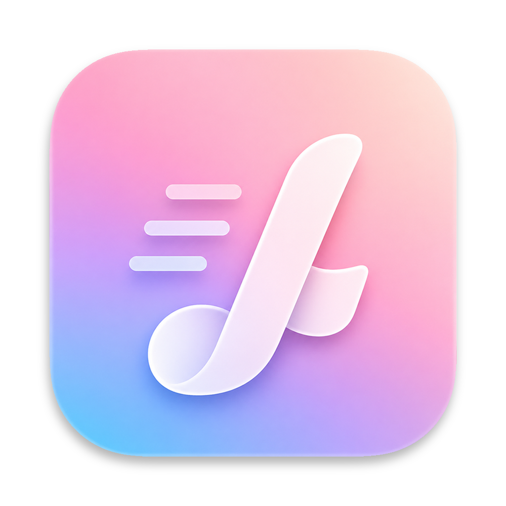

<div align="center">



# LyricsAdapter

**一款以本地音乐和同步歌词为核心的桌面播放器。**

听本地收藏，连接 WebDAV 云曲库，也可以接入 QQ 音乐与网易云音乐。

[下载安装](https://github.com/xwsjjctz/LyricsAdapter/releases) · [English](README.en.md)

</div>

## 开始使用

从 [Releases](https://github.com/xwsjjctz/LyricsAdapter/releases) 下载适合设备的安装包。当前发布配置提供 macOS Apple Silicon 的 `.dmg` 和 Windows x64 的 `.exe` 安装包。

1. 打开应用，在侧边栏选择「本地」。
2. 点击曲库右上方的导入按钮，选择 **MP3 或 FLAC** 文件；也可以将多个音频文件拖入曲库区域。
3. 点击曲目开始播放，再点击底部控制栏的「专注模式」按钮查看同步歌词。

本地音乐无需登录即可使用。导入时会读取文件中的标题、艺术家、专辑、封面和内嵌歌词。

## 曲库与播放

### 播放控制

底部控制栏提供播放／暂停、上一首／下一首、进度调节、音量和静音控制，支持顺序播放、随机播放和单曲循环。

应用会记住曲库、当前曲目、播放进度和音量等状态，重新打开后从暂停状态恢复。浏览其他曲库或打开歌单时，可以继续收听当前歌曲。

### 查找音乐

曲库顶部的「搜索全部音乐…」同时查找本地与已加载的云端曲目，支持歌曲名、艺术家、专辑、文件名，以及中文拼音搜索。开启第三方音源后，搜索结果中还会显示在线歌曲。

点击本地或云端结果可定位并播放曲目；也可以用方向键选择搜索结果，按 `Enter` 确认、`Esc` 收起。列表中的「定位到当前播放」按钮可以快速返回正在播放的歌曲。

### 整理本地曲库

点击曲库顶部的「编辑模式」按钮后，可以：

- 拖拽曲目调整顺序。
- 选择多首曲目或全选，批量移除。
- 点击单首曲目的删除按钮，将其移出曲库。
- 点击曲目右侧的元数据按钮，编辑标题、艺术家、专辑、歌词，或导入新封面。

本地曲目的元数据修改会在保存后写回音频文件。删除默认只移出曲库；勾选「同时删除本地音频文件」后，才会一并删除原文件。

## 歌词与专注模式

专注模式展示专辑封面、随封面变化的背景和滚动歌词，保留常用播放控制。点击带时间信息的歌词，可以跳转到对应位置播放。

- **逐行歌词**：读取音频内嵌的 LRC 歌词，随播放进度滚动。
- **逐字歌词**：歌曲提供 QRC／YRC 等逐字时间信息时，显示逐字高亮。
- **显示调整**：在设置中调节专注模式背景不透明度、背景模糊、歌词字号和行间距。

没有歌词时会显示相应提示。可以在本地曲目的元数据编辑框中补充歌词；同步滚动需要歌词包含时间标签。

### 系统歌词与媒体控制

| 平台 | 系统歌词 |
| --- | --- |
| macOS | 在菜单栏显示当前歌词，并提供上一首、播放／暂停、下一首控制。 |
| Windows | 在任务栏显示歌词，支持逐字高亮和悬停播放控制。 |

播放信息也会提供给系统媒体控制，便于查看歌曲信息和控制播放。

## WebDAV 云曲库

在侧边栏底部打开「设置」，填写「WebDAV 配置」中的服务器地址、账号和应用密码，测试连接后保存，再进入侧边栏的「云端」。

- 加载服务器上的音乐，以曲目列表浏览并在线播放。
- 点击刷新按钮，更新云端曲库。
- 在顶部搜索框中查找已加载的云端歌曲。

云端播放需要可用的网络连接。本地文件和在线歌曲上传到 WebDAV 的入口目前已停用；已有云端曲库读取、播放、刷新和元数据缓存机制保持不变。

## 在线音乐与歌单

### 开启与登录

1. 打开「设置 → 在线音乐」，开启「添加第三方音源」。
2. 在下方出现的「第三方音源」区域选择 QQ 音乐或网易云音乐。
3. 使用对应平台的手机应用扫码并确认登录，也可以手动填写 Cookie 后保存。

QQ 音乐需要有效的登录凭证才能参与在线搜索；网易云音乐支持匿名搜索和试听。个人歌单需要登录对应平台，歌曲能否播放、下载以及可用音质取决于平台返回的资源和账号权限。

### 音乐源插件

QQ 与网易云接口实现独立维护在 [LyricsAdapter-Music-Plugins](https://github.com/xwsjjctz/LyricsAdapter-Music-Plugins)。主应用可无插件启动，在「设置 → 插件」中直接从 GitHub 下载安装 QQ 或网易云插件，也可导入本地 `.laplugin` 文件、查看版本或启用/禁用插件。首次安装立即生效，更新已有插件后重启应用。

安装文件集中保存在 `~/.la/plugin/`。启用音乐插件后显示在线音乐设置，禁用后保留歌曲、歌单与登录数据。首版提供官方插件目录和手动下载更新；第三方市场与自动更新尚未实现。开发合同与构建说明见[音乐源插件文档](docs/music-source-plugins.md)。

第三方开发者可阅读[插件 API 文档](docs/plugins/README.md)，使用通用接口注册音乐源或歌词翻译能力；核心 API 与扩展点独立版本化，旧音乐源 API v1 保持兼容。翻译插件可在插件页选择并为专注模式提供对照译文。新增音乐源的界面与登录链路仍需进一步开放。

### 搜索、试听与下载

回到曲库，在顶部搜索框输入关键词。在线结果会标明 QQ 或网易来源，点击歌曲即可试听，试听记录可在侧边栏的「在线队列」中查看。

结果卡片上的下载按钮提供三档音质选择：

| 音质 | 选项 |
| --- | --- |
| 标准 | 128 kbps |
| 高品质 | 320 kbps |
| 无损 | FLAC |

下载前，在第三方音源设置中选择保存文件夹，也可以输入 `~/Music` 这样的路径。下载完成的歌曲会加入本地曲库，并写入可获取的歌曲信息、封面和歌词。

### 浏览歌单

登录后，侧边栏的「歌单」区域会加载对应平台的歌单。点击歌单可查看曲目，再点击歌曲开始播放；较长的歌单会在向下滚动时继续加载。

点击歌单区域的编辑按钮，可以隐藏或重新显示歌单。此操作只调整应用侧边栏中的显示，不会删除平台上的歌单。

## 外观与快捷键

侧边栏底部的明暗切换按钮可以切换深色和浅色外观；左上方按钮可以收起或展开侧边栏，拖动侧边栏右边缘可以调整宽度。

设置中提供中文、英语、日语、韩语、德语和法语界面。Windows 还提供「新版 FocusMode 字体」开关。

常用默认快捷键如下，macOS 使用 `⌘`，Windows 使用 `Ctrl`：

| 操作 | 快捷键 |
| --- | --- |
| 播放／暂停 | `Space` |
| 上一首／下一首 | `⌘ / Ctrl` + `← / →` |
| 后退／前进 5 秒 | `← / →` |
| 后退／前进 30 秒 | `Alt` + `← / →` |
| 降低／提高音量 | `↓ / ↑` |
| 静音／取消静音 | `M` |
| 切换播放模式 | `Tab` |
| 进入／退出专注模式 | `⌘ / Ctrl` + `Enter` |
| 聚焦搜索框 | `⌘ / Ctrl` + `F` |
| 打开设置 | `⌘ / Ctrl` + `,` |

在「设置 → 快捷键」中点击按键组合即可重新绑定，按 `Esc` 取消，按 `Backspace` 或 `Delete` 清除绑定，也可以恢复默认设置。

## 开发

使用 Node 24.19.0 或更新的 24 系列版本。主应用可在无插件、无插件源码时启动：

```sh
npm ci
npm run electron:dev
```

设置 → 插件提供官方插件下载、本地安装、启用和卸载。启用音乐插件后才会显示在线音乐设置。安装文件集中保存在 `~/.la/plugin/<插件 ID>/`，页面会显示实际路径并提供打开文件夹入口。

`npm run check` 会检查、测试和构建主应用。插件开发和独立验证见 [音乐源插件文档](docs/music-source-plugins.md)。调试和隔离数据说明见 [DEBUGGING.md](DEBUGGING.md)。

## 许可与致谢

项目使用 [GPLv3 许可证](LICENSE)，应用图标使用 [CC BY 4.0 许可证](app-icon-LICENSE)。第三方组件与设计来源见[第三方声明](docs/THIRD_PARTY_NOTICES.md)。
