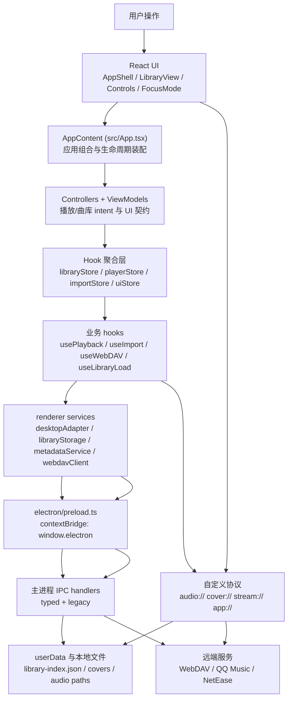

# LyricsAdapter 架构说明

本文按当前源码梳理 LyricsAdapter 的运行时边界、核心状态模型、数据持久化和主要业务流。它描述的是当前实现，不是理想化目标；其中一些历史文档中的说法已经落后于源码，例如播放 slot 已经不止 `local/cloud` 两个，本地播放也已经改为 `audio://` 协议流式读取。

## 总览

LyricsAdapter 是一个 Electron + React + Vite 桌面音乐播放器。Electron 主进程负责窗口、文件系统、协议、IPC、WebDAV 代理、在线音乐代理和系统能力；renderer 进程负责 React UI、播放状态、曲库状态、导入流程、WebDAV 列表同步和在线音乐交互。

## 运行时分层

### Electron 主进程

入口是 `electron/main.ts`。启动时先注册自定义 scheme，然后在 `app.whenReady()` 中完成协议、窗口和 IPC 注册。

主要职责：

| 模块 | 职责 |
| --- | --- |
| `electron/windowManager.ts` | 创建 frameless 窗口、管理生命周期和窗口状态 |
| `electron/protocols/audioProtocol.ts` | 注册 `audio://`，用 Range + `fs.createReadStream` 流式读取本地音频 |
| `electron/protocols/coverProtocol.ts` | 注册 `cover://`，从 `userData/covers` 读取封面并按 `?size=N` 降采样 |
| `electron/protocols/streamProtocol.ts` | 注册 `stream://`，为 QQ/网易在线播放补 cookie、解析 CDN URL、转发 Range 请求 |
| `electron/protocols/appProtocol.ts` | 注册应用资源协议 |
| `electron/ipc/typedHandlers.ts` | typed IPC: 文件选择/读取、library index、WebDAV、下载等，带 payload 校验 |
| `electron/ipc/handlers.ts` | legacy IPC: 文件、library、封面、窗口、下载、元数据、QQ Music 等 |
| `electron/ipc/webdavHandlers.ts` | legacy WebDAV HTTP 代理 |
| `electron/ipc/neteaseHandlers.ts` / `qqLoginHandlers.ts` | 在线音乐 API 与登录相关代理 |
| `electron/utils/metadataUtils.ts` | 主进程写音频标签，MP3 走 `node-id3`，FLAC 优先 ffmpeg remux，失败后 fallback 到直接块写 |

主进程也维护音频路径 allowlist。用户通过文件选择或拖拽授权后的音频路径才允许通过 IPC 读取；app-managed `userData/audio` 也被视为可读范围。

### Preload 桥

`electron/preload.ts` 通过 `contextBridge.exposeInMainWorld('electron', ...)` 暴露受控 API。它同时包含：

- 新的 typed IPC 命名空间：`window.electron.ipc.file.*`、`ipc.library.*`、`ipc.webdav.*`、`ipc.download.*`。
- 旧的扁平 API：`readFile`、`selectFiles`、`loadLibraryIndex`、`webdavGetRange`、`downloadAndSave` 等。
- 事件订阅：下载进度、窗口关闭前 flush、快捷键、更新器事件。

renderer 业务代码通过 `services/desktopAdapter.ts` 使用这些能力，避免直接读写 `window.electron`。除 `index.tsx` 启动时读取平台以及 adapter 自身的桥接实现外，业务调用都经过 adapter；在线音乐 cookie 也由 `syncOnlineCookiesToMain()` 经 adapter 同步到 `stream://` 协议。

### Renderer 进程

renderer 的根组合点是 `App.tsx` 中的私有 `AppContent`。默认导出的 `App` 只负责用 `ErrorBoundary` 包住 `AppContent`；后者挂载全局 `<audio>`，组合 stores、controllers、viewmodels、业务 hooks 与 `AppShell`。

当前主要意图边界是：

- `usePlayerController` 负责跨 slot 选歌、搜索定位、在线流播放、歌单播放上下文和歌单歌词窗口。
- `useLibraryController` 负责 view-slot-aware 删除、批量删除、重排、元数据更新和下载完成后的曲库写入。
- player/library/import/online viewmodel 向 `AppShell` 提供面向 UI 的状态和回调。
- `AppContent` 保留应用级装配，例如持久化快照、启动恢复、cookie 启动同步、生命周期注册和孤儿缓存清理。

文件长度不作为组合根的架构边界；判断标准是领域状态变更是否继续由对应 controller、hook 或 service 持有。

## 核心状态模型

### Track

`types.ts` 中的 `Track` 是统一曲目模型。所有来源最终都归一为这个结构。

关键字段：

| 字段 | 含义 |
| --- | --- |
| `id` | 曲目身份。local 多由导入生成，WebDAV 为 `webdav-${webdavPath}`，在线为 `online-${source}-${songmid}` |
| `title/artist/album/duration` | 展示与播放所需元数据 |
| `coverUrl` | 封面 URL，可为 `cover://`、http(s)、data/blob 或占位图 |
| `lyrics/syncedLyrics` | 纯文本或同步歌词 |
| `audioUrl` | HTML audio 使用的 URL。持久化时会清空 |
| `filePath/fileName/fileSize/lastModified` | 本地或 WebDAV 身份、校验、排序信息 |
| `source` | `local`、`webdav`、`qq`、`netease` |
| `webdavPath` | WebDAV 远端路径 |
| `songmid` | 在线音乐曲目 id，供 `stream://` 重新构建 URL |
| `available` | 本地路径校验结果。文件不存在时可保留条目但标记不可用 |

### LibrarySlot

当前 `SlotId` 是四种：

| Slot | 用途 | 是否可作为播放上下文 | 是否普通库视图 |
| --- | --- | --- | --- |
| `local` | 本地导入曲库 | 是 | 是 |
| `cloud` | WebDAV 云曲库 | 是 | 是 |
| `online` | 在线搜索结果的最近播放队列，LRU | 是 | 是 |
| `playlist` | 第三方歌单播放上下文 | 是 | 否。没有侧边栏入口，常用于 Playlists 视图背后的播放队列 |

每个 `LibrarySlot` 保存：

- `tracks`
- `currentTrackIndex`
- `currentTime`
- `volume`
- `playbackMode`
- `scrollPosition`
- `filterType`
- `categorySelection`

这让每个 slot 可以恢复自己的播放位置、音量、播放模式和列表浏览状态。

### activeSlotId 与 viewSlot

源码里有两个容易混淆但很重要的概念：

| 概念 | 所属 | 含义 |
| --- | --- | --- |
| `activeSlotId` | `useLibrarySlots` | 当前真正的播放上下文，`usePlayback` 使用 `slots[activeSlotId]` |
| `viewSlot` | `useLibraryStore` | 当前曲库面板正在浏览的 slot |

这两个值可以不同。例如用户正在播放 `playlist` slot 中的在线歌单，同时曲库面板仍显示 `local` 或 Playlists 视图。删除、重排、导入这类库操作应面向 `viewSlot`，播放控制应面向 `activeSlotId`。

### Hook 聚合层

`stores/` 目录里的文件不是 Redux/Zustand 式全局 store，而是 React hook 聚合层。

| 文件 | 作用 |
| --- | --- |
| `stores/libraryStore.ts` | 包装 `useLibrarySlots`，增加 `viewSlot`、slot 切换动画、云端可写性检测、滚动位置和分类选择 |
| `stores/playerStore.ts` | 包装 `usePlayback` 与 `useBlobUrls`，把播放时间、音量、播放模式同步回 active slot |
| `stores/importStore.ts` | 包装 `useImport`，根据 `viewSlot` 路由本地导入或 cloud 上传 |
| `stores/uiStore.ts` | 聚合视图模式、焦点模式、页面动画、未保存元数据导航拦截、窗口焦点和玻璃 UI 状态 |

## 数据持久化

### Library index

现代曲库索引写入 `app.getPath('userData')/library-index.json`。renderer 通过 `services/libraryStorage.ts` 调用 `desktopAdapter`，主进程在 typed IPC 或 legacy IPC 中完成读写。

持久化结构由 `services/librarySerializer.ts` 构建：

- `songs`: local tracks
- `cloudSongs`: cloud tracks
- `onlineSongs`: online LRU tracks
- `playlistSongs`: playlist play context
- `settings`: 每个 slot 的非 track 状态、`activeSlotId`、Playlists 视图状态等

序列化时会清空 `audioUrl`，并通过 `sanitizePersistedCoverUrl` 去掉 `blob:`、`file:`、`data:` 这类不可跨会话稳定使用的封面 URL。

### Library load/save 生命周期

`hooks/useLibraryLoad.ts` 负责：

1. 启动时加载 `library-index.json`。
2. 重建 `Track` 对象，恢复 `local/cloud/online/playlist` 状态。
3. 将 `isPlaying` 固定恢复为 `false`，避免启动后自动播放。
4. 初始化 IndexedDB 元数据缓存。
5. 启动后台路径校验，把不存在的本地文件标记为 `available: false`。
6. 在 slot tracks、index、time、volume、mode 变化时防抖保存。
7. 监听窗口关闭前 flush，保证待保存数据落盘。

浏览器模式没有主进程文件系统，`useImport` 中的 web fallback 会写 `indexedDBStorage.saveLibrary()`。

### IndexedDB

`services/indexedDBStorage.ts` 保存 renderer 侧缓存：

- 普通 metadata cache。
- WebDAV metadata cache。
- WebDAV file list snapshot，用于 PROPFIND 后做 diff。
- browser-mode library。
- cookie/settings 等其他本地状态。

`services/metadataCacheService.ts` 在内存 Map 和 IndexedDB 之间提供 LRU/FIFO 风格缓存，最大 300 条，写入时做数据校验。

### 封面缓存

内嵌封面会尽量通过主进程保存到 `userData/covers/`，再以 `cover://<safe-id>.<ext>` 暴露。`coverProtocol` 支持 `?size=N` 缩略图降采样，`TrackCover` 会对 `cover://` 追加缩略图参数并在失败时重试。

WebDAV 封面使用 `webdavCoverId(webdavPath)` 构造稳定 id，避免不同远端路径经清洗后发生文件名碰撞。

## 导入与曲库变更

### 本地导入

本地导入入口在 `useImport`，通过 `importStore` 由 `viewSlot` 路由。

桌面模式流程：

1. `desktopAdapter.selectFiles()` 打开系统文件选择。
2. 过滤支持格式和重复文件。
3. 分批调用 `desktopAdapter.parseAudioMetadata(filePath)`。
4. `ElectronAdapter.parseAudioMetadata()` 读取文件并构造 `File`，再复用 `metadataService.parseAudioFile()`。
5. 封面优先保存为 `cover://`。
6. 生成 `Track`，更新 local tracks。
7. 写 metadata cache 和 library index。

拖拽路径导入使用 `getPathForFile` 获取真实路径，并通过 typed IPC 把路径加入 allowlist。

浏览器模式使用 `File` 对象，直接创建 blob URL 和 IndexedDB library。

### WebDAV cloud 导入

当 `viewSlot === 'cloud'` 时，导入按钮和拖拽路径会走 cloud 上传：

1. 检查 WebDAV 配置与可写性。
2. 读取本地文件字节。
3. 解析本地元数据和封面。
4. `webdavClient.uploadFile()` PUT 到 WebDAV 根目录。
5. 构造 `source: 'webdav'` 的 Track。
6. `mergeCloudTracks()` 合并进 cloud slot，按 `lastModified` 排序并处理同名去重。

### 在线音乐下载/上传

在线 provider 抽象在 `services/onlineMusicProvider.ts`，QQ 和网易都归一成 `OnlineSong`。

`useOnlineMusicIntegration` 负责：

- 下载到用户设置的下载目录。
- 拉歌词和封面。
- 调主进程 `downloadAndSave` 保存音频。
- 调 `writeAudioMetadata` 写标签。
- 上传到 WebDAV 时再读本地文件字节，PUT 到远端，并上传 `.meta.json`，随后把 Track 合并进 cloud slot。

在线音乐 provider 只负责搜索、获取 URL、歌词、歌单等，不直接控制播放器。播放意图由 `usePlayerController` 处理，`AppContent` 只负责装配 controller 与 viewmodel。

## 播放架构

播放由 `usePlayerStore` 包装 `usePlayback` 提供。

核心职责：

- 绑定全局 `<audio>`。
- 根据当前 `Track.source` 选择播放 URL。
- 控制播放/暂停、seek、音量、上下曲、播放模式。
- 在 `timeupdate` 后同步当前时间到 active slot。
- 在音量/播放模式变化后同步回 active slot。
- 在 `loadedmetadata` 后恢复进度和更新本地曲目时长。
- 处理 WebDAV CDN URL 失效恢复、blob URL 清理和 canplay 重试。

播放 URL 的来源：

| 来源 | URL | 生成位置 | 实际服务方 |
| --- | --- | --- | --- |
| 本地桌面文件 | `audio://localhost/<absolute-path>` | `usePlayback.loadAudioFileForTrack` | `audioProtocol` 流式读磁盘 |
| 浏览器 File/blob | `blob:` | `metadataService.parseAudioFile` | 浏览器内存对象 URL |
| WebDAV | CDN/http(s) URL | `webdavClient.getCdnUrl()` | WebDAV GET redirect 后的远端 CDN |
| QQ/网易在线播放 | `stream://<source>/<songmid>?q=320` | `usePlayback` | `streamProtocol` 解析 CDN 并转发 |

更详细的链路见 [播放流程说明](./playback-flow.md)。

## WebDAV 云曲库

WebDAV 客户端在 `services/webdavClient.ts`，配置保存在 `localStorage` 的 `webdav-config`。它负责：

- PROPFIND 列目录。
- 解析 WebDAV href 为稳定路径。
- 获取 CDN redirect URL。
- Range 读取文件头或封面区间。
- PUT/DELETE/MKCOL。
- 可写性探针。
- 本地 CDN URL cache。

`hooks/useLibraryCloudSync.ts` 在 `LibraryView` 中使用 `useWebDAV`：

- 首次进入 cloud slot 自动加载。
- 手动 refresh 重新扫描。
- 把 full 或 diff 结果回传到上层 `loadCloudTracks` / `mergeCloudTracks`。
- 注册 debug commands: `clear_webdav_cache`、`sync_webdav`、`scan_webdav_audio`、`webdav_meta_update`。

`hooks/useWebDAV.ts` 的加载策略：

1. PROPFIND 得到音频文件列表。
2. 与 IndexedDB 中的 file list snapshot 做 diff。
3. 无变化且 metadata cache 完整时，直接从 IndexedDB 重建 tracks。
4. 有新增/变更时，只解析新增/变更文件。
5. 首次或缓存不完整时进入 full mode。
6. 可写且 provider 支持时，把 metadata 写回 WebDAV `/Metadata/`。

WebDAV `/Metadata/` 当前是 v3 manifest + chunks：

- `_manifest.json` 保存轻量字段、文件指纹、chunkId 和是否有封面/歌词。
- `_chunk_0001.json` 等保存重量字段：封面 data URL、歌词、同步歌词。
- 写入顺序是 chunk-first、manifest-last，避免 manifest 指向未写好的 chunk。

Provider 策略在 `services/webdav/providerConfig.ts`，目前包含 generic 和 123pan 特化。用户设置 readonly 时会强制关闭写入和自动上传元数据。

## 元数据

renderer 侧读取：

- `metadataService.parseAudioFile(file)` 优先使用 `services/workers/metadataWorker.ts`，失败时回到主线程 parser。
- 支持 MP3 ID3v2、FLAC metadata block/VORBIS_COMMENT/PICTURE、M4A/MP4 atoms。
- LRC 通过 `parseLRCLyrics()` 转为 `syncedLyrics`。
- WebDAV Range 解析使用 `parseMetadataFromBuffer()`，当文件头不足以包含封面或完整 Vorbis comment 时返回需要补读的 range。

主进程写入：

- `electron/utils/metadataUtils.ts` 的 `writeAudioMetadata()`。
- MP3 使用 `node-id3`。
- FLAC 优先 ffmpeg remux，失败后 fallback 到直接重写 metadata blocks。
- coverUrl 可来自 data URL、`cover://` 或远程 http(s)。

## 当前边界与注意事项

当前架构已经有清晰的跨进程边界和 slot 模型，但还有一些需要重构时特别留意的点：

- `AppContent` 仍直接编排持久化快照和孤儿缓存清理；若继续增长，应按领域边界下沉，而不是按行数机械拆文件。
- `useLibraryActions` 目前仍保留文件重载入口，曲库 mutation 则由 `useLibraryController` 统一持有。
- `useImport` 同时处理文件选择、批处理、元数据解析、通知、持久化和 WebDAV 上传。
- `useWebDAV` 很复杂，且 `useLibraryCloudSync` 当前从 `LibraryView` 内触发云同步，UI 组件仍承载业务副作用入口。
- `desktopAdapter` 已提供业务侧统一入口；`index.tsx` 的启动平台探测是剩余的边界级直接读取。
- typed IPC 与 legacy IPC 并存，短期利于兼容，长期会带来重复维护成本。
- renderer 主线程 parser 与 worker parser 有重复实现，需要重构时保证解析行为一致。
