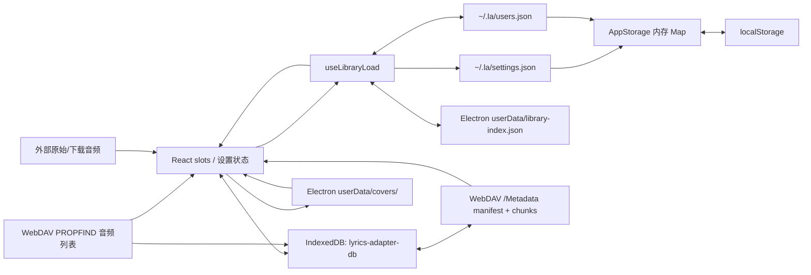

# 持久化现状、权威关系与 SQLite 迁移边界

> 状态：现状审计，更新至 2026-08-13。Phase 0 已完成 typed IPC 契约、敏感 `localStorage` 隔离、版本化空曲库语义、受控旧设置迁移和 JSON 主备恢复加固；Phase 1 已完成只读启动 Repository 与纯恢复 reconciler。文中会明确区分已收口项与剩余问题。
>
> 范围：`library-index.json`、`users.json`、`settings.json`、`localStorage`、IndexedDB、封面/音频文件，以及 WebDAV `Metadata/` manifest/chunks。当前迁移不改变曲库、播放或 UI 交互格式，也不执行破坏性数据清理。

## 结论

当前桌面端没有单一持久化源，而是三组会互相回灌的状态：

1. 曲库：`users.json`、`library-index.json`、React 四个 slot；
2. 设置：`settings.json`、`users.json.settings`、`localStorage`、`AppStorage` 内存 Map；
3. WebDAV 元数据：远端音频列表、远端 manifest/chunks、IndexedDB、本地封面文件、React cloud slot。

代码意图是把 `users.json` 当作“不可重建的用户数据”，把 `library-index.json` 和 IndexedDB 当缓存；但实际仍存在双向迁移、全量快照和多个写入者，因此任何一份都不能简单视为唯一真相。最明显的反例是 IndexedDB 的 `settings` store：它既放可重建的播放列表缓存，也放不可重建的用户自定义封面、名称和侧栏布局，而 IndexedDB 损坏自愈却会直接删除整个数据库。

目标不应是“所有东西塞进 SQLite”，而应是：

- 桌面端的**结构化状态**只以 SQLite 为权威；
- 原始音频、下载文件和封面二进制仍留在文件系统，SQLite 只存身份、路径、hash 和引用；
- WebDAV 音频列表仍由远端服务器权威，manifest/chunks 是可重建的远端同步投影；
- 浏览器模式保留 IndexedDB，但实现同一套 Repository contract，不再与桌面端共享物理后端假设。

## 当前数据图



图中箭头很多并非抽象上的合理设计，而是当前代码真实存在的复制或回灌路径。

## 介质清单与当前职责

| 介质 | 位置 / key | 主要内容 | 当前读写方 | 实际角色 | 能否直接删除 |
| --- | --- | --- | --- | --- | --- |
| 曲库索引 | `app.getPath('userData')/library-index.json` | 四个 slot 的完整序列化曲目和 playback/settings 快照 | `libraryCore`、`libraryStorage`、`useLibraryLoad`、导入/曲库 controller | 快速恢复缓存；仅在 `users.json.libraryInitialized === false` 时可作为旧数据迁移源 | 仅在 `users.json` 已完整、原始文件可达且迁移已验证时可重建；当前不宜直接删 |
| 用户数据 | `~/.la/users.json` + `.bak` | 带 schema/version 的最小曲目归属、slot、路径、播放计数，以及 settings/playback 灾备快照 | `userDataStore`、`useLibraryLoad` | 曲目归属和“明确为空”的用户数据权威；仍与曲库索引双写 | 不可当缓存删除 |
| 设置文件 | `~/.la/settings.json` + `.bak` | 字符串键值设置、`playback`、WebDAV 配置、在线 cookie、CDN URL 缓存 | `settingsStore`、`AppStorage`、各设置 service | 桌面设置的当前权威；typed IPC 已统一返回 `IpcResult`，旧 raw 通道暂留兼容 | 不可直接删除 |
| Renderer KV | `app://localhost` 的 `localStorage` | 非敏感设置镜像；浏览器模式仍保存全部设置 | `AppStorage` 及仍直接调用 `localStorage` 的非敏感设置 service | 浏览器模式权威；桌面模式只用于同步启动读取和旧版迁移，凭据/签名 URL 不再落盘 | 不应直接整库清理；桌面端敏感键可由 `AppStorage` 自动移除 |
| Renderer DB | IndexedDB `lyrics-adapter-db` v4 | local/WebDAV metadata、WebDAV snapshot、UI settings、浏览器曲库 | `indexedDBStorage` 及多个 hook/service | 同时混有缓存和用户数据，分类边界失真 | 不能安全整库删除 |
| 封面文件 | `app.getPath('userData')/covers/` | 本地和 WebDAV 的 jpg/png/webp 缩略图 | `coverHandlers`、`cover://`、`coverArtService`、`useWebDAV`、cleanup | 派生 blob 缓存 | 通常可重建，但源文件/网络不可达时会造成可见损失；必须按引用清理 |
| App 音频目录 | `app.getPath('userData')/audio/` | 旧 IPC 创建的 symlink 或复制文件 | `fileHandlers`、startup cleanup | 当前没有业务调用方，且启动时整目录删除，实际上只能是临时/遗留数据 | 当前代码会删；不得把它当用户音频权威 |
| 原始/下载音频 | 用户选择的任意路径、`la_download_path` 下文件 | 本地导入原件、在线音乐下载结果 | 文件导入、下载 handler、metadata service、`audio://` | 音频内容的真实来源 | 不归应用缓存清理；数据库只应保存引用和指纹 |
| WebDAV 列表 | 远端根目录 PROPFIND | 文件 path/size/lastModified | `webdavClient`、`useWebDAV`、`useLibraryCloudSync` | 云端曲目存在性的权威 | 只读观察，不是本地可删对象 |
| WebDAV 元数据投影 | `/Metadata/_manifest.json`、`_chunk_NNNN.json`；旧版 `_metadata.json` | 轻量列表字段、封面 data URL、歌词 | `metadataFolderService`、`useWebDAV`、`useLibraryCloudSync` | 可重建的跨设备同步投影，不是音频真相 | 可重建但代价高；并发写入需防覆盖 |

另外还有 `library-local-backup.json` 和旧 `library.json`。前者目前只有 IPC 能力、没有实际调用方；后者只用于一次兼容读取，并会被 startup cleanup 删除。它们不应进入新模型。

## 1. 曲库：`library-index.json` 与 `users.json`

### `library-index.json`

主进程路径和读写在 `electron/ipc/core/libraryCore.ts:13-80`：

- 位于 Electron `userData`，不是 `~/.la`；
- `libraryStorage.loadLibrary()` 经 typed IPC 读取；
- `libraryStorage.saveLibrary()` / `saveLibraryDebounced()` 经 typed IPC 原子覆盖；
- `writeJsonAtomic()` 保证临时文件 + rename，但这里没有启用 `.bak`，读取也没有 backup fallback；
- 若文件不存在，会兼容读取旧 `library.json`，但只转换 local `songs` 的旧结构。

序列化在 `src/services/librarySerializer.ts:5-56`。它保存四个 slot：

- `songs`：local；
- `cloudSongs`：WebDAV；
- `onlineSongs`：搜索/在线 slot；
- `playlistSongs`：歌单浏览 slot；
- `settings`：每个 slot 的 index、音量、模式、时间、scroll/filter 等 playback 快照。

曲目是完整的展示缓存：title/artist/album/duration/lyrics、路径、远端 source、播放统计等都会写入。`blob:`、`file:`、`data:` 封面不会持久化，`cover://` 和远程 HTTP URL 会保留（`src/services/coverUrl.ts:16-21`）。`audioUrl` 被强制清空，启动后再按路径懒加载。

### `users.json`

`electron/services/userDataStore.ts` 定义一个版本化快照：

- `schemaVersion`：当前为 `1`；
- `libraryInitialized`：显式区分“已初始化且合法为空”和“尚待从旧索引迁移”；
- `tracks`：最小化的用户归属记录，不含可从文件头恢复的 title/artist/album/duration/lyrics；
- `settings`：由主进程从当前 `settingsStore` 合并的灾备快照；常规曲库保存不再由 renderer 回传全量设置或 secret；
- `playback._json`：完整 playback JSON。

文件使用原子写和 `.bak`。首次不存在时，从 `~/.la/settings.json` 导入 settings/playback，并保持 `libraryInitialized: false`；renderer 只有在完成旧 `library-index.json` 播种或用户明确保存曲库后才将其置为 `true`。旧版没有该字段时，非空 tracks 视为已初始化；空 tracks 视为迁移状态不明并保持 `false`。这是兼容旧版“空数组无法表达主动清空”的保守策略：升级时优先保留仍存在的旧索引，首次成功写入 v1 后便不再依赖猜测。

读取先对磁盘原始数据验证 v1 或明确的 legacy schema；`{}`、字段类型损坏和未知 `schemaVersion` 不会被强制正规化成空库。主文件语义无效时才尝试 `.bak`，有效备份恢复后原子修复主文件；后续 backup 轮换也使用相同校验，避免“合法 JSON、错误结构”的主文件覆盖好备份。

### 启动时谁优先

启动读取现由 main `PersistenceRepository` 通过单个 typed IPC 返回三个相互独立的 `ready/error` 结果；renderer 的 `libraryPersistenceRepository` 只做兼容适配，旧 preload 暂时回退到三个 legacy read。曲目归属、空库、slot 推断、缓存元数据补齐、播种记录生成和设置恢复计划已集中到纯领域模块 `src/domain/library-persistence/`；`src/hooks/useLibraryLoad.ts` 继续编排迁移条件、缓存 fallback、存储副作用与 React 状态恢复。实际恢复顺序仍是：

1. 先读 `library-index.json`；
2. 桌面端独立读取 `settings.json` 和 `users.json`，单个来源失败不会阻止另一个来源恢复；
3. 若 `users.json.tracks` 非空，以它决定曲目归属和 slot，再用 `library-index.json` 中相同 id 的展示元数据补齐；
4. 若 `libraryInitialized: true` 且 tracks 为空，则以明确空库覆盖陈旧索引；
5. 仅当 `libraryInitialized: false` 时，才允许从旧索引反向播种 `users.json`；
6. 将最终重建结果回写 `library-index.json`；
7. local metadata 再由 IndexedDB 或本地音频文件头异步补齐，封面另存到 `covers/`；
8. 最后验证本地路径并启动 cleanup。

若 `users.json` 读取失败，本次会话会禁止覆盖它，避免把降级读取到的空状态写回权威文件；若 `settings.json` 读取失败但 users 灾备可读，则先尝试用经过 allowlist 过滤的 `users.json.settings` 修复设置主存储，失败时只恢复到当前 renderer 内存，不把失败误判成“主存储确实为空”。

因此当前可描述为：

- **曲目归属的优先权**：已初始化的 `users.json`（包括明确空库）> `library-index.json` fallback；
- **展示元数据的优先权**：`library-index.json` > IndexedDB metadata > 重新解析音频；
- **迁移判定**：只看版本化的 `libraryInitialized`，不再用 `tracks.length === 0` 猜测。

### 运行期与退出 flush

`src/hooks/useLibraryLoad.ts` 同时维护三份投影：

- slot 的曲目/index/volume/mode 变化：1 秒防抖写 `library-index.json`；
- 同一 effect 异步写 `settings.json['playback']`；
- 同一 effect 通过 `saveLibraryState` 原子更新 `users.json` 的最小曲目和 playback；主进程在同一次写入中合并当前 `settingsStore`，renderer 不再重复回传 secret；
- currentTime 单独按 5 秒 leading + trailing 节流写 `settings.json['playback']`，不会同步写 `users.json`；
- 导入、重排、下载完成等路径还会直接立即写 `library-index.json`，与防抖写并存。

关闭窗口时 flush 会合并 playback、`users.json` 和 `libraryStorage.flushPendingSave()` 的结果并向主进程报告。主进程当前仍会在失败后关闭窗口，因此三份文件尚未形成同一事务；浏览器原生 `beforeunload` 也不保证等待异步 Promise。Electron 自定义 close handshake 只是让失败可观测，并不等价于事务提交。

结果是一次崩溃可能产生下列合法但不一致的组合：

- `settings.json` 的播放时间较新，`users.json.playback` 较旧；
- `library-index.json` 已有新曲目，`users.json.tracks` 尚未写入；
- 某次较早的防抖 save 比显式 save 更晚完成，覆盖较新的索引快照。

## 2. 设置：`settings.json`、`AppStorage` 与 `localStorage`

### 键和读写方

主要键包括：

| 类别 | key |
| --- | --- |
| 主题 / 语言 / 快捷键 | `app-theme`、`app-language`、`app-shortcuts` |
| playback | `playback` |
| 常规偏好 | `la_download_path`、`la_bg_blur_trans`、`la_online_source`、`la_qq_music_enabled`、`la_gsap_button_bounce`、四个 `la_focus_*` |
| 已停用/兼容偏好 | `la_floating_panel`、`la_glass_ui` |
| New UI 开关 | `la_new_ux_enabled` |
| WebDAV | `webdav-config`、`webdav-cdn-cache` |
| 在线凭据 | `qq_music_cookie`、`netease_cookie`、`soda_cookie` 及各自 `_last_check` |

`src/shared/persistencePolicy.ts` 统一把 `webdav-config`、`webdav-cdn-cache` 和三个在线 cookie 视为敏感键。`settingsStore` 与 `userDataStore` 写入时用 `safeStorage` 加密为 `enc:` hex；若 `safeStorage` 不可用或加密失败，当前会拒绝持久化并向调用方报告失败，不再静默明文降级。文件写入使用 `.bak`。

`src/services/appStorage.ts` 提供同步读取 + 异步持久化，Phase 0 后的规则是：

- 桌面端主进程快照非空时，以它为权威；缺失键视为已删除，不再从本地镜像复活；
- 主进程设置确实为空时，只迁移 `persistencePolicy` allowlist 中仍活跃的旧键；
- 敏感值只保留在 renderer 内存和主进程加密文件中，不镜像到 `localStorage`；
- `setItem()` / `setMany()` / `removeItem()` / `replaceAll()` 会把主进程持久化失败传播给调用方，并回滚 renderer 内存与本地镜像；
- `replaceAll()` 会真正移除替换集合以外的旧本地键；浏览器模式仍将 `localStorage` 作为完整后端。

应用入口会先 `await appStorage.init()`，再动态导入 `App` 和其依赖图。这样 theme、i18n、shortcut、WebDAV 和 Cookie 单例在构造时读到的是同一份已初始化快照，不再存在 React 已渲染但敏感设置尚未进入内存 cache 的启动窗口。

### Typed IPC 契约（Phase 0 已收口）

此前 nested preload 声明返回 `IpcResult<T>`，主进程却返回 raw value / `void`，导致 `settingsGetAll()` 把真实 map 当作失败并返回 `{}`。现在：

- 新增 `ipc:settings:*` / `ipc:userData:*` 通道，输入经 Zod 校验，输出统一为 `IpcResult<T>`；
- nested `preload.ipc` 只调用 typed 通道，并用 `satisfies TypedElectronIPC` 校验暴露形状；
- adapter 对领域层仍返回普通值，并在写失败时抛错；
- 原有 `settings:*` / `userData:*` raw 通道暂时保留，供旧 preload、开发 HMR 和外部工具过渡；adapter 也只保留一个迁移窗口的 raw 兼容。

`settingsStore` 的 mutation 现在返回真实持久化结果；写盘失败不会继续发布新的内存快照，typed handler 也不会再虚假返回成功。

从旧 Electron `userData/settings.json` 迁入当前 `~/.la/settings.json` 时，会逐项经过相同的敏感值加密与原子写路径；迁移失败会保持读取错误并在下次启动重试，不会先创建 marker-only 目标遮蔽旧源。若当前路径本身来自曾经允许明文降级的版本，初始化也会先把主/备份中的敏感值重新加密，再开放 IPC 读取。读取从 `.bak` 成功时会直接原子修复主文件；`users.json` 的后续 backup 轮换还会验证 schema，而不只检查 JSON 语法。

### 权威关系

桌面端当前权威顺序已经明确为：可读的 `settings.json` > allowlist 过滤后的 `users.json.settings` 灾备 > 首次升级本地镜像。主进程非空时，本地独有键不再反向写回，曲库保存也不再从 `localStorage` 构造 settings 快照。

循环依赖尚未完全消失：`settings.json` 和 `users.json.settings` 仍保存同一批设置，但后者现在由主进程在曲库事务中复制，缺少 revision 和字段级冲突策略。这是 Phase 1 Repository façade 要继续收口的边界。

## 3. IndexedDB

数据库名 `lyrics-adapter-db`，版本 4（`src/constants/config.ts:11-22`）。object store 定义在 `src/services/indexedDBStorage.ts:19-66`：

| Store | key | 内容 | 分类 |
| --- | --- | --- | --- |
| `metadata` | track id | 本地曲目可重建 metadata/lyrics/文件指纹 | 缓存 |
| `webdavMetadata` | WebDAV path | 云曲目 metadata、`coverUrl`、指纹 | 缓存 |
| `webdavFileListSnapshot` | WebDAV path | size/lastModified | 缓存 |
| `library` | `main` | 浏览器模式曲库 | 用户数据，但目前缺少读取 API |
| `settings` | 字符串 key | 侧栏、歌单覆盖、New UI 图片/覆盖、播放列表缓存，以及旧 cookie 迁移源 | 缓存与用户数据混存 |

`metadataCacheService` 把 `metadata` 载入内存 Map，写入采用 fire-and-forget。内存只保留 300 条，但淘汰时不会同步删除 IndexedDB，因此磁盘 store 仍可增长。`webdavMetadata` 的全量替换使用单个 IDB transaction，这是当前少数真正的原子批量操作。

数据库打开遇到 `UnknownError`、`QuotaExceededError` 或疑似 corruption 时，会 `deleteDatabase()` 后重建（`src/services/indexedDBStorage.ts:144-187`）。该注释声称“全部数据均可重建”，但以下键不是纯缓存：

- `sidebar-layout`：用户侧栏宽度/折叠状态；
- `playlist-overrides`：旧界面的歌单自定义名称、封面和隐藏状态；
- `new-ux-card-overrides`：New UI 卡片自定义；
- `new-ux-bg-image`：New UI 自定义背景图；
- `new-ux-bg-blur`：New UI 背景模糊度。

整库自愈会无提示丢掉这些数据。相反，`playlist-cache`、local/WebDAV metadata 和 snapshot 才是明确可重建缓存。

浏览器模式还有一个独立缺口：`useImport` 会把曲库写入 IDB `library/main`，但 `indexedDBStorage` 没有对应的 `loadLibrary()`，而通用 `libraryStorage.loadLibrary()` 在没有 Desktop API 时直接返回空库。因此该 store 当前是 write-only，不能构成可靠的浏览器持久化方案。

## 4. 封面和音频文件

### 封面

`electron/ipc/coverHandlers.ts:9-109` 把 base64 图片写入 `userData/covers/<sanitized-id>.<ext>`；React 持久化的只是 `cover://...` 指针。WebDAV 封面使用由 `webdavPath` 算出的稳定 id，远端 chunk 中则应保存可移植的 `data:` URL，加载到本机后再物化成 `cover://`。

当前引用关系并没有独立索引：是否为孤儿由运行时四个 slot 的 track id 推导。需要注意：

- startup cleanup 以恢复出来的 active ids 删除其他封面；
-“清理孤儿缓存”只收集 local/cloud slot，遗漏 online/playlist slot（`src/AppWorkspace.tsx:370-438`）；
- `cover://` handler 的目录校验使用字符串 `startsWith()`（`electron/protocols/coverProtocol.ts:20-23`），不是可靠的目录边界校验；
- 封面虽然可重建，但本地原文件离线、WebDAV 不可达或在线 CDN 失效时，删除会变成实际可见的数据损失。

目标模型应把 cover blob 视为文件系统对象，并在 SQLite 维护 `cover_blobs(hash, relative_path, mime, size)` 和 track/account 引用；清理只删除 refcount 为 0 且超过 grace period 的 blob。

### 音频

存在三种不同语义，不能混成一个“audio cache”：

1. 本地导入原件：应用只保存绝对 `filePath`，原文件由用户权威；
2. 在线下载：写到用户配置的 `la_download_path`，随后作为 local track 加库，属于用户文件；
3. `userData/audio/`：旧 handler 可创建 symlink 或复制文件，但当前没有业务调用方，而且 `electron/cleanup.ts:47-55` 每次 startup cleanup 都递归删除整个目录。

第三类必须继续定义为临时/遗留目录，或者在启用任何新调用前先移除“启动整目录删除”。SQLite 不应存音频 BLOB；只存外部路径、文件身份、hash/fingerprint 和 ownership（external/downloaded/temp）。

`audio://` 当前直接编码绝对路径，并只检查“存在且是文件”（`electron/protocols/audioProtocol.ts:41-73`）。这不是持久化一致性问题，但会把数据库/索引中的任意路径暴露成 renderer 可读能力。未来 Repository 应给 renderer opaque `trackId`，由主进程解析到受控路径。

## 5. WebDAV manifest/chunks 与本地缓存

### 远端格式

123pan provider 使用 v3 `Metadata/` 目录（`src/services/webdav/metadataFolderService.ts:1-72`）：

- `_manifest.json`：version、generatedAt、chunkSize，以及 path -> title/artist/album/duration/size/mtime/chunkId/has*；
- `_chunk_NNNN.json`：每块默认最多 50 首，保存 path -> cover data URL / lyrics / syncedLyrics；
- `_metadata.json`：v2 旧格式，仅在可写模式下一次迁移；
- 通用 provider 默认不使用 `Metadata/` 且不可写，只在本机解析缓存。

写协议是 chunk-first / manifest-last（`src/services/webdav/metadataFolderService.ts:381-399`）：全部 chunk PUT 成功后才 PUT manifest。它能避免 manifest 指向本次未成功写入的 chunk，但不能解决多客户端同时编辑、旧缓存覆盖新 manifest 或 orphan chunk 回收。

### 当前读写方

有两个独立 orchestration owner：

- `useWebDAV`：常规加载、差异同步、IndexedDB 缓存、manifest/chunk 补全与修复；
- `useLibraryCloudSync`：debug/强制扫描和 metadata update，也会读取、合并并完整写回 manifest/chunks。

`metadataFolderService` 只是 transport + 小型内存缓存，并不拥有业务事务。常规加载大致为：

1. PROPFIND 得到当前音频列表，这是曲目存在性的权威；
2. 与 IndexedDB `webdavFileListSnapshot` 做 path/size/mtime diff；
3. 三方一致时用 `webdavMetadata` 快速建列表；
4. 冷启动先读 manifest 得到轻量列表，再按 chunk 分批补封面/歌词；
5. manifest/IDB 都不命中时读取音频 Range 并解析；
6. 结果原子替换到 `webdavMetadata`；
7. 可写模式先写 manifest/chunks，成功后才更新 snapshot。

这套顺序有一定自愈能力，但还存在几个结构性问题：

- IDB 的 key 仅是远端 path，track id 和 cover id 也主要基于 path，没有 `server/account/root` namespace；切换 WebDAV 账号后相同路径可错误复用旧 metadata/snapshot/封面；
- `webdav-cdn-cache` 同样以 path 为 key，配置变更不会自动清空；
- 两个 hook 和多台客户端都可写 manifest，没有 ETag / `If-Match` / generation compare-and-swap，最终是 last-write-wins；
- manifest 的内存缓存和上传队列只在单个 renderer 会话内协调，不能跨窗口、进程或设备；
- chunk 可出现孤儿；常规写会清理受影响 chunk 中的无引用 entry，但没有完整的远端 GC；
- 远端 chunk 保存大体积 base64 封面，既放大 WebDAV 流量，也让单个字段变化需要整块重写。

未来 SQLite 中必须先引入稳定 `webdav_account_id`，所有 snapshot、metadata、track identity、cover reference 均以 `(account_id, normalized_path)` 作为复合身份。远端 manifest/chunks 仍是同步投影，不应反过来覆盖本地用户行为字段。

## 6. 已知漂移与安全问题

Phase 0 已解决：settings/userData typed IPC 形状漂移与 capability 缺失伪装成空成功；WebDAV password、三个在线 Cookie 和签名 CDN URL 的桌面 `localStorage` 明文镜像；已有/迁移中 settings 文件的明文 secret；无边界的本地旧键反向迁移；`replaceAll()` 后旧键复活；v1 空曲库与未迁移混淆；结构损坏的 users 主文件覆盖好备份；主要设置保存误报成功。

剩余问题按优先级排序：

1. **删除型自愈与数据分类冲突**：IndexedDB corruption recovery 会删除不可重建的 UI 自定义数据；startup cleanup 会无条件删除整个 `userData/audio/`。
2. **曲库多写者无事务/revision**：立即写、防抖写、退出写和首次重建写可能乱序；JSON 文件之间无法原子提交，窗口关闭也不会因 flush 失败而取消。
3. **降级会话缺少只读提示**：`users.json` 读取失败时会禁止覆盖权威文件，但 UI 仍允许本次会话增删曲目；关闭只记录 flush 失败，恢复后这些改动可能被旧 users 快照覆盖。
4. **secret 仍进入 renderer 宽接口**：`settingsGetAll()` 和恢复快照仍可把解密后的敏感值交给 renderer；Phase 0 已停止反复经曲库保存回传，但最终仍应改成 main-owned purpose-specific commands。
5. **WebDAV 缓存未按账户命名空间隔离**：换服务器/账号时相同 path 可串数据；配置保存没有触发 IDB snapshot/metadata 清理。
6. **远端同步缺少并发控制**：chunk-first 只解决单次写顺序，不解决跨设备 lost update。
7. **schema 覆盖不完整**：`users.json` 已有原始数据校验和显式版本，`library-index.json` 与部分 IndexedDB payload 仍依赖宽类型/default；索引无 backup fallback，损坏时直接返回空库。
8. **路径是 renderer 能力**：绝对 `filePath` 在 JSON、IPC 和 `audio://` 中流转；`cover://` 目录边界校验也不够严格。

## 7. 本次删除 New UI 后的遗留键

删除 New UI 代码本身**不会自动删除任何持久化数据**。完成删除后，下列键会没有消费者，当前版本可以安全“忽略”，但仍会占空间：

| key | 所在介质 | 原用途 | 删除 New UI 后 |
| --- | --- | --- | --- |
| `la_new_ux_enabled` | 旧 `localStorage`、`settings.json`、`users.json.settings` | 选择 New UI shell | 无读取者后成为孤儿；不会主动清理，但不再从旧本地镜像或 users 备份迁回空主存储 |
| `new-ux-card-overrides` | IDB `settings` | New UI 卡片名称/封面/隐藏覆盖 | 忽略；可能含较大的 base64 自定义封面 |
| `new-ux-bg-image` | IDB `settings` | New UI 自定义背景图 | 忽略；通常是这组键里占空间最大的一个 |
| `new-ux-bg-blur` | IDB `settings` | New UI 背景模糊度 | 忽略 |

这次删除**不应**顺手删除以下数据：

- `sidebar-layout`：保留的 `Sidebar` / `AppShell` 仍使用；
- `playlist-overrides`：旧界面仍使用，且包含不可重建的名称、封面和隐藏设置；
- `playlist-cache`：`useOnlinePlaylists` 已移到通用 hook，旧界面的 Sidebar 仍读取并刷新它；
- `playlistSongs` / `users.json` 中 `slotId: "playlist"` / playlist slot playback：旧 Sidebar 选歌单和 player controller 仍使用；
- `la_gsap_button_bounce`：仍由通用 `useGsapButtonBounce` 消费；
- `app-theme`、四个 `la_focus_*`、WebDAV 配置、在线 cookie、下载路径等共享设置。

建议当前只让这些孤儿键失去消费者，不做破坏性清理。未来加入 versioned migration 后，再一次性、幂等地删除四个明确孤儿键。Phase 0 allowlist 已保证旧本地镜像和 users 备份不会把 `la_new_ux_enabled` 迁回空主存储；已有 `settings.json` 中的孤儿值仍留待正式 migration 清理。

## 8. 目标 Repository 边界

“单一 Repository”应理解为一个入口和一套事务边界，而不是一个巨型 class。建议 renderer 只见到 `AppRepository` contract，内部按领域分接口：

```ts
interface AppRepository {
  bootstrap(): Promise<AppSnapshot>;
  library: LibraryRepository;
  playback: PlaybackRepository;
  settings: SettingsRepository;
  metadataCache: MetadataCacheRepository;
  webdav: WebdavRepository;
  uiPreferences: UiPreferencesRepository;
}
```

桌面实现由主进程拥有 SQLite；renderer 只调用 typed use-case IPC。浏览器实现用 IndexedDB。两种实现返回同一 versioned DTO，但不要求共享物理存储。

### SQLite 应负责

- schema migrations 和 migration journal；
- tracks、slot membership/order、playCount/lastPlayed；
- 每 slot playback、过滤/scroll 等恢复状态；
- typed settings；
- safeStorage 加密后的 secret blob，且默认不把明文返回 renderer；
- local metadata cache 和文件 fingerprint；
- WebDAV account、file snapshot、metadata cache、sync generation/error；
- sidebar/playlist override 等真正的用户偏好；
- cover/audio blob 的引用与 ownership，不保存二进制本体。

### SQLite 不应负责

- 原始音频或下载音频 BLOB；
- 大型封面 BLOB；
- Soda 等会话级解密临时文件；
- 把远端 WebDAV manifest/chunks 当本地用户数据权威；
- 把浏览器 `localStorage` 继续当桌面端灾备副本。

建议核心表至少包括：

```text
schema_migrations
tracks
slot_entries
slot_state
settings
secrets
track_metadata_cache
webdav_accounts
webdav_files
webdav_metadata_cache
ui_preferences
cover_blobs
```

每个用户数据表有明确 schema version / updated_at；需要跨表一致的曲库变更在一个 transaction 提交。cache 表可以单独清空，不能与用户数据表共用“删库自愈”。

## 9. 分阶段迁移

### Phase 0：先稳定现有读写协议

- [x] 修正 settings/userData typed IPC 的 raw value 与 `IpcResult` 不一致；
- [x] 给现有设置键建立 allowlist 和敏感级别；
- [x] 停止无期限的 `localStorage -> settings.json` 反向迁移，仅在主存储为空时迁移 allowlist；
- [x] 让设置与用户数据写盘失败可观测，并增加 adapter/handler/AppStorage 契约测试；
- [x] 增加持久化 migration marker，区分首次升级与用户主动清空后的空设置；
- [x] 在 UI 模块加载前完成 AppStorage bootstrap，避免主题、语言、快捷键、WebDAV 和 Cookie 单例读到半初始化状态；
- [x] 给 `users.json` 增加 schema version 和 `libraryInitialized`，明确区分空库与未迁移；
- [x] 独立读取 settings/users，并在权威 users 读取失败时禁止降级空状态覆盖；
- [x] 对 users 原始 schema 和 backup 轮换做语义校验，并在从 `.bak` 恢复后修复主文件；
- [x] 让 WebDAV、Cookie 和保存按钮只在落盘成功后发布成功状态，并防止旧失败写回滚较新设置；
- [x] settings 灾备恢复后统一刷新主题、语言、快捷键、WebDAV、常规设置和 Cookie consumer；
- [ ] 给 WebDAV 引入 account identity，即使第一阶段仍写旧存储；

在这一阶段之前直接加 SQLite，只会形成第四个写入者。

### Phase 1：引入 Repository façade，不换数据源

- [x] main 提供单个只读 `loadBootstrap()`，逐源返回 settings/users/library-index 的成功或失败，不在 transport 层合并权威数据；
- [x] `useLibraryLoad` 的启动三源读取改走 renderer 薄 façade，并保留一版旧 preload fallback；
- [x] 把 `useLibraryLoad` 的权威判定、四 slot 归属、播种记录生成和 settings 恢复计划抽成纯 reconciler；
- [ ] 将运行期写入和关闭 flush 逐步收口到 main use-case；
- [ ] 把 settings manager、WebDAV hook 的直接存储调用收口到按领域拆分的 Repository；
- 长操作使用 operation id / progress / cancellation，renderer 不再拿任意路径或 secret；
- 为 legacy JSON、localStorage、IDB 写 adapter 和契约测试。

此阶段的目标是先只有一个逻辑入口，仍可读取旧介质。

### Phase 2：SQLite 接管用户数据

- 在一个稳定目录创建数据库；若要延续“清 Chromium userData 不丢用户数据”的现有承诺，推荐 `~/.la/state.sqlite3`；
- 首次升级在主进程事务中导入 `users.json`、`settings.json`、`library-index.json`；
- renderer 通过一次 versioned export DTO 提供 IDB 中不可重建的 `sidebar-layout`、`playlist-overrides` 等数据；
- secret 解密后立即用 `safeStorage` 重新加密再写 SQLite，不把 migration 明文写日志或临时文件；
- 事务成功并校验 counts/checksum 后写 migration marker；失败则 rollback，下一次可幂等重试；
- 成功后 bootstrap 只读 SQLite，legacy 文件改为只读回退，不长期 dual-write。

优先接管 tracks/slot membership、settings、playback 和 UI preferences；它们才是不可重建数据。

### Phase 3：SQLite 接管本地缓存索引

- 把 desktop 的 local metadata、WebDAV metadata 和 file snapshot 从 IDB 迁到 SQLite cache 表；
- IndexedDB 仅保留 browser implementation；
- 建立 cover blob 索引和延迟 GC；
- 明确废弃 `userData/audio/`，或为其建立 ownership 后再允许写入；
- 移除 renderer 中的 secret/localStorage 镜像。

### Phase 4：收口 WebDAV 同步

- 将 `useWebDAV` / `useLibraryCloudSync` 的重复 orchestration 移到一个 `WebdavSyncService`；
- 所有本地缓存以 `(account_id, path)` 命名；
- manifest 写入串行化，并在服务端支持时使用 ETag / `If-Match`；不支持时至少比较 generation 并在冲突后重新 merge；
- SQLite 记录最后成功的远端 generation 和 pending operation，只有 manifest 成功后才提交相应 snapshot；
- manifest/chunks 始终是远端派生物，绝不覆盖本地 playCount、slot order、用户 override 等字段。

### Phase 5：停止兼容写并清理遗留

- 保留旧 JSON 的只读回滚窗口至少 1–2 个发布周期，并提供显式 JSON export；
- 通过 migration 删除已确认孤儿的 New UI 四个键；
- 移除 `library-local-backup.json`、旧 cookie IDB migration 和无调用方的 audio IPC；
- 在遥测/本地诊断确认迁移成功率后，才停止 legacy fallback。

## 10. 迁移验收条件

迁移不能只以“能启动”为完成标准。至少覆盖：

- 旧文件任意一份缺失、损坏或 `.bak` 恢复；
- `users.json.tracks` 为空但 index 非空，以及用户明确清空曲库；
- 写入每一步崩溃后的幂等重试；
- localStorage 含陈旧键、secret 和未知键；
- IDB 打不开，但 UI override 不被误判为缓存删除；
- WebDAV 切换服务器/账号且路径相同；
- 两台客户端并发更新 manifest；
- 关闭窗口期间曲库、playback、settings 在一个 transaction 后可恢复；
- SQLite 降级回 legacy 只读模式，不产生反向覆盖；
- browser Repository 能真正读回 `library/main`，而不是只写不读。

达到这些条件后，才可以把 SQLite 称为桌面端的单一结构化持久化源。
