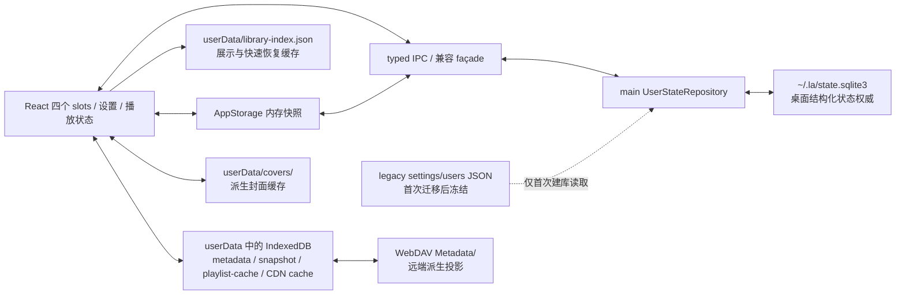

# 持久化当前架构：SQLite 权威与缓存边界

> 状态：已落地架构，更新至 2026-08-13。
>
> 范围：桌面端 `~/.la/state.sqlite3`、首次升级使用的 legacy JSON、Electron `userData` 下的缓存、renderer `localStorage` / IndexedDB，以及 WebDAV 远端元数据投影。
>
> 兼容性原则：这次迁移只替换结构化状态的物理存储和提交边界，不改变 React 四个 slot、列表恢复顺序、播放控制、关闭确认或任何 UI 交互。

## 结论

桌面端现在只有一个结构化用户状态权威：

```text
~/.la/state.sqlite3
```

它保存设置、四个 slot 的曲目归属与顺序、显式空曲库状态和播放工作区。`settings.json` 与 `users.json` 已退出运行期读写，不再与 SQLite 双写。

其余介质按职责分为两类：

- Electron `app.getPath('userData')` 下保存可替换的快速恢复缓存和派生文件，例如 `library-index.json`、`covers/` 和 Chromium 的 IndexedDB；
- WebDAV `Metadata/` 中的 manifest/chunks 是远端音频的派生同步投影，远端文件列表仍由服务器权威。

浏览器模式不使用 SQLite：配置继续以 `localStorage` 为后端，曲库和缓存继续使用 IndexedDB。桌面和浏览器共享上层调用接口，但不共享物理存储假设。

## 当前数据图



图中只有 SQLite 是桌面结构化用户状态权威。缓存可以帮助补齐展示数据和加快启动，但不能覆盖 SQLite 中“已经初始化且为空”的曲库。

## 介质与权威关系

| 数据 | 位置 | 桌面端角色 | 可否重建 / 清理 |
| --- | --- | --- | --- |
| 设置与用户偏好 | `~/.la/state.sqlite3` / `settings` | 权威；包括主题、语言、快捷键、下载偏好、侧栏布局、歌单覆盖和在线服务配置 | 不可当缓存删除 |
| 曲库初始化状态与播放工作区 | `~/.la/state.sqlite3` / `workspace_state` | 权威；表达明确空库并保存 playback JSON | 不可当缓存删除 |
| 四 slot 曲目归属与顺序 | `~/.la/state.sqlite3` / `tracks` | 权威；保存最小用户记录和透传字段 | 不可当缓存删除 |
| schema 迁移历史 | `~/.la/state.sqlite3` / `schema_migrations` | 权威；配合 `PRAGMA user_version` 校验数据库版本 | 不可手工清理 |
| 曲库展示快照 | `app.getPath('userData')/library-index.json` | 快速恢复缓存；保留 title、artist、lyrics、cover URL 等展示字段 | 可由 SQLite 归属、音频标签和网络来源重建 |
| 封面缩略图 | `app.getPath('userData')/covers/` | 派生文件缓存，通过 `cover://` 引用 | 原始音频或网络来源可达时可重建 |
| renderer metadata | Chromium IndexedDB `lyrics-adapter-db` | local/WebDAV metadata、文件列表 snapshot 等缓存 | 桌面端可删除并重建 |
| 在线歌单列表 | IndexedDB `settings/playlist-cache` | 降低首次网络等待的列表缓存 | 可重新请求 QQ / 网易云 / Soda |
| WebDAV CDN 签名 URL | IndexedDB `settings/webdav-cdn-cache` | 有 TTL 的临时访问 URL 缓存，不是配置或凭据权威 | 可随时清理并向 provider 重新解析 |
| WebDAV 元数据 | IndexedDB `webdavMetadata`、`webdavFileListSnapshot` | 本机缓存 | 可由远端列表、音频标签或远端 `Metadata/` 重建 |
| WebDAV manifest/chunks | 远端 `Metadata/_manifest.json`、`_chunk_NNNN.json` | 跨设备派生投影，不是用户曲库权威 | 可重建，但可能有较高网络代价 |
| 原始与下载音频 | 用户选择的路径、`la_download_path` | 音频内容权威；SQLite 只保存引用 | 不属于应用缓存，不得由缓存清理删除 |
| legacy 用户状态 | `~/.la/settings.json`、`~/.la/users.json` 及 `.bak` | 仅首次创建 SQLite 时读取；成功后冻结 | 保留作人工检查或回退材料，不再更新 |
| 更早版本设置 | `app.getPath('userData')/settings.json` 及 `.bak` | `~/.la/settings.json` 不存在时的一次性迁移备选 | 成功后冻结，不再更新 |

`library-index.json` 与 legacy 用户 JSON 的含义不同：前者仍会作为缓存持续更新；后者只记录迁移发生时的旧状态，迁移后不再参与正常启动、保存或关闭提交。

## SQLite 模型

数据库由 `electron/services/userStateRepository.ts` 在主进程中独占。当前 schema version 为 1，使用四张 `STRICT` 表。

### `schema_migrations`

记录已经应用的 schema 版本和时间。Repository 同时校验 `PRAGMA user_version`，不接受未知版本的数据库。

### `settings`

```text
key TEXT PRIMARY KEY
value TEXT
updated_at INTEGER
```

这里保存字符串键值设置。`playback` 是 API 层的兼容虚拟键：读取或写入 `playback` 时实际访问 `workspace_state.playback_json`，不会在两张表中保存两份播放状态。

`webdav-cdn-cache` 虽然历史上使用 setting key 命名，现在已被明确分类为可替换缓存。Repository 不读取或写入这个键，并会在 legacy 导入和 settings 批量写入时过滤它；当前实现直接使用 IndexedDB。它缓存的签名 URL 默认最多保留 30 分钟，过期项在加载时丢弃。

侧栏布局 `sidebar-layout` 和歌单覆盖 `playlist-overrides` 已改由 `AppStorage` 保存，因此桌面端最终进入本表。旧版本在 IndexedDB `settings` store 中的同名值仅作为一次迁移源：必须先成功写入 AppStorage / SQLite，之后才删除旧 IDB 值。`playlist-cache` 仍留在 IndexedDB，因为它只是可重新获取的网络缓存。

### `workspace_state`

这是只有 `singleton = 1` 的单行表：

```text
library_initialized INTEGER
revision INTEGER
playback_json TEXT
```

- `library_initialized` 区分“尚待旧缓存播种”和“用户已经得到一个合法空曲库”；
- `revision` 在工作区写入时递增，为后续诊断和并发控制保留基础；
- `playback_json` 保存四个 slot 的 index、时间、音量、播放模式、滚动和筛选等恢复状态。

### `tracks`

```text
slot_id TEXT
position INTEGER
track_id TEXT
record_json TEXT
PRIMARY KEY (slot_id, position)
```

`slot_id` 只允许 `local`、`cloud`、`online`、`playlist`。每个 slot 独立编号，因而能准确恢复列表归属和顺序。`record_json` 保存经过 schema 校验的最小曲目记录，同时保留已存在的透传字段；`track_id` 另建索引用于身份查询。

这种设计没有改变 renderer 的 `Track`、`LibrarySlot` 或 playback DTO。SQLite 只替代旧 `users.json` / `settings.json` 的物理布局，上层仍按原有四槽模型工作。

## 敏感设置

以下四个键在写入 SQLite 前必须经过 Electron `safeStorage` 加密：

1. `webdav-config`
2. `qq_music_cookie`
3. `netease_cookie`
4. `soda_cookie`

磁盘值使用 `enc:` 前缀加十六进制密文。Repository 读取时解密，调用方仍看到原有字符串接口，因此不需要改变现有设置 UI 或 provider 交互。

若 `safeStorage` 不可用，敏感值写入会失败，而不会降级成明文。Linux 的 `basic_text` backend 也按不可用处理，因为 Electron 明确将其标为未受保护。已有密文无法解密时，数据库的逻辑校验同样失败，应用不会把该状态当作空配置继续启动。

`safeStorage` 密文依赖生成它的操作系统用户凭据存储，可视为机器/用户环境绑定。直接把 `state.sqlite3` 复制到另一台机器并不保证四个敏感值可解密；非敏感状态仍可检查，但跨机器恢复通常需要重新输入 WebDAV 密码和在线 cookie，或未来提供显式的可移植 export。

`webdav-cdn-cache` 不属于上述敏感 SQLite 设置。它可能包含短期签名 URL，仍应按临时敏感缓存保护，但它没有不可重建价值，放在应用数据目录的 IndexedDB 中并可随时清除。

桌面端 `AppStorage` 的同步 cache 只存在于 renderer 内存中：

- 初始化时从主进程 SQLite 载入；
- 写入经 typed IPC 到主进程；
- 不把任何配置镜像到 `localStorage`，并清除应用拥有的旧本地镜像；
- theme、i18n、shortcuts、sidebar layout 和 playlist overrides 都走同一入口。

浏览器模式是明确例外：没有 Electron 主进程和 `safeStorage`，`AppStorage` 仍以 `localStorage` 为持久后端，曲库和其他数据继续使用 IndexedDB。

## 首次迁移

只有 `~/.la/state.sqlite3` 不存在时才执行 legacy 导入。数据库一旦存在，正常启动不会再用旧 JSON 补值或回灌。

### 迁移输入

Repository 按 schema 验证以下来源：

1. `~/.la/settings.json`，失败时可读取其 `.bak`；
2. `~/.la/users.json`，失败时可读取其 `.bak`；
3. 仅当第一项完全不存在时，读取更早版本的 `app.getPath('userData')/settings.json` 及 `.bak`；
4. `app.getPath('userData')/library-index.json` 只作为曲目和 playback 的缓存播种来源。

导入规则保持原有恢复语义：

- 有效 `users.json` 决定曲目归属和 `libraryInitialized`；
- 只有 `libraryInitialized === false` 时，才允许从 `library-index.json` 播种四个 slot，明确空库不会被陈旧缓存复活；
- 有公共键的 settings 文件优先；只有 settings 缺失或只含内部 marker 时，才使用 users 快照中的设置补齐；
- playback 优先使用 users 快照，其次 settings 中的 `playback`，最后才用 `library-index.json.settings`；
- legacy 明文敏感值在导入 SQLite 时通过同一 `safeStorage` 路径加密。
- legacy 中的 `webdav-cdn-cache` 不导入 SQLite；应用会在 IndexedDB 中按需重新生成签名 URL。

### 原子建库与 fail closed

迁移不会直接写最终数据库文件：

1. 在 `~/.la/state.sqlite3.migrating-<pid>-<time>` 创建临时数据库；
2. 建表并在一个 `BEGIN IMMEDIATE` transaction 内导入所有权威状态；
3. 校验 schema version、`PRAGMA quick_check`、单例工作区和完整逻辑快照；
4. 关闭临时连接后 rename 为 `state.sqlite3`；
5. 再次打开并校验，随后才注册 IPC 和创建应用窗口。

任何导入、加密、schema 或完整性校验失败都会 fail closed：临时数据库被清理，旧 JSON 保持原样，应用显示启动错误并退出。实现不会创建一个空权威库继续运行，也不会在已有 SQLite 损坏时悄悄退回可能过期的 JSON。

损坏的 `library-index.json` 是可替换缓存，因此会被忽略，而不会阻止有效 users/settings 迁移。相反，`users.json` 与其备份都不可读时必须停止迁移；settings 不可读且没有有效 users 恢复来源时同样停止迁移。

### 迁移后的 legacy 文件

旧 `settings.json`、`users.json` 和它们的 `.bak`：

- 不删除；
- 不原地修复；
- 不再读取；
- 不再写入；
- 不与 SQLite 双写。

它们可用于人工核对或回退到旧版本，但只包含迁移时刻的数据。SQLite 生效后的新增曲目、播放进度和设置不会同步回这些文件，因此它们不是当前备份。

旧版本曾允许部分凭据以明文落在 JSON 中，所以被冻结的 `settings.json`、`users.json` 或 `.bak` 仍可能保留历史 WebDAV 密码、cookie 或签名 URL。SQLite 迁移会加密导入的四个权威敏感键，但不会回写或清洗 legacy 文件。保留它们有助于人工回退，也意味着文件权限、复制和备份都必须按含敏感信息处理；确认不再需要旧版本回退后，应由用户通过明确流程处置，而不是由应用静默删除。

## 启动、运行期与关闭提交

### 启动

主进程在注册持久化 IPC 和创建窗口之前初始化 `UserStateRepository`。renderer 随后通过现有 Repository façade 加载：

1. SQLite 中的设置、曲目归属、顺序和工作区；
2. `library-index.json` 的展示快照；
3. IndexedDB metadata、音频标签和封面等可重建数据，用于补齐展示字段。

SQLite 决定用户拥有哪些曲目及其 slot；缓存只负责 title、artist、album、lyrics、cover 等展示补全。缓存缺失或损坏可能让首次恢复变慢，但不应改变用户归属或把明确空库恢复成旧列表。

### 运行期

桌面端的 slot 归属变化和对应 playback 通过 `userDataSaveLibraryState` 在一个 SQLite transaction 中更新。高频 currentTime 仍按 5 秒 leading + trailing 节流写 `workspace_state`，避免每次 `<audio timeupdate>` 都触发磁盘写入。

普通 settings 保持独立写入边界：主题、语言、快捷键、WebDAV 配置等在各自变更时通过 `AppStorage` / settings IPC 写入 SQLite，不随每次曲库快照或关闭事务做全量替换。这避免旧的曲库快照覆盖刚保存的用户配置。

同一份曲库还会防抖写入 `library-index.json`，但它是独立缓存提交。SQLite transaction 的成功不依赖缓存成功，缓存失败也不会回滚权威用户状态。

### 关闭

关闭时 renderer 从同一份最新四槽快照生成最终提交，main `PersistenceCommitService` 使用固定顺序：

1. 在一个 SQLite transaction 中提交 tracks、`libraryInitialized` 和 playback；
2. SQLite transaction 尝试结束后，最后写 `library-index.json` 缓存；
3. 返回 settings、userData、libraryIndex 各自的 `saved / skipped / error` 结果和 `fullyPersisted`。

普通 settings 不参与该关闭 transaction，也不会被曲库快照替换；它们保留此前通过独立 settings 写入路径提交的值。关闭结果中的 `settings` outcome 是现有 IPC DTO 的兼容字段：正常 write 模式下与 tracks+playback transaction 共享结果，skip 模式下表示单独 playback 写入结果，并不表示关闭时全量重写 `settings` 表。

缓存始终最后写且不属于 SQLite transaction；即使权威 transaction 失败，也仍会尝试保存缓存并分别报告结果。权威 transaction 失败时不会报告完整成功；缓存失败时权威状态仍然有效，但关闭结果会保留 partial failure 供现有关闭握手处理。若本次会话因用户状态读取失败而禁用了曲库写入，关闭路径不会覆盖 tracks，只尝试兼容的 playback 更新并把整体结果标记为未完整持久化。

## 缓存与远端投影

### Electron `userData`

桌面缓存留在 `app.getPath('userData')`，使用户可以清理或重建应用缓存，而不会删除 `~/.la/state.sqlite3` 中的结构化用户状态：

- `library-index.json`：完整展示快照和快速启动缓存；
- `covers/`：本地化的封面缩略图；
- Chromium IndexedDB：local metadata、WebDAV metadata、文件列表 snapshot、`playlist-cache` 和 `webdav-cdn-cache`；
- Chromium 的其他临时数据和网络缓存。

IndexedDB 的损坏恢复可以删库重建，因为桌面端不可重建的 `sidebar-layout` 和 `playlist-overrides` 已迁到 SQLite。它们在 IDB 中的旧值只用于一次兼容迁移。

### WebDAV

WebDAV 数据分三层：

- 远端音频文件和 PROPFIND 列表决定文件是否存在；
- 远端 `Metadata/` manifest/chunks 是为减少重复解析而生成的同步投影；
- 本机 IndexedDB 保存下载后的 metadata、file-list snapshot 和短期 CDN 签名 URL 缓存。

后两层都不能反向成为用户曲库、slot 顺序、play count 或设置的权威。清理它们会增加网络和重新解析成本，但不应删除 SQLite 用户状态。

## 浏览器模式

浏览器构建没有 Electron `userData`、主进程 IPC、`node:sqlite` 或 `safeStorage`：

- `AppStorage` 使用 `localStorage` 保存设置；
- IndexedDB 保存浏览器曲库和 metadata / WebDAV / playlist 等缓存；
- 桌面端清理本地镜像的规则不适用于浏览器模式。

因此，“IndexedDB 全部可替换”是桌面端成立的边界，不应套用到浏览器模式的曲库 store。未来若统一 browser Repository，仍应保持与桌面相同的领域 DTO，而不是要求两端使用相同数据库引擎。

## 对 UI、列表与播放的影响

本次变更刻意保持以下上层契约：

- 四个 slot 仍为 `local`、`cloud`、`online`、`playlist`；
- 每个 slot 的列表顺序、current index、current time、volume、playback mode、scroll 和 filter 恢复语义不变；
- 切换 slot、选曲、播放、暂停、seek 和预加载仍由现有 controller 负责；
- UI 组件不直接访问 SQLite，也不承担迁移或事务逻辑；
- `settingsStore`、`userDataStore`、Repository façade 和 typed IPC 保留原有调用形状，内部才切换到 SQLite。

所以这不是 UI 重写，也不是交互模型迁移。用户可见行为应保持不变；变化集中在数据损坏时更保守、关闭提交更一致，以及清理 Chromium 数据时不再丢失桌面用户配置和曲目归属。

## 当前限制与维护约束

### 已知限制

1. 使用的是 Electron/Node 内置 `node:sqlite`，当前为同步 API。它被严格封装在 main 的 `UserStateRepository` 内，renderer、UI、hook 和 provider 不得直接导入或执行 SQL；现有 façade 也避免将数据库实现扩散到业务层。
2. legacy JSON 只保留作人工检查和旧版本回退材料。因为迁移后不双写，它们会逐渐过期，不能当作 SQLite 的实时灾备；它们还可能残留历史明文凭据，必须按敏感文件管理。
3. `safeStorage` 密文与当前机器/操作系统用户凭据环境绑定。复制数据库不是完整的跨机器 secret 恢复方案。
4. 目前尚未实现 SQLite 自动备份、定期快照或显式 export。`BEGIN IMMEDIATE`、`journal_mode=DELETE`、`synchronous=FULL` 和完整性检查提供的是原子性与损坏检测，不等于备份。增加自动备份前，不应删除 legacy 文件。
5. 当前 SQLite 只接管不可重建的结构化用户状态；metadata、封面、歌单列表、CDN URL 和 WebDAV snapshot 仍是独立缓存。这是有意的介质边界，不是迁移遗漏。
6. `workspace_state.revision` 已递增记录，但尚未作为跨进程 compare-and-swap 冲突协议。Repository 仍是唯一允许的写入口。

### 新持久化代码必须遵守

- 新的桌面用户配置进入 `settings`，不得重新镜像到 `localStorage`；
- 新的敏感键必须先加入统一敏感策略并通过 `safeStorage`，禁止明文降级；
- 曲目归属、顺序和对应 playback 的一致性变更必须在一个 SQLite transaction 内；
- 关闭最终提交中的 cache 写入必须位于权威 transaction 尝试之后，cache 失败不得回滚或覆盖 SQLite；
- `libraryInitialized: true` 的空库必须压过任何陈旧缓存；
- legacy JSON 不恢复双写；若需要回退或导出，应实现显式、可验证的工具；
- UI 和 controller 只依赖领域接口，不感知表名、SQL 或数据库路径。

在这些约束下，桌面持久化的核心关系可以简化为一句话：`~/.la/state.sqlite3` 保存不可重建的用户状态，Electron `userData` 和 WebDAV 保存可重建的缓存与投影。
