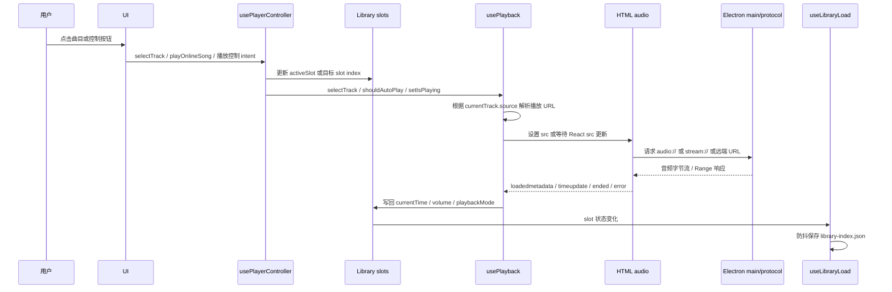

# 播放流程说明

本文只描述当前源码中的播放链路。重点是从用户点击曲目到 `<audio>` 获得可播放 URL，再到播放状态被写回 slot 和持久化的全过程。

## 核心参与者

| 参与者 | 文件 | 职责 |
| --- | --- | --- |
| UI | `components/AppShell.tsx`、`components/LibraryView.tsx`、`components/Controls.tsx`、`components/FocusMode.tsx` | 发出用户意图：选歌、播放暂停、seek、上下曲、音量、模式切换 |
| 应用组合层 | `App.tsx` 中的 `AppContent` | 挂载 `<audio>`，连接 UI、stores、controllers、viewmodels 与生命周期 hooks |
| 播放意图 | `controllers/usePlayerController.ts` | 处理同/跨 slot 选歌、在线流播放、歌单浏览与播放上下文 |
| 播放聚合层 | `stores/playerStore.ts` | 包装 `usePlayback`，同步播放时间、音量、播放模式到 active slot |
| 播放核心 | `hooks/usePlayback.ts` | 控制 `<audio>`，按 track source 解析播放 URL，处理事件与错误恢复 |
| 曲库状态 | `hooks/useLibrarySlots.ts`、`stores/libraryStore.ts` | 保存四个 slot 的 tracks、index、time、volume、mode、滚动和过滤状态 |
| 持久化 | `hooks/useLibraryLoad.ts`、`services/libraryStorage.ts` | 启动恢复、运行中防抖保存、关闭前 flush |
| 主进程协议 | `audioProtocol.ts`、`streamProtocol.ts`、`coverProtocol.ts` | 提供本地音频、在线音频、封面自定义协议 |

## 顶层流程



## 启动恢复

启动后 `AppContent` 调用 `useLibraryLoad()`，流程如下：

1. `libraryStorage.loadLibrary()` 读取 `userData/library-index.json`，找不到时返回空库。
2. `useLibraryLoad` 把 `songs/cloudSongs/onlineSongs/playlistSongs` 重建为 `Track[]`。
3. `restoreFromPersistence()` 恢复四个 slot 的 index、time、volume、playbackMode、scroll/filter 状态。
4. `activeSlotId` 恢复到上次播放上下文；如果是 `playlist`，曲库视图仍回到真实库 slot。
5. `setIsPlaying(false)`，启动后不自动播放。
6. `setRestoreTime(restoredTime)` 将上次时间交给 `usePlayback`，等音频 metadata 加载后恢复。
7. 初始化 metadata cache，后台校验本地文件路径，并运行启动清理。

恢复后的 `<audio>` 元素只有当前曲目时才挂载。真正播放要等用户点击播放或选歌。

## 选歌流程

### 同 slot 选歌

当用户点击的曲目属于当前 `activeSlotId`：

1. `usePlayerController.handleTrackSelect(index)` 调用 `selectTrack(index)`。
2. `selectTrack` 设置 `shouldAutoPlayRef.current = true`。
3. 如果点击的是同一首，直接 `audio.play()` 恢复播放。
4. 如果是不同 index，`switchToTrackIndex()` 触发 `onTrackSwitch`，更新 `currentTrackIndex`，并把 `isPlaying` 设为 `true`。
5. `currentTrack` 变化后，`usePlayback` 的 effect 进入 source 分支并加载 URL。

### 跨 slot 选歌

当用户正在浏览的 `viewSlot` 与当前播放的 `activeSlotId` 不同：

1. 保存当前 active slot 的 `currentTime`。
2. 更新目标 slot 的 `currentTrackIndex`。
3. 清空 restore time。
4. 标记曲目切换，触发列表自动定位 token。
5. `switchTo(targetSlot)` 切换播放上下文。
6. 设置 `shouldAutoPlayRef.current = true` 和 `isPlaying = true`。
7. `usePlayback` 使用新的 `activeTracks` 和 `activeTrackIndex` 加载目标曲目。

这里的关键是：库视图的 `viewSlot` 和播放上下文的 `activeSlotId` 可以不同，跨 slot 播放必须先保存旧 slot 时间，再切换 active slot。

## 播放 URL 解析

`usePlayback` 的主 effect 以 `currentTrack.source` 和 `audioUrl/filePath` 选择不同路径。

### 本地桌面文件

本地导入的桌面曲目通常持久化 `filePath`，运行时 `audioUrl` 为空。

流程：

1. `usePlayback` 发现 `!currentTrack.audioUrl && currentTrack.filePath`。
2. `loadAudioFileForTrack()` 构建 `audio://localhost/<absolute-path>`。
3. 更新 tracks 中该曲目的 `audioUrl`，作为后续缓存。
4. 如果异步回调没有过期，把 `audioRef.current.src` 设置为 `audio://...`。
5. 若 `shouldAutoPlayRef` 为 true，调用 `audio.play()`。
6. Electron 的 `audioProtocol` 接管请求，按 Range 头返回 206 Partial Content 或完整流。

当前源码不再为桌面本地播放通过 IPC 读完整文件并创建 blob URL。旧文档中关于“lazy IPC readFile -> Blob URL”的表述已经过期。

### 浏览器 File/blob 曲目

浏览器 fallback 导入会在 `metadataService.parseAudioFile(file)` 中创建 `blob:` URL。React 给 `<audio src={currentTrack.audioUrl}>` 更新后，`usePlayback` 在已有 `audioUrl` 的情况下直接 `play()`。

### WebDAV 曲目

WebDAV 曲目的 `source === 'webdav'`，播放时不直接用 `webdavPath` 作为 audio src。

流程：

1. `usePlayback` 调用 `webdavClient.getCdnUrl(currentTrack.webdavPath)`。
2. `webdavClient` 先查本地 CDN cache，未命中则通过主进程 `webdavGetRedirect` 做 GET redirect。
3. 获取到 redirect URL 后保存 30 分钟 cache。
4. `audioRef.current.src = cdnUrl`。
5. 若需要自动播放，调用 `audio.play()`。

错误恢复：

- 如果 `<audio>` 报 `MEDIA_ERR_SRC_NOT_SUPPORTED` 且当前是 WebDAV 曲目，`usePlayback` 会清空 WebDAV CDN cache。
- 重新获取 fresh CDN URL。
- 记录错误前播放时间，等 `loadedmetadata` 后恢复。
- 设置 `waitingForCanPlayRef`，等待 `canplay` 后尝试继续播放。

### 在线搜索结果

在线搜索结果可以立即流式播放，不必下载到本地。

流程：

1. UI 通过 online viewmodel 调用 `usePlayerController.playOnlineSong(song, source)`。
2. player controller 归一化并构造 `Track`：
   - `id = online-${source}-${songmid}`
   - `source = 'qq' | 'netease'`
   - `songmid = song.songmid`
   - `audioUrl = ''`
3. 保存当前 active slot 时间。
4. `addOnlineTrack(track)` 把曲目加入 `online` slot 的 LRU 队列头部。
5. 设置 `online.currentTrackIndex = 0`。
6. 切换 `activeSlotId` 和 `viewSlot` 到 `online`。
7. `usePlayback` 遇到 `source === 'qq' || 'netease'`，构建 `stream://<source>/<songmid>?q=320`。
8. `streamProtocol` 在主进程解析真实 CDN URL，补 cookie，转发 Range 请求给 CDN。

QQ 和网易的 cookie 在应用启动时从 renderer cookie store 同步到主进程的 `streamProtocol` 内存 cookie store。

### 在线歌单 playlist slot

打开在线歌单时，`usePlayerController.openOnlinePlaylistInLibrary()` 先把分页结果放入独立的浏览列表，不中断当前播放。用户点击其中一行后，`playLibraryPlaylistTrack()` 才把当前浏览列表提交到 `playlist` slot，设置点击 index 并切换 `activeSlotId`。这些 Track 的 source 仍然是 `qq` 或 `netease`，所以实际音频 URL 解析仍走 `stream://` 分支。

`playlist` slot 的特点：

- 是播放上下文，不是普通侧边栏库。
- next/prev 在完整歌单内移动。
- Playlists 视图可以保持可见，不需要切到 online 列表。
- 有一个 current +/- 1 的歌词预取窗口，窗口外歌词会被清掉以控制内存。

## 播放控制

### 播放/暂停

`togglePlay()` 只操作当前 `<audio>`：

- 当前正在播放：设置 `shouldAutoPlayRef = false`，调用 `pause()`。
- 当前暂停：设置 `shouldAutoPlayRef = true`，调用 `play()`。

如果没有 audio 或 currentTrack，直接返回。

### 上一曲/下一曲

`skipForward()` 与 `skipBackward()` 有 150ms 防抖：

1. 清掉前一个 skip timer。
2. 先更新 index，让 UI 立即看到目标曲目。
3. 暂不加载音频，避免快速连按时每一首都发起加载。
4. 150ms 后设置 `shouldAutoPlayRef = true`。
5. 清空 `loadedTrackIdRef` 并 bump `reloadToken`，触发最后一首真正加载。

下一首计算：

- `shuffle`: 随机选择一个不等于当前 index 的曲目。
- `order`: forward 到末尾后回到 0，backward 到开头前回到末尾。
- `repeat-one`: 只影响 ended 事件，不影响手动 skip。

### 单曲结束

`handleTrackEnded()`：

- `repeat-one`: currentTime 归零并继续播放同一首。
- 其他模式：计算下一首，设置 `shouldAutoPlayRef = true`，更新 index。

### 进度与恢复

`handleSeek(time)` 直接设置 `<audio>.currentTime` 并更新 `currentTime` state。

`handleLoadedMetadata()` 做两件事：

1. 如果 `restoredTimeRef > 0` 且尚未恢复，把 audio currentTime 设到恢复时间。
2. 非 WebDAV 曲目会把 `<audio>.duration` 写回当前 Track。

### 音量

UI 传入的是 0 到 1 的线性音量。`usePlayback` 写入 `<audio>.volume` 前做平方映射：

```text
actualVolume = linearVolume * linearVolume
```

这样低音量区间更细。静音时保存最后一个非零音量，取消静音时恢复。

## Audio 事件与状态写回

`AppContent` 创建的 `<audio>` 绑定了：

| 事件 | handler | 作用 |
| --- | --- | --- |
| `timeupdate` | `handleTimeUpdate` | 更新播放 hook 的 `currentTime` |
| `loadedmetadata` / `loadeddata` | `handleLoadedMetadata` | 恢复时间、写回 duration |
| `ended` | `handleTrackEnded` | 单曲循环或切下一首 |
| `canplay` | `handleCanPlay` | 在等待 canplay 的恢复场景中重试 play |
| `error` | `handleAudioError` | 记录错误，WebDAV fresh URL 恢复，其他来源清空 audioUrl 后重载 |

`playerStore` 把播放状态写回 slot：

- `currentTime > 0` 时写入 active slot 的 `currentTime`。
- `volume` 变化时写入 active slot 的 `volume`。
- `playbackMode` 变化时写入 active slot 的 `playbackMode`。

`useLibraryLoad` 监听 slot 状态变化，构建 library index 并防抖保存。

## 持久化时机

运行中：

- slot tracks/index/time/volume/mode 变化会触发 `saveLibraryDebounced()`，延迟约 1 秒写入。
- 某些动作会立即保存，例如导入完成、重排、下载完成加入本地库。

关闭前：

- `useLibraryLoad` 注册 `addLibraryFlushListener()`。
- preload 的 `onBeforeWindowClose` 会等待 renderer flush。
- 主进程最多等 3 秒，flush 成功后继续关闭。

## 当前边界问题

播放路径已经比较清楚，但源码中还有一些职责交叠：

- 跨 slot 选歌、在线流播放和歌单播放已经集中到 `usePlayerController`；`AppContent` 只负责装配其输入输出。
- `usePlayback` 除了控制 `<audio>`，还会写回 Track duration、从 metadata cache 补歌词。
- `usePlayback` 同时负责 source URL 解析、错误恢复、播放控制和状态维护，单个 hook 较大。
- 删除曲目时既可能影响曲库状态，也可能暂停当前 audio，这些 mutation 集中在 `useLibraryController`，仍需谨慎维护 active/view slot 语义。
- 当前源码没有看到音频相邻曲目预加载逻辑；只有封面/歌词一类的异步补全和 playlist 歌词窗口预取。

这些问题不会阻塞当前播放功能，但会增加后续修改播放行为时的回归风险。
