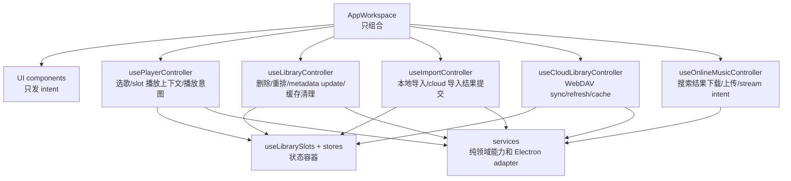

# 重构计划

本文基于当前源码提出重构路线。目标不是一次性大改，而是按行为边界拆小步，每一步都能独立验证并保持播放器可用。

## 重构目标

1. 让 `AppWorkspace.tsx` 回到 composition/wiring 角色。
2. 明确播放器、曲库、导入、云同步、在线音乐之间的所有权边界。
3. 降低跨 slot 播放、WebDAV 同步、在线 streaming 的回归风险。
4. 消除重复逻辑，特别是删除、持久化、IPC fallback、元数据解析相关重复。
5. 给后续功能留下可测试的纯函数和小型 controller。

## 非目标

- 不在重构初期更换 React 状态管理方案。
- 不改变 `Track`、`LibrarySlot`、`library-index.json` 的外部语义，除非先写迁移。
- 不移除 legacy IPC，除非 typed IPC 覆盖率和回归验证足够。
- 不同时做 UI 视觉重构。

## 当前诊断

### 1. `AppWorkspace` 职责过多

`AppWorkspace.tsx` 当前承担：

- UI composition。
- view-slot-aware 删除。
- 批量删除。
- 重排和立即保存。
- 下载完成后加入本地库。
- 跨 slot 搜索定位。
- 跨 slot 选歌。
- 在线搜索结果 streaming play。
- 在线歌单播放上下文。
- playlist 歌词滑动窗口。
- 孤儿缓存清理。
- 在线 cookie 同步到主进程。

这些逻辑属于多个领域，却集中在一个组件里，导致任何播放或曲库改动都容易触碰 UI composition。

### 2. 播放 hook 边界偏宽

`usePlayback` 做了很多正确但混杂的事情：

- 播放/暂停、seek、上下曲、音量、播放模式。
- 根据 source 解析本地、WebDAV、在线 URL。
- WebDAV CDN 失效恢复。
- 写回 duration。
- 从 metadata cache 补歌词。
- blob URL 清理。

播放控制和播放 URL 解析可以先拆成纯函数/服务，降低 hook 复杂度。

### 3. 曲库变更逻辑重复

`hooks/useLibraryActions.ts` 有基于 active tracks 的删除/重载逻辑；`AppWorkspace` 又实现了 view-slot-aware 删除/批量删除。当前后者更符合 `viewSlot` 模型，但重复逻辑会造成后续修复漏改。

### 4. 导入逻辑跨度大

`useImport` 同时负责：

- 文件选择和拖拽路径处理。
- 批处理进度。
- 元数据解析。
- 封面保存。
- 本地 tracks 更新。
- WebDAV 上传。
- notification。
- library save。

这让导入流程很难单独测试，也让“导入产生结果”和“把结果提交到曲库/持久化”耦合在一起。

### 5. 云同步由 UI 组件触发

`LibraryView` 内部调用 `useLibraryCloudSync()`。虽然回调结果仍交给上层 slot mutation，但云同步副作用入口位于 UI 组件中。更理想的边界是 controller 持有云同步，UI 只接收 `loadProgress`、`refresh`、`isRefreshing` 等 props。

### 6. IPC 双轨重复

`desktopAdapter` 已经优先 typed IPC 再 fallback legacy，这是好过渡方案。但 preload、typed handlers、legacy handlers 同时维护同类能力，长期会提高不一致风险。

### 7. 元数据 parser 重复

renderer 主线程 parser 与 worker parser 有大量重复逻辑。它们当前能工作，但任何解析修复都可能需要同步改两份。

## 目标架构

目标边界：

| 层 | 可做 | 不做 |
| --- | --- | --- |
| UI components | 展示状态、发 intent | 直接 `updateSlot`、直接控制 player、直接持久化 |
| AppWorkspace | 创建 controller、传 props、选择 legacy/new UI | 业务分支和状态变更细节 |
| Player controller | 选歌、跨 slot 播放、playlist 播放上下文、播放 intent | 文件导入、曲库删除、provider 搜索 |
| Library controller | 删除、批量删除、重排、metadata update、缓存清理 | 播放 URL 解析、在线 provider 内部请求 |
| Import controller | 把导入结果提交到 local/cloud slot | UI 展示、播放控制 |
| Cloud controller | WebDAV refresh/sync/cache 状态 | UI 行渲染、在线音乐下载 |
| Services | 纯函数、I/O adapter、协议/IPC 封装 | React 状态更新 |

## 分阶段计划

### Phase 0: 行为基线和测试护栏

目标：先锁住现有行为，避免重构时不知道哪里坏了。

行动：

- 补充当前架构与播放链路文档，并标注现有旧文档里的过期点。
- 为纯函数和小服务补测试：
  - `librarySerializer`
  - `libraryReorder`
  - `importIdentity`
  - `webdavPath`
  - `metadataFolderService`
  - WebDAV diff 逻辑
- 为高风险交互补轻量 React hook 测试或集成测试：
  - 同 slot 选歌。
  - 跨 slot 选歌保存旧时间并切换 active slot。
  - `online` LRU 插入与去重。
  - `playlist` slot next/prev 语义。
  - 删除当前播放曲目时的 index 和 audio 状态。

验证：

- `npx tsc --noEmit`
- `npm test`
- 手动覆盖 local/WebDAV/online 三条播放路径。

### Phase 1: 提取播放 URL 解析

目标：让 `usePlayback` 少做 source 分支判断，先把可测试逻辑拆出去。

建议新增或抽取：

- `services/playbackSource.ts`
  - `buildLocalAudioUrl(filePath, platform?)`
  - `buildOnlineStreamUrl(source, songmid, quality)`
  - `resolveWebdavCdnUrl(webdavPath, webdavClient)`

迁移策略：

1. 先复制最小逻辑到纯函数并加测试。
2. `usePlayback` 调用纯函数，行为不变。
3. 保持 WebDAV 错误恢复仍在 `usePlayback`，先不一次性移动。

收益：

- 本地路径 Windows/macOS URL 规则可独立测试。
- `stream://` URL 构建不再散落在 hook 内。
- 后续 controller 可以明确“请求播放某 source”与“audio 如何解析 src”的边界。

### Phase 2: 提取 Player Controller

目标：把 `AppWorkspace` 中播放上下文相关逻辑移出。

候选 controller：

- `hooks/controllers/usePlayerController.ts`

应接管：

- `handleTrackSelect`
- `handleSearchNavigate`
- `handleOnlineStreamPlay`
- `handlePlayPlaylist`
- `handleOpenOnlinePlaylist`
- playlist 歌词 current +/- 1 预取和淘汰

输入：

- slots、activeSlotId、viewSlot。
- slot mutation API。
- `selectTrack`、`setRestoreTime`、`shouldAutoPlayRef`、`setIsPlaying`。
- online provider API 或歌词 provider facade。

输出：

- 给 UI 使用的播放 intent callbacks。
- 当前 playlist/open playlist 状态需要的派生数据。

迁移顺序：

1. 先移动 `handleTrackSelect`，因为这是最核心且可验证。
2. 再移动 `handleSearchNavigate`。
3. 再移动 `handleOnlineStreamPlay`。
4. 最后移动 playlist 相关逻辑。

验证场景：

- local 曲目点击播放。
- cloud 曲目点击播放。
- 搜索结果跨 slot 定位并播放。
- 在线搜索结果立即播放。
- 在线歌单点击任意 index 后 next/prev 在歌单中移动。

### Phase 3: 提取 Library Controller

目标：曲库变更只通过一个 controller 入口，不再散落在 `AppWorkspace` 和 `useLibraryActions`。

候选 controller：

- `hooks/controllers/useLibraryController.ts`

应接管：

- view-slot-aware 单曲删除。
- view-slot-aware 批量删除。
- 重排。
- `onUpdateTrack`。
- `handleReloadLocalFiles`。
- 孤儿缓存清理。
- 下载完成后加入 local 库。

迁移策略：

1. 把 `AppWorkspace` 中的 view-slot-aware 删除整体搬入 controller，保持 API 不变。
2. 删除或降级 `useLibraryActions` 中重复的 active-only 删除逻辑，只保留仍有实际调用的 reload 能力。
3. 把重排和保存逻辑放入 controller。
4. 把 metadata/indexedDB/cover cleanup 封装成小 service，controller 只编排。

验证场景：

- 删除非播放 slot 中的曲目不影响正在播放的 active slot。
- 删除当前播放曲目时 audio 暂停或 index 调整符合现状。
- 批量删除前后 currentTrackIndex 正确。
- WebDAV 被删除但正在播放的曲目仍保留为 `available: false`。
- 重排保持当前播放曲目 identity。

### Phase 4: 拆分导入流程

目标：把“获取/解析文件”和“提交到曲库”分离。

建议结构：

- `services/import/localImportService.ts`
  - 输入文件路径或 File。
  - 返回 `Track[]`、metadata cache updates、warnings。
- `services/import/cloudImportService.ts`
  - 输入本地路径。
  - 上传 WebDAV。
  - 返回 `Track[]` 和失败项。
- `hooks/controllers/useImportController.ts`
  - 调用 import service。
  - 更新 local/cloud slot。
  - 触发通知。
  - 触发持久化。

迁移策略：

1. 先抽取 duplicate filtering 和 `tracksMap` 相关逻辑。
2. 抽取本地路径批处理，保持 `useImport` 外部 API 不变。
3. 抽取 cloud 上传批处理。
4. 最后让 `importStore` 指向新 controller，逐步瘦身 `useImport`。

验证场景：

- 文件选择导入。
- 拖拽导入。
- 重复文件跳过。
- browser mode File fallback。
- cloud 可写上传。
- cloud readonly 禁用导入。
- 上传同名 WebDAV 文件时去重与排序。

### Phase 5: 云同步从 UI 下沉

目标：`LibraryView` 不再持有 WebDAV 同步 hook。

候选 controller：

- `hooks/controllers/useCloudLibraryController.ts`

应接管：

- `useLibraryCloudSync`
- refresh 状态。
- load progress。
- debug commands 注册。
- `onLoadCloudTracks` / `onMergeCloudTracks` 编排。

UI 变化：

- `LibraryView` 接收 `cloudLoadProgress`、`isCloudRefreshing`、`onRefreshCloud`。
- UI 仍负责空态按钮、进度条、列表展示。

验证场景：

- 首次切到 cloud 自动加载。
- 手动 refresh。
- 无变化时从缓存恢复。
- 新增、删除、变更 diff 合并。
- clear cache 后 full mode。
- readonly provider 不尝试写 Metadata。

### Phase 6: 收敛 IPC 与 desktop adapter

目标：所有 renderer 业务通过 `desktopAdapter` 或明确 provider facade，不直接碰 `window.electron`。

行动：

- 给 `DesktopAPI` 增补在线 cookie、download progress、online request、downloadAndSave、fetchCoverBase64 等当前直接使用的能力。
- 把 `AppWorkspace.syncOnlineCookies` 移到 online controller 或 online service。
- 对每个 typed IPC 能力建立 parity checklist。
- typed IPC 覆盖后再考虑删除对应 legacy handler 或保留兼容 fallback。

验证场景：

- 文件选择和拖拽路径 allowlist。
- library load/save。
- WebDAV PROPFIND/range/put/delete/mkcol。
- online download/upload。
- close flush。

### Phase 7: 元数据解析与写入收敛

目标：减少 worker parser 与主线程 parser 的重复维护。

可选路线：

1. 抽共享 parser core，worker 和主线程都 import 同一组纯函数。
2. worker 只做线程封装，主线程 fallback 调同一 parser core。
3. Range parser 保持独立入口，但复用同一 ID3/FLAC/MP4 基础函数。
4. 写入侧继续由主进程完成，优先稳定 MP3/FLAC 行为，再考虑统一日志和错误类型。

验证场景：

- MP3 标题/艺术家/专辑/歌词/封面读取。
- FLAC Vorbis comment、PICTURE、超出首 1MB 的封面补 range。
- M4A/MP4 基础 metadata。
- LRC 同步歌词解析。
- MP3 写标签。
- FLAC ffmpeg remux 和 fallback。

## 风险清单

| 风险 | 影响 | 缓解 |
| --- | --- | --- |
| 跨 slot 语义被破坏 | 播放错 slot、删除错列表、恢复时间丢失 | 先补同 slot/跨 slot 测试，再移动 controller |
| WebDAV cache 行为回归 | 大库加载变慢或封面丢失 | 保留 full/diff/cache/Metadata v3 的测试与手动脚本 |
| 在线 streaming cookie 丢失 | QQ/网易无法播放 | 把 cookie sync 纳入 adapter/controller，并手测登录后播放 |
| `audio://` 路径编码错误 | Windows 或含空格路径无法播放 | 为 path -> audio URL 纯函数加平台和特殊字符测试 |
| 删除逻辑合并不完整 | 当前播放曲目被误停或 orphan cache 未清 | 先保留行为等价，再移除旧入口 |
| typed/legacy IPC 收敛过快 | 老路径失效 | 先 parity checklist，再逐项删除 |

## 每个阶段的完成标准

每个 phase 完成时应满足：

- `AppWorkspace` 行数和职责减少，且没有新增业务分支。
- UI 组件只接收状态和 callbacks，不直接做 slot mutation。
- 关键流程有测试或明确手动验证记录。
- `npx tsc --noEmit` 通过。
- `npm test` 通过。
- local、cloud、online、playlist 四类播放路径至少手动冒烟一次。

## 建议优先级

推荐先做 Phase 1 到 Phase 3：

1. 播放 URL 解析纯函数化，风险低、收益快。
2. Player controller 下沉，直接减少 `AppWorkspace` 最大复杂度。
3. Library controller 合并删除/重排，减少重复逻辑和误删风险。

等这三步稳定后，再处理导入和 WebDAV。导入与 WebDAV 都涉及大量 I/O 和缓存，应该在测试护栏更充分后动。
